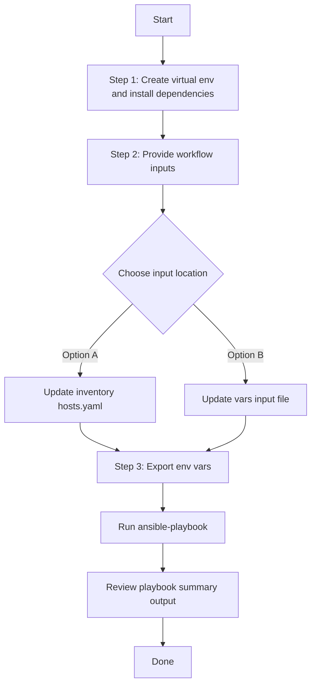

# User Role Config Generator

## Table of Contents

- [Overview](#overview)
- [Features](#features)
- [Prerequisites](#prerequisites)
- [Workflow Structure](#workflow-structure)
- [Schema Parameters](#schema-parameters)
- [Operational Behavior](#operational-behavior)
- [Quick Start](#quick-start)
- [Operations](#operations)
- [Examples](#examples)
- [Notes](#notes)

## Overview

The User Role config generator automates YAML playbook generation for existing users and custom roles in Cisco Catalyst Center. It produces output compatible with `user_role_workflow_manager`, helping with brownfield extraction, backup, and role/user migration workflows.

---

## Features

- **Configuration Generation**: Generate YAML configurations compatible with `user_role_workflow_manager`.
  - Extract existing user accounts and custom role definitions.
  - Transform API data into playbook-ready YAML.
  - Reuse generated files for automation and recovery scenarios.
- **Component Filtering**: Generate `user_details`, `role_details`, or both.
- **User Filtering**: Filter users by `username`, `email`, and assigned `role_name`.
- **Role Filtering**: Filter custom roles by `role_name`.
- **Flexible Output**: Supports custom `file_path` and `file_mode` (`overwrite` / `append`).
- **Brownfield Discovery**: At the workflow level, omit both `config` and top-level `component_specific_filters`, or set `generate_all_configurations: true`, to generate all supported user/role components.

---

## Prerequisites

### Software Requirements

| Component | Version |
|-----------|---------|
| Ansible | 2.13+ |
| cisco.catalystcenter collection | 2.6.0 |
| Python | 3.9+ |
| Cisco Catalyst Center | 2.3.5.3+ |
| catalystcentersdk | 2.7.2+ |

### Required Collections

```bash
ansible-galaxy collection install cisco.catalystcenter
ansible-galaxy collection install ansible.utils
pip install catalystcentersdk
pip install yamale
```

### Access Requirements

- Catalyst Center credentials with access to user/role APIs
- Network connectivity to Catalyst Center
- Existing users and/or custom roles in Catalyst Center

---

## Workflow Structure

```
user_role_config_generator/
├── playbook/
│   └── user_role_config_generator.yml          # Main operations
├── vars/
│   └── user_role_config_inputs.yml             # Input examples
├── schema/
│   └── user_role_config_schema.yml             # Input validation
└── README.md
```

---

## Schema Parameters

### Basic Configuration

Top-level workflow variable:

- `user_role_config` (list, required)

Each item under `user_role_config` supports:

| Parameter | Type | Required | Default | Description |
|-----------|------|----------|---------|-------------|
| `generate_all_configurations` | boolean | No | false | Workflow convenience flag. When true, playbook omits module `config` and the module generates all supported components |
| `file_path` | string | No | auto-generated | Output file path for generated YAML |
| `file_mode` | string | No | `overwrite` | File write mode: `overwrite` or `append` |
| `config` | dict | No | omitted | Module-native config wrapper. If provided, it must contain `component_specific_filters`. |
| `component_specific_filters` | dict | No | omitted | Workflow convenience input. The playbook wraps it into module `config.component_specific_filters` only when `config` is omitted or empty. |

### Supported Components

- `user_details`
- `role_details`

### Filters

- `user_details` filter keys (list of dictionaries):
  - `username`: list of usernames (case-insensitive match)
  - `email`: list of email addresses (case-insensitive match)
  - `role_name`: list of role names assigned to users (case-insensitive match)
  - **Filter logic**: Multiple filter dictionaries use **OR** logic (any match includes the user). Within a single dictionary, all criteria must match (**AND** logic).
- `role_details` filter keys (list of dictionaries):
  - `role_name`: list of custom role names (case-sensitive match)
  - **Filter logic**: Multiple filter dictionaries use **OR** logic (any match includes the role).

### Input Rules

- Use one input shape per `user_role_config` entry:
  - Module-native shape: `config.component_specific_filters`
  - Workflow convenience shape: top-level `component_specific_filters`
- If both `config` and top-level `component_specific_filters` are present in the same entry, the playbook passes `config` and ignores the top-level convenience filters.
- If `component_specific_filters` contains `user_details` and/or `role_details` blocks, the module auto-adds those components into `components_list`.
- If `component_specific_filters` is provided without `user_details` or `role_details` blocks, `components_list` must be present and non-empty.

---

## Operational Behavior

1. The playbook loads input from `VARS_FILE_PATH` when provided, or falls back to inventory / host variables.
2. The playbook fails early if `user_role_config` is not defined.
3. For each `user_role_config` entry, the playbook applies this precedence:
   - If `generate_all_configurations: true`, omit module `config`
   - Else if `config` is provided and non-empty, pass `config` directly
   - Else if top-level `component_specific_filters` is provided, wrap it into module `config.component_specific_filters`
   - Else omit module `config`
4. When module `config` is omitted, the module performs full generation for both supported components: `user_details` and `role_details`.
5. `file_mode` defaults to `overwrite` when not specified.
6. Generated YAML is compatible with `user_role_workflow_manager`.

---

## Quick Start

### User Flow (3 Steps)



### 1. Prepare Inventory

Update `inventory/demo_lab/hosts.yaml` or another inventory file with Catalyst Center connection details.

Example using environment-variable lookups:

```yaml
catalyst_center_hosts:
  hosts:
    catalyst_center_primary:
      catalyst_center_host: "{{ lookup('ansible.builtin.env', 'HOSTIP') }}"
      catalyst_center_username: "{{ lookup('ansible.builtin.env', 'CATALYST_CENTER_USERNAME') }}"
      catalyst_center_password: "{{ lookup('ansible.builtin.env', 'CATALYST_CENTER_PASSWORD') }}"
      catalyst_center_port: 443
      catalyst_center_verify: false
      catalyst_center_version: "2.3.5.3"
      catalyst_center_debug: false
      catalyst_center_log: true
      catalyst_center_log_level: "INFO"
```

If your inventory uses environment-variable lookups like the example above, export:

```bash
export HOSTIP=<catalyst-center-ip-or-fqdn>
export CATALYST_CENTER_USERNAME=<username>
export CATALYST_CENTER_PASSWORD='<password>'
```

### 2. Install Dependencies and Provide Workflow Input

Create and activate a Python virtual environment, then install dependencies:

```bash
python3 -m venv .venv
source .venv/bin/activate
pip install -r requirements.txt
ansible-galaxy collection install cisco.catalystcenter --force
ansible-galaxy collection install ansible.utils
```

Define `user_role_config` in one of these locations:

- Recommended: `workflows/user_role_config_generator/vars/user_role_config_inputs.yml`
- Alternative: inventory / `host_vars` / `group_vars`

### 3. Validate and Execute

Validate the vars file against the workflow schema:
```bash
export HOSTIP=<catalyst-center-ip-or-fqdn>
export CATALYST_CENTER_USERNAME=<username>
export CATALYST_CENTER_PASSWORD='<password>'
ansible-playbook -i ./inventory/demo_lab/hosts.yaml ./workflows/user_role_config_generator/playbook/user_role_config_generator.yml -vvvv
```

```bash
./tools/schemavalidation.sh \
  -s workflows/user_role_config_generator/schema/user_role_config_schema.yml \
  -v workflows/user_role_config_generator/vars/user_role_config_inputs.yml
```

Option A: vars file input (recommended)

```bash
ansible-playbook -i inventory/demo_lab/hosts.yaml \
  workflows/user_role_config_generator/playbook/user_role_config_generator.yml \
  --extra-vars VARS_FILE_PATH=${PWD}/workflows/user_role_config_generator/vars/user_role_config_inputs.yml \
  -vvvv
```

Option B: inventory / host variable input

Define `user_role_config` directly in your inventory or under `host_vars` / `group_vars`, then run without `VARS_FILE_PATH`:

```bash
ansible-playbook -i inventory/demo_lab/hosts.yaml \
  workflows/user_role_config_generator/playbook/user_role_config_generator.yml \
  -vvvv
```

The playbook prints the detected input source at startup:

- `Input source: vars file <path>` when using `VARS_FILE_PATH`
- `Input source: inventory / host variables (VARS_FILE_PATH not provided)` when using inventory-based input


## Operations

### Generate Operations (state: gathered)

Use `user_role_config_generator.yml` for all generation tasks.

1. **Generate all user/role configurations**
   - Set `generate_all_configurations: true`, or omit both `config` and top-level `component_specific_filters` for that entry.

2. **Generate user component only**
   - Use `component_specific_filters.components_list: ["user_details"]` or the module-native `config.component_specific_filters.components_list`.

3. **Generate role component only**
   - Use `component_specific_filters.components_list: ["role_details"]` or the module-native `config.component_specific_filters.components_list`.

4. **Generate filtered user/role slices**
   - Provide list-based filters under `user_details` / `role_details`.

5. **Append generated output**
   - Set `file_mode: append` to append into an existing file.

---

## Examples

### Example 1: Generate all users and roles

```yaml
user_role_config:
  - generate_all_configurations: true
    file_path: "/tmp/user_role_complete_config.yml"
```

### Example 2: Filter users by username

```yaml
user_role_config:
  - file_path: "/tmp/user_role_users_by_username.yml"
    component_specific_filters:
      components_list: ["user_details"]
      user_details:
        - username: ["testuser1", "testuser2"]
```

### Example 3: Filter users by email

```yaml
user_role_config:
  - file_path: "/tmp/user_role_users_by_email.yml"
    component_specific_filters:
      components_list: ["user_details"]
      user_details:
        - email: ["admin@example.com", "operator@example.com"]
```

### Example 4: Filter custom roles by role_name

```yaml
user_role_config:
  - file_path: "/tmp/user_role_role_name_filter.yml"
    component_specific_filters:
      components_list: ["role_details"]
      role_details:
        - role_name: ["Custom-Admin-Role"]
```

### Example 5: Combined user and role filters

```yaml
user_role_config:
  - file_path: "/tmp/user_role_combined_filters.yml"
    component_specific_filters:
      components_list: ["user_details", "role_details"]
      user_details:
        - username: ["testuser1"]
        - email: ["admin@example.com"]
      role_details:
        - role_name: ["Custom-Admin-Role"]
```

### Example 6: Module-native `config` shape

```yaml
user_role_config:
  - file_path: "/tmp/user_role_users_via_config_wrapper.yml"
    config:
      component_specific_filters:
        components_list: ["user_details"]
        user_details:
          - username: ["testuser1"]
```

---

## Notes

- `user_role_playbook_config_generator` expects `config` as a dictionary when filters are used.
- This workflow accepts either the standard `config.component_specific_filters` shape or the workflow convenience top-level `component_specific_filters` shape.
- If both `config` and top-level `component_specific_filters` are present in the same entry, the playbook uses `config`.
- When both `config` and top-level `component_specific_filters` are absent, the workflow omits `config`, which triggers full generation mode.
- Within `component_specific_filters`, `components_list` is auto-populated when `user_details` and/or `role_details` filter blocks are provided.
- If `component_specific_filters` is present without any component filter blocks, `components_list` must be provided and non-empty.
- System roles (SUPER-ADMIN, NETWORK-ADMIN, OBSERVER) and roles with type `default` or `system` are automatically excluded from `role_details` output.
- Role permissions are transformed from the API `resourceTypes` format into a hierarchical permission structure with 9 categories: `assurance`, `network_analytics`, `network_design`, `network_provision`, `network_services`, `platform`, `security`, `system`, `utilities`.
- User role assignments are transformed from role IDs to role names for readability.
- Filter logic: multiple filter dictionaries under `user_details` or `role_details` use **OR** logic (any matching dict includes the record). Within a single filter dictionary, all specified keys must match (**AND** logic).
- All filter values are expected as lists of strings, even for single values.
- `user_details` filter matching is case-insensitive. `role_details` `role_name` matching is case-sensitive.
- Check mode is supported but does not generate files (dry-run).
- APIs used: `GET /dna/system/api/v1/user`, `GET /dna/system/api/v1/role`.
## VARS_FILE_PATH Path Resolution

Ansible resolves `VARS_FILE_PATH` relative to the playbook directory, not the current working directory.

Use either of these forms:

- Relative to the playbook: `../vars/user_role_config_inputs.yml`
- Fully resolved from the repo root: `${PWD}/workflows/user_role_config_generator/vars/user_role_config_inputs.yml`

