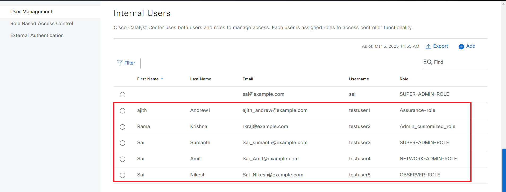
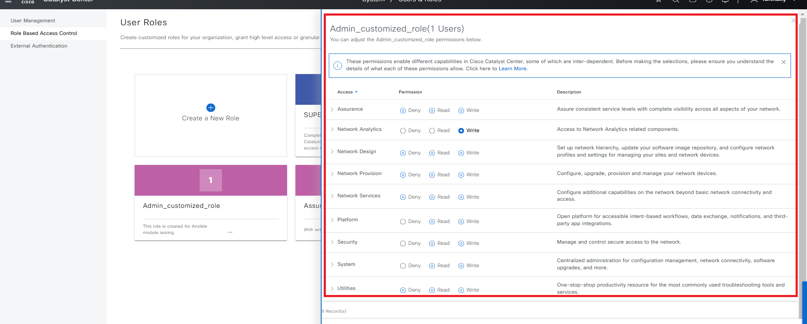
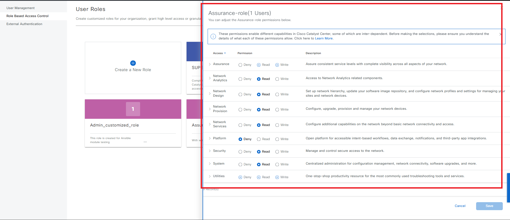
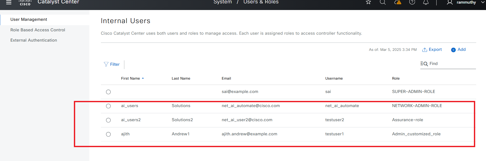
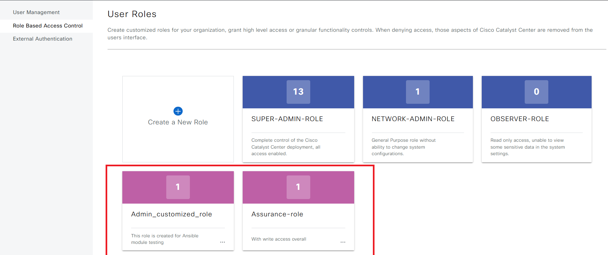
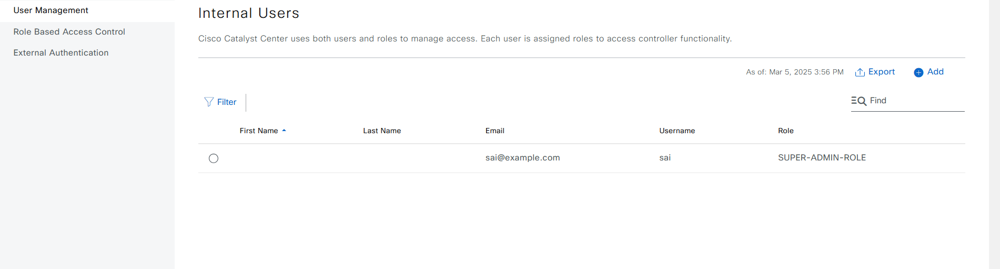
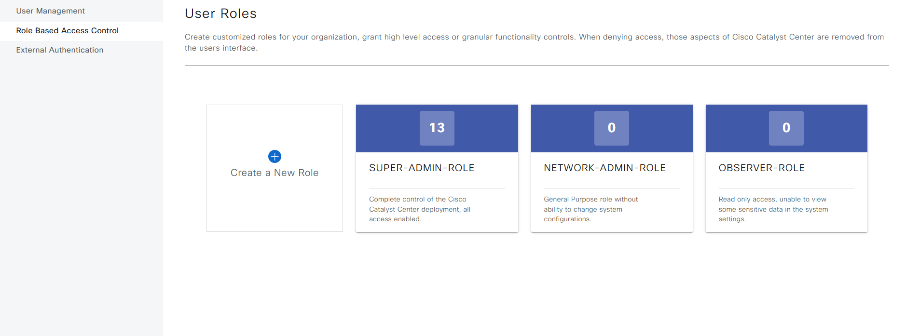

# Users and Roles Playbook:

**Overview**

This Ansible playbook automates both users and roles to manage access. Each user is assigned roles to access controller functionality.

# User Profile Roles and Permissions in Catalyst Center

Catalyst Center utilizes Role-Based Access Control (RBAC) to manage user permissions. User roles determine the actions a user can perform within the system.

## Default Roles

* **SUPER-ADMIN-ROLE:** Grants full access to all Catalyst Center features, including creating custom roles.
* **NETWORK-ADMIN-ROLE:** Provides limited access for network administration tasks.
* **OBSERVER-ROLE:** Restricts access to view-only capabilities.

## Custom Role Creation

Users with the SUPER-ADMIN-ROLE can create custom roles to fine-tune access permissions.

# Procedure

1. ## Prepare your Environment:

**Before starting, ensure the following requirements are met:**

* **Access to Cisco Catalyst Center:** Ensure that User and Role is enabled.
* **Ansible Installation:** Ansible must be installed on the machine managing the automation process.
* **Yamale Python Library:** `yamale` Python library installed (`pip install yamale`)
* **Cisco DNA Ansible Collection:** The cisco.dnac.user_role_workflow_manager module must be available from the Cisco DNA Ansible Collection.
* **dnacentersdk Python SDK:** This SDK is required to interact with Cisco Catalyst Center.

2. ## Configure Host Inventory:

The host_inventory_dnac1/hosts.yml file specifies the connection details (IP address, credentials, etc.) for your Catalyst Center instance.
Make sure the dnac_version in this file matches your actual Catalyst Center version.
##The Sample host_inventory_dnac1/hosts.yml

```bash
catalyst_center_hosts:
    hosts:
        catalyst_center220:
            #(Mandatory) CatC Ip address
            catalyst_center_host:  <DNAC IP Address>
            #(Mandatory) CatC UI admin Password
            catalyst_center_password: <DNAC UI admin Password>
            catalyst_center_port: 443
            catalyst_center_timeout: 60
            #(Mandatory) CatC UI admin username
            catalyst_center_username: <DNAC UI admin username> 
            catalyst_center_verify: false
            #(Mandatory) DNAC Release version
            catalyst_center_version: <DNAC Release version>
            catalyst_center_debug: true
            catalyst_center_log_level: INFO
            catalyst_center_log: true
```
3. ## Define User and Role Data:

The workflows/users_and_roles/vars/users_and_roles_workflow_inputs.yml file stores the user and role details you want to configure.
Refer to the full workflow specification for detailed instructions on the available options and their structure: https://galaxy.ansible.com/ui/repo/published/cisco/dnac/content/module/user_role_workflow_manager/

Use the `user_details` section in your YAML configuration to define the role's username, email, password and role_list.

### Define User and assign it to the default roles:

 **Example:**
```yaml
user_details:
- username: "xxxxxxxxx"
    first_name: "Rama"
    last_name: "Krishna" 
    email: "xxxxxxxxx@example.com"
    password: "Example@0101"
    role_list: ["SUPER-ADMIN-ROLE"]
```

### Define the Custom Role and assign users to the Custom Role:
User Inputs for Users and roles are stored in  workflows/users_and_roles/vars/users_and_roles_workflow_inputs.yml

Use the `role_details` section in your YAML configuration to define the role's name, description, and specific permissions.

### Define Custom Role Details:

   **Example:**
```yaml
role_details:
    - role_name: Admin_customized_role
    description: With write access overall
    assurance:
        - overall: write
        monitoring_and_troubleshooting: read
```
### Assign Users to the Custom Role:

    In the `user_details` section, add users and specify their assigned roles in the role_list.

   **Example:**
```yaml
user_details:
- username: xxxxxxx
    first_name: Rama
    last_name: Krishna
    email: xxxxxxw@example.com
    password: xxxxx@123!45
    role_list: 
    - Admin_customized_role
```
## Validate Your Input:
##Validate user input before running though ansible
```bash
    (pyats)  dnac_ansible_workflows % ./tools/validate.sh -s workflows/users_and_roles/schema/users_and_roles_workflow_schema.yml -d workflows/users_and_roles/vars/users_and_roles_workflow_inputs.yml                             
    workflows/users_and_roles/schema/users_and_roles_workflow_schema.yml
    workflows/users_and_roles/vars/users_and_roles_workflow_inputs.yml
    yamale   -s workflows/users_and_roles/schema/users_and_roles_workflow_schema.yml  workflows/users_and_roles/vars/users_and_roles_workflow_inputs.yml
    Validating /Users/pawansi/dnac_ansible_workflows/workflows/users_and_roles/vars/users_and_roles_workflow_inputs.yml...
    Validation success! 👍
```

Use the provided validation script to ensure your YAML input file adheres to the required schema.

## Execute the Playbook:
Run the create Playbook
```bash
    ansible-playbook -i host_inventory_dnac1/hosts.yml workflows/users_and_roles/playbook/users_and_roles_workflow_playbook.yml --e VARS_FILE_PATH=../vars/users_and_roles_workflow_inputs.yml -vvvv
```
   **Example:**
```yaml
  role_details:

    - role_name: Admin_customized_role
      description: This role is created for Ansible module testing
      assurance:
        - monitoring_and_troubleshooting: write
          monitoring_settings: read
          troubleshooting_tools: deny
      network_analytics:
        - data_access: write
      network_design:
        - advanced_network_settings: deny
          image_repository: deny
          network_hierarchy: deny
          network_profiles: write
          network_settings: write
          virtual_network: read
      network_provision:
        - compliance: deny
          eox: read
          image_update: write
          inventory_management:
            - device_configuration: write
              discovery: deny
              network_device: read
              port_management: write
              topology: write
          license: write
          network_telemetry: write
          pnp: deny
          provision: read
      network_services:
        - app_hosting: deny
          bonjour: write
          stealthwatch: read
          umbrella: deny
      platform:
        - apis: write
          bundles: write
          events: write
          reports: read
      security:
        - group_based_policy: read
          ip_based_access_control: write
          security_advisories: write
      system:
        - machine_reasoning: read
          system_management: write
      utilities:
        - audit_log: read
          event_viewer: deny
          network_reasoner: write
          remote_device_support: read
          scheduler: read
          search: write

    - role_name: Assurance-role
      description: With write access overall
      assurance:
        - overall: write
          monitoring_and_troubleshooting: read

  user_details:
    - username: testuser1
      first_name: ajith
      last_name: Andrew1
      email: ajith_andrew@example.com
      #Password Restrictions: Minimum 8 characters, at least one uppercase letter, one lowercase letter, one number and one special character, no white spaces, no more than 2 identical characters in a row, no more than 3 consecutive characters,
      password: "Password@2025"
      password_update: true
      # Only one role can be assigned to a user at a time. Please select a single role before proceeding
      role_list: 
        - Assurance-role

    - username: testuser2
      first_name: Rama
      last_name: Krishna
      email: rkraj@example.com
      #Password Restrictions: Minimum 8 characters, at least one uppercase letter, one lowercase letter, one number and one special character, no white spaces, no more than 2 identical characters in a row, no more than 3 consecutive characters,
      password: "Password@2025"
      password_update: true
      # Only one role can be assigned to a user at a time. Please select a single role before proceeding
      role_list: 
        - Admin_customized_role

    - username: testuser3
      first_name: Sai
      last_name: Sumanth
      email: Sai_sumanth@example.com
      #Password Restrictions: Minimum 8 characters, at least one uppercase letter, one lowercase letter, one number and one special character, no white spaces, no more than 2 identical characters in a row, no more than 3 consecutive characters,
      password: "Password@2025"
      password_update: true
      # Only one role can be assigned to a user at a time. Please select a single role before proceeding
      role_list: 
        - SUPER-ADMIN-ROLE

    - username: testuser4
      first_name: Sai
      last_name: Amit
      email: Sai_Amit@example.com
      #Password Restrictions: Minimum 8 characters, at least one uppercase letter, one lowercase letter, one number and one special character, no white spaces, no more than 2 identical characters in a row, no more than 3 consecutive characters,
      password: "Password@2025"
      password_update: true
      # Only one role can be assigned to a user at a time. Please select a single role before proceeding
      role_list: 
        - NETWORK-ADMIN-ROLE

    - username: testuser5
      first_name: Sai
      last_name: Nikesh
      email: Sai_Nikesh@example.com
      #Password Restrictions: Minimum 8 characters, at least one uppercase letter, one lowercase letter, one number and one special character, no white spaces, no more than 2 identical characters in a row, no more than 3 consecutive characters,
      password: "Password@2025"
      password_update: true
      # Only one role can be assigned to a user at a time. Please select a single role before proceeding
      role_list: 
        - OBSERVER-ROLE
        
```

Once the users and roles are created, they will be reflected in the Catalyst Center.

Figure 1: User mapping with the default and customized roles.


Figure 2: Customized Role 1 creation with the permissions.


Figure 3: Customized Role 2 creation with the permissions.


## Run the playbook with password in Ansible vault. 
Create your password file in the folder: vaulted_passwords/<filename>
and write your password in yaml format as shown below.

---
test_password: sample123

### Generate and encrypt the password file
```bash
    ansible-vault encrypt vaulted_passwords/<filename>
```

It will prompt for the vault password. Set it up and remember it.
In the Jinja template located in the jinja_template folder, update your vault password file as follows:
passwords_file: ../../../ansible_vault_encrypted_inputs/mypasswordfile.yaml

### Generate the password file alternatively
1. Create vault password hidden file:
~/.vault_secret.sh

## File Content:
```bash
#!/bin/bash
echo password
```
2. Add permissions to execute:
```bash
chmod 711 ~/.vault_secret.sh
```

3. Add to ansible.cfg: 
```bash
vi ~/.ansible.cfg
[defaults]
vault_password_file=~/.vault_secret.sh
```

### Create User and Roles with Jinja template and Vault password
```bash
    dnac_ansible_workflows % ansible-playbook -i host_inventory_dnac1/hosts.yml workflows/users_and_roles/playbook/users_and_roles_workflow_playbook.yml --ask-vault-pass --e VARS_FILE_PATH=../jinja_template/template_users_and_roles_workflow_inputs.j2 -vvvv
```

```jinja_template
---
roles_users_details:
  # Define roles and users to be created or updated, and their permissions
  # Assign users with custom roles
  role_details:
    - role_name: Admin_customized_role
      description: This role is created for Ansible module testing
      assurance:
        - monitoring_and_troubleshooting: write
          monitoring_settings: read
          troubleshooting_tools: deny
      network_analytics:
        - data_access: write
      network_design:
        - advanced_network_settings: deny
          image_repository: deny
          #network_hierarchy: deny
          network_profiles: write
          network_settings: write
          virtual_network: read
      network_provision:
        - compliance: deny
          eox: read
          image_update: write
          inventory_management:
            - device_configuration: write
              discovery: deny
              network_device: read
              port_management: write
              topology: write
          license: write
          network_telemetry: write
          pnp: deny
          provision: read
      network_services:
        - app_hosting: deny
          bonjour: write
          stealthwatch: read
          umbrella: deny
      platform:
        - apis: write
          bundles: write
          events: write
          reports: read
      security:
        - group_based_policy: read
          ip_based_access_control: write
          security_advisories: write
      system:
        - machine_reasoning: read
          system_management: write
      utilities:
        - audit_log: read
          event_viewer: deny
          network_reasoner: write
          remote_device_support: read
          scheduler: read
          search: write
    - role_name: Assurance-role
      description: With write access overall
      assurance:
        - overall: write
          monitoring_and_troubleshooting: read
  user_details:
    - username: testuser1
      first_name: ajith
      last_name: Andrew1
      email: ajith.andrew@example.com
      password: "{{ testuser1_vault_password }}"
      role_list: 
        - Admin_customized_role
    - username: net_ai_automate
      first_name: ai_users
      last_name: Solutions
      email: 'net_ai_automate@cisco.com'
      password: "{{ ai_users_vault_password }}"
      role_list: 
        - NETWORK-ADMIN-ROLE
    - username: testuser2
      first_name: ai_users2
      last_name: Solutions2
      email: 'net_ai_user2@cisco.com'
      password: "{{ testuser2_vault_password }}"
      role_list: 
        - Assurance-role
```
Figure 4: User associated with roles using Jinja template.


Figure 5: Role creation and assigned role to the user with Jinja template.


### ## Deleting the users and the roles with Jinja template and Vault password
```bash
    dnac_ansible_workflows % ansible-playbook -i host_inventory_dnac1/hosts.yml workflows/users_and_roles/playbook/delete_users_and_roles_workflow_playbook.yml  --ask-vault-pass --e VARS_FILE_PATH=../jinja_template/template_users_and_roles_workflow_inputs.j2 -vvvv
```

Figure 6: User deleted using Jinja template.


Figure 7: Role deleted using Jinja template.



## References
*Note: The environment used for the references in the above instructions is as follows:*

```yaml
python: 3.12.0
dnac_version: 2.3.7.6
ansible: 9.9.0
dnacentersdk: 2.8.6
cisco.dnac: 6.30.2
```