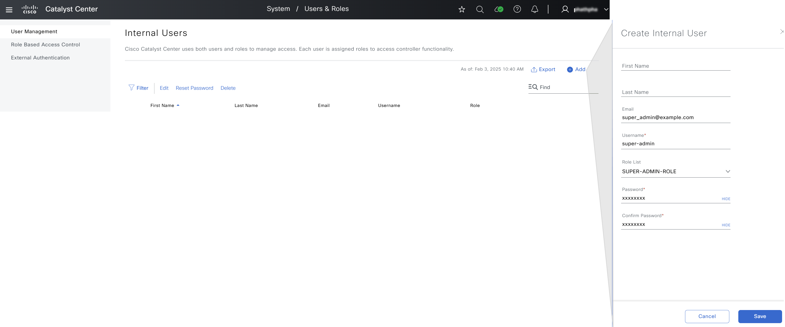

# Ansible User and Role Workflow Manager Guide for Cisco Catalyst Center

This guide provides an overview of how to use the **Ansible playbook** to automate user and role management workflows on **Cisco Catalyst Center**. The playbook utilizes the `cisco.dnac.user_role_workflow_manager` module to interact with Cisco Catalyst Center and perform tasks related to **creating**, **updating**, and **managing** users and roles.

## Overview of User and Role Management Functions

The user and role management workflow in Cisco Catalyst Center focuses on:

- **Creating** and **managing users**
- **Assigning roles**
- Configuring **role-based access control (RBAC)**

The `cisco.dnac.user_role_workflow_manager` module is designed to automate these processes, ensuring **consistency** and reducing **manual effort**.

By leveraging this module, network administrators can efficiently manage users and roles, thus improving **consistency** across the network while minimizing the need for manual tasks.

## User and Role Management Workflow Overview

This diagram illustrates the flow of a user and role management workflow initiated from an **Ansible Playbook**, utilizing the `cisco.dnac.user_role_workflow_manager` module to interact with **Cisco Catalyst Center**.

### Workflow Steps

#### 1. Ansible Playbook
The process begins with the **Ansible Playbook**, which triggers the execution of the `cisco.dnac.user_role_workflow_manager` module. The playbook defines the tasks and configurations needed to manage users and roles.

#### 2. Ansible Module
Within the **Ansible Module**, the `cisco.dnac.user_role_workflow_manager` module interacts with the **Cisco Catalyst Center SDK** to perform tasks such as creating or updating users, assigning roles, and managing role-based access control.

#### 3. Cisco Catalyst Center SDK
The **SDK** acts as an intermediary between the Ansible Module and the **Cisco Catalyst Center APIs**. It handles the construction and execution of API calls to Cisco Catalyst Center.

#### 4. Cisco Catalyst Center APIs
The final step involves direct interaction with the **Cisco Catalyst Center APIs** to perform the user and role management tasks.

## Understanding the Configs for User and Role Management Tasks

- **config_verify** (bool): Set to `True` to verify the Cisco Catalyst Center configuration after applying the playbook configuration. Defaults to `False`.
- **state** (str): The state of Cisco Catalyst Center after module completion. Choices: `["merged", "deleted"]`. Defaults to `merged`.
- **config** (dict): A dictionary containing the configuration details for users or roles. **Required**.

  - **user_details** (list[dict]): Manages the configuration details for user accounts.
    - **username** (str): The username associated with the user account. **Required** for user create, update, and delete operations.
    - **first_name** (str): The first name of the user.
    - **last_name** (str): The last name of the user.
    - **email** (str): The email address of the user (e.g., `syedkhadeerahmed@example.com`). Used to retrieve user data if the 'username' is forgotten. **Required** for user deletion if the 'username' is forgotten.
    - **password** (str): The password for the user account, which must adhere to specified complexity requirements: at least one special character, one capital letter, one lowercase letter, and a minimum length of 8 characters. **Required** for creating a new user account.
    - **password_update** (str): Indicates whether the password should be updated. Set to `true` to trigger a password update. **Required** if a password change is necessary; must be explicitly set to `true` to initiate the update process. Omit this parameter or set it to `false` if no update is needed.
    - **role_list** (list[str]): A list of role names to be assigned to the user. If no role is specified, the default role will be `"OBSERVER-ROLE"`. The role names must match those defined in Cisco Catalyst Center. Default roles include:
      - `"SUPER-ADMIN-ROLE"` (Full access)
      - `"NETWORK-ADMIN-ROLE"` (Full network access)
      - `"OBSERVER-ROLE"` (View-only access)

  - **role_details** (list[dict]): Manages the configuration details for roles.
    - **role_name** (str): The name of the role to be managed.
    - **description** (str): A brief description of the role's purpose and scope.
    - **assurance** (str): Access level for network assurance features. Choices: `["deny", "read", "write"]`. Defaults to `read`.
      - **overall** (str): Access level for all assurance sub-parameters. Choices: `["deny", "read", "write"]`. Defaults to `read`.
      - **monitoring_and_troubleshooting** (str): Access level for monitoring and troubleshooting features. Choices: `["deny", "read", "write"]`. Defaults to `read`.
      - **monitoring_settings** (str): Access level for configuring monitoring settings. Choices: `["deny", "read", "write"]`. Defaults to `read`.
      - **troubleshooting_tools** (str): Access level for troubleshooting tools. Choices: `["deny", "read", "write"]`. Defaults to `read`.

    - **network_analytics** (dict): Access levels for network analytics features.
      - **overall** (str): Access level for all network analytics sub-parameters. Choices: `["deny", "read", "write"]`. Defaults to `read`.
      - **data_access** (str): Access level for query engine APIs and related functions. Choices: `["deny", "read", "write"]`. Defaults to `read`.

    - **network_design** (dict): Access levels for network design features.
      - **overall** (str): Access level for all network design sub-parameters. Choices: `["deny", "read", "write"]`. Defaults to `read`.
      - **advanced_network_settings** (str): Access level for advanced network settings. Choices: `["deny", "read", "write"]`. Defaults to `read`.
      - **image_repository** (str): Access level for managing software images. Choices: `["deny", "read", "write"]`. Defaults to `read`.
      - **network_hierarchy** (str): Access level for defining network hierarchy.
      - **network_profiles** (str): Access level for creating network profiles. Choices: `["deny", "read", "write"]`. Defaults to `read`.
      - **network_settings** (str): Access level for managing network settings. Choices: `["deny", "read", "write"]`. Defaults to `read`.
      - **virtual_network** (str): Access level for managing virtual networks. Choices: `["deny", "read", "write"]`. Defaults to `read`.

    - **network_provision** (dict): Access levels for network provision features.
      - **overall** (str): Access level for all network provision sub-parameters. Choices: `["deny", "read", "write"]`. Defaults to `read`.
      - **compliance** (str): Access level for managing compliance provisioning. Choices: `["deny", "read", "write"]`. Defaults to `read`.
      - **exo** (str): Access level for scanning network for EOL/EOS information. Choices: `["deny", "read", "write"]`. Defaults to `read`.
      - **image_update** (str): Access level for updating software images. Choices: `["deny", "read", "write"]`. Defaults to `read`.
      - **inventory_management** (list[dict]): Access levels for inventory management features.
        - **overall** (str): Access level for all inventory management sub-parameters. Choices: `["deny", "read", "write"]`. Defaults to `read`.
        - **device_configuration** (str): Access level for viewing device configurations. Choices: `["deny", "read", "write"]`. Defaults to `read`.
        - **discovery** (str): Access level for discovering new devices. Choices: `["deny", "read", "write"]`. Defaults to `read`.
        - **network_device** (str): Access level for managing network devices. Choices: `["deny", "read", "write"]`. Defaults to `read`.
        - **port_management** (str): Access level for managing device ports. Choices: `["deny", "read", "write"]`. Defaults to `read`.
        - **topology** (str): Access level for managing network topology. Choices: `["deny", "read", "write"]`. Defaults to `read`.
        - **license** (str): Access level for managing licenses. Choices: `["deny", "read", "write"]`. Defaults to `read`.

      - **network_telemetry** (str): Access level for managing network telemetry. Choices: `["deny", "read", "write"]`. Defaults to `read`.
      - **pnp** (str): Access level for managing Plug and Play. Choices: `["deny", "read", "write"]`. Defaults to `read`.
      - **provision** (str): Access level for provisioning devices. Choices: `["deny", "read", "write"]`. Defaults to `read`.

    - **network_services** (dict): Access levels for network services.
      - **overall** (str): Access level for all network services sub-parameters. Choices: `["deny", "read", "write"]`. Defaults to `read`.
      - **app_hosting** (str): Access level for managing app hosting. Choices: `["deny", "read", "write"]`. Defaults to `read`.
      - **bonjour** (str): Access level for managing Bonjour service. Choices: `["deny", "read", "write"]`. Defaults to `read`.
      - **stealthwatch** (str): Access level for managing Stealthwatch. Choices: `["deny", "read", "write"]`. Defaults to `read`.
      - **umbrella** (str): Access level for managing Umbrella. Choices: `["deny", "read", "write"]`. Defaults to `read`.

    - **platform** (dict): Access levels for platform features.
      - **overall** (str): Access level for all platform sub-parameters. Choices: `["deny", "read", "write"]`. Defaults to `deny`.
      - **apis** (str): Access level for API access. Choices: `["deny", "read", "write"]`. Defaults to `deny`.
      - **bundles** (str): Access level for managing bundles. Choices: `["deny", "read", "write"]`. Defaults to `deny`.
      - **events** (str): Access level for managing events. Choices: `["deny", "read", "write"]`. Defaults to `deny`.
      - **reports** (str): Access level for managing reports. Choices: `["deny", "read", "write"]`. Defaults to `deny`.

    - **security** (dict): Access levels for security features.
      - **overall** (str): Access level for all security sub-parameters. Choices: `["deny", "read", "write"]`. Defaults to `read`.
      - **group_based_policy** (str): Access level for managing group-based policies. Choices: `["deny", "read", "write"]`. Defaults to `read`.
      - **ip_based_access_control** (str): Access level for managing IP-based access control. Choices: `["deny", "read", "write"]`. Defaults to `read`.
      - **security_advisories** (str): Access level for scanning for security advisories. Choices: `["deny", "read", "write"]`. Defaults to `read`.

    - **system** (dict): Access levels for system features.
        - **overall** (str): Access level for all system sub-parameters. Choices: `["deny", "read", "write"]`. Defaults to `read`.
        - **machine_reasoning** (str): Access level for configuring machine reasoning updates. Choices: `["deny", "read", "write"]`. Defaults to `read`.
        - **system_management** (str): Access level for managing system settings. Choices: `["deny", "read", "write"]`. Defaults to `read`. This includes:
            - Cisco Credentials
            - Integrity Verification
            - Device EULA
            - HA (High Availability)
            - Integration Settings
            - Disaster Recovery
            - Debugging Logs
            - Telemetry Collection
            - System EULA
            - IPAM (IP Address Management)
            - vManage Servers
            - Cisco AI Analytics
            - Backup & Restore
            - Data Platform

    - **utilities** (dict): Access levels for utility features.
        - **overall** (str): Access level for all utility sub-parameters. Choices: `["deny", "read", "write"]`. Defaults to `read`.
        - **audit_log** (str): Access level for viewing audit logs. Choices: `["deny", "read", "write"]`. Defaults to `deny`.
        - **event_viewer** (str): Access level for viewing event viewer. Choices: `["deny", "read", "write"]`. Defaults to `read`.
        - **network_reasoner** (str): Access level for allowing Cisco support to troubleshoot network devices. Choices: `["deny", "read", "write"]`. Defaults to `read`.
        - **remote_device_support** (str): Access level for allowing Cisco support to remotely troubleshoot devices. Choices: `["deny", "read", "write"]`. Defaults to `deny`.
        - **scheduler** (str): Access level for managing the scheduler. Choices: `["deny", "read", "write"]`. Defaults to `write`.
        - **search** (str): Access level for using the search functionality. Choices: `["deny", "read", "write"]`. Defaults to `read`.

### Task: Create SUPER-ADMIN-ROLE User

This task creates a user with the **SUPER-ADMIN-ROLE** in **Cisco Catalyst Center**.

#### Mapping Config to UI Actions

The `config` parameter within this task corresponds to the **System > Users & Roles** action in the Cisco Catalyst Center UI. It initiates the creation of a user with the specified role.



```yaml
      user_details:
        - username: super-admin
          email: "super_admin@example.com"
          password: xxxx
          role_list: ["SUPER-ADMIN-ROLE"]
```
### Task: Create NETWORK-ADMIN-ROLE User

This task creates a user with the **NETWORK-ADMIN-ROLE** in **Cisco Catalyst Center**.

```yaml
      user_details:
        - username: network-admin
          email: "network_admin@example.com"
          password: xxxx
          role_list: ["NETWORK-ADMIN-ROLE"]
```
### Task: Create OBSERVER-ROLE User

This task creates a user with the **OBSERVER-ROLE** in **Cisco Catalyst Center**.

```yaml
      user_details:
        - username: observer
          email: "observer@example.com"
          password: xxxx
          role_list: ["OBSERVER-ROLE"]
```

### Task: Create Default User

This task creates a user with the **Default** in **Cisco Catalyst Center**.

```yaml
      user_details:
        - username: default
          email: "default@example.com"
          password: xxxx
```

### Task: Create Multiple User

This task creates a user with the **Multiple** in **Cisco Catalyst Center**.

```yaml
- name: Create user
      user_details:
        - username: Admin_multiple
          email: "super_admin_multiple@example.com"
          password: xxxx
          role_list: ["SUPER-ADMIN-ROLE"]
        - username: Network-admin_multiple
          email: "net_admin_multiple@example.com"
          password: xxxx
          role_list: ["NETWORK-ADMIN-ROLE"]
        - username: Observer_multiple
          email: "observer_multiple@example.com"
          password: xxxx
          role_list: ["OBSERVER-ROLE"]
        - username: Guest
          email: "guest@example.com"
          password: xxxx
          role_list: ["SUPER-ADMIN-ROLE","NETWORK-ADMIN-ROLE","OBSERVER-ROLE"]
```

## Default Roles

* **SUPER-ADMIN-ROLE:** Grants full access to all Catalyst Center features, including creating custom roles.
* **NETWORK-ADMIN-ROLE:** Provides limited access for network administration tasks.
* **OBSERVER-ROLE:** Restricts access to view-only capabilities.

## Custom Role Creation

Users with the SUPER-ADMIN-ROLE can create custom roles to fine-tune access permissions.

# Procedure
1. ## Prepare your Ansible environment:

Install Ansible if you haven't already
Ensure you have network connectivity to your Catalyst Center instance.
Checkout the project and playbooks: git@github.com:cisco-en-programmability/catalyst-center-ansible-iac.git

2. ## Configure Host Inventory:

The host_inventory_dnac1/hosts.yml file specifies the connection details (IP address, credentials, etc.) for your Catalyst Center instance.
Make sure the dnac_version in this file matches your actual Catalyst Center version.
##The Sample host_inventory_dnac1/hosts.yml

```bash
catalyst_center_hosts:
    hosts:
        catalyst_center220:
            dnac_host: xx.xx.xx.xx.
            dnac_password: XXXXXXXX
            dnac_port: 443
            dnac_timeout: 60
            dnac_username: admin
            dnac_verify: false
            dnac_version: 2.3.7.6
            dnac_debug: true
            dnac_log_level: INFO
            dnac_log: true
```
3. ## Define User and Role Data:
The workflows/users_and_roles/vars/users_and_roles_workflow_inputs.yml file stores the user and role details you want to configure.
Refer to the full workflow specification for detailed instructions on the available options and their structure: https://galaxy.ansible.com/ui/repo/published/cisco/dnac/content/module/user_role_workflow_manager/
### Define the Custom Role
User Inputs for Users and roles are stored in  workflows/users_and_roles/vars/users_and_roles_workflow_inputs.yml

Use the `role_details` section in your YAML configuration to define the role's name, description, and specific permissions.
   **Example:**
```yaml
role_details:
    - role_name: Assurance-role
    description: With write access overall
    assurance:
        - overall: write
        monitoring_and_troubleshooting: read
```
assign roles to the users
### Assign Users to the Role
    In the user_details section, add users and specify their assigned roles in the role_list.
   **Example:**
```yaml
user_details:
- username: xxxxxxx
    first_name: Pawan
    last_name: Singh
    email: xxxxxxw@example.com
    password: xxxxx@123!45
    role_list: 
    - Admin_customized_role
    - Assurance-role
- username: "ajithandrewj"
    first_name: "ajith"
    last_name: "andrew"
    email: "ajith.andrew@example.com"
    role_list: ["SUPER-ADMIN-ROLE"]
```


## Validate Your Input:
##Validate user input before running though ansible
```bash
    (pyats)  dnac_ansible_workflows % ./tools/validate.sh -s workflows/users_and_roles/schema/users_and_roles_workflow_schema.yml -d workflows/users_and_roles/vars/users_and_roles_workflow_inputs.yml                             
    workflows/users_and_roles/schema/users_and_roles_workflow_schema.yml
    workflows/users_and_roles/vars/users_and_roles_workflow_inputs.yml
    yamale   -s workflows/users_and_roles/schema/users_and_roles_workflow_schema.yml  workflows/users_and_roles/vars/users_and_roles_workflow_inputs.yml
    Validating /Users/pawansi/dnac_ansible_workflows/workflows/users_and_roles/vars/users_and_roles_workflow_inputs.yml...
    Validation success! 👍
```

Use the provided validation script to ensure your YAML input file adheres to the required schema.
## Execute the Playbook:
Run the create Playbook
```bash
    ansible-playbook -i host_inventory_dnac1/hosts.yml workflows/users_and_roles/playbook/users_and_roles_workflow_playbook.yml --e VARS_FILE_PATH=../vars/users_and_roles_workflow_inputs.yml -vvvv
```
Post the user and the roles will start reflecting in the catalyst center.

## Running playbook with passowrd in Ansible vault. 
Create your password file in folder: valted_passwords/<filename>
write your password in yaml format there example

---
test_password: sample123

### Generate encrypt the password file
```bash
    ansible-vault encrypt valted_passwords/<filename>
```
It will ask valt password, setup and remember it
in jinja template in jinja_template folder update your valt passowrd file
passwords_file: ../../../valted_passwords/mypasswordfile.yaml

### Run playbook with jinja template and Valt password
```bash
    dnac_ansible_workflows % ansible-playbook -i host_inventory_dnac1/hosts.yml workflows/users_and_roles/playbook/users_and_roles_workflow_playbook.yml --ask-vault-pass --e VARS_FILE_PATH=../jinja_template/template_users_and_roles_workflow_inputs.j2 -vvvv
```
it will prompt for valt password. Enter the val password which was used to encrypt the password. 
Alternatively:
1. Create valt password hidden file:
~/.vault_secret.sh

## file content:
```bash
#!/bin/bash
echo password
```
2. Add permissions to execute:
```bash
chmod 711 ~/.vault_secret.sh
```

3. Add to ansible.cfg: 
```bash
vi ~/.ansible.cfg
[defaults]
vault_password_file=~/.vault_secret.sh
```
4. Execute:
```bash
ansible-playbook -i host_inventory_dnac1/hosts.yml workflows/users_and_roles/playbook/users_and_roles_workflow_playbook.yml --e VARS_FILE_PATH=../vars/users_and_roles_workflow_jinja_input.yml  -vvvv
```

## Deleting the users and the roles
Playbook can be used to delete roles and users
Run the delete Playbook
```bash
    ansible-playbook -i host_inventory_dnac1/hosts.yml workflows/users_and_roles/playbook/delete_users_and_roles_workflow_playbook.yml --e VARS_FILE_PATH=../vars/users_and_roles_workflow_inputs.yml -vvvv
```
Roles and Users will get deleted from the Catalyst Center
