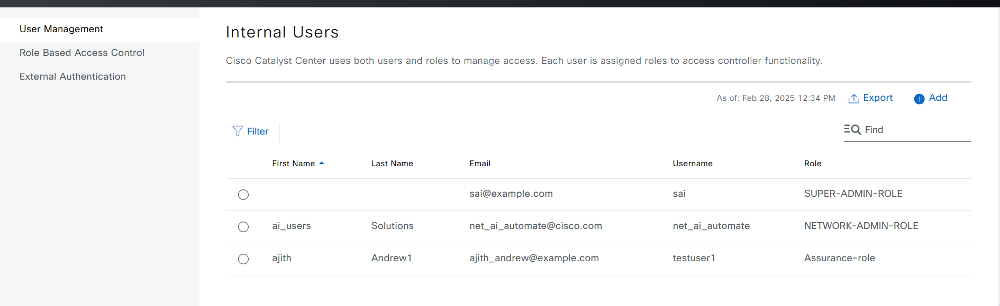

# User and Role Ansible workflow:

**OVERVIEW**

This Ansible playbook automates both users and roles to manage access. Each user is assigned roles to access controller functionality.

# User Profile Roles and Permissions in Catalyst Center

Catalyst Center utilizes Role-Based Access Control (RBAC) to manage user permissions. User roles determine the actions a user can perform within the system.

## Default Roles

* **SUPER-ADMIN-ROLE:** Grants full access to all Catalyst Center features, including creating custom roles.
* **NETWORK-ADMIN-ROLE:** Provides limited access for network administration tasks.
* **OBSERVER-ROLE:** Restricts access to view-only capabilities.

## Custom Role Creation

Users with the SUPER-ADMIN-ROLE can create custom roles to fine-tune access permissions.

# Procedure

1. ## Prepare your Ansible environment:

**Before starting, ensure the following requirements are met:**

* **Access to Cisco Catalyst Center (DNAC):** Ensure that User and Role is enabled.
* **Ansible Installation:** Ansible must be installed on the machine managing the automation process.
* **Yamale Python Library:** `yamale` Python library installed (`pip install yamale`)
* **Cisco DNA Ansible Collection:** The cisco.dnac.user_role_workflow_manager module must be available from the Cisco DNA Ansible Collection.
* **dnacentersdk Python SDK:** This SDK is required to interact with Cisco Catalyst Center.

2. ## Configure Host Inventory:

The host_inventory_dnac1/hosts.yml file specifies the connection details (IP address, credentials, etc.) for your Catalyst Center instance.
Make sure the dnac_version in this file matches your actual Catalyst Center version.
##The Sample host_inventory_dnac1/hosts.yml

```bash
catalyst_center_hosts:
    hosts:
        catalyst_center220:
            catalyst_center_host: xx.xx.xx.xx.
            catalyst_center_password: XXXXXXXX
            catalyst_center_port: 443
            catalyst_center_timeout: 60
            catalyst_center_username: admin
            catalyst_center_verify: false
            catalyst_center_version: 2.3.7.6
            catalyst_center_debug: true
            catalyst_center_log_level: INFO
            catalyst_center_log: true
```
3. ## Define User and Role Data:

The workflows/users_and_roles/vars/users_and_roles_workflow_inputs.yml file stores the user and role details you want to configure.
Refer to the full workflow specification for detailed instructions on the available options and their structure: https://galaxy.ansible.com/ui/repo/published/cisco/dnac/content/module/user_role_workflow_manager/

Use the `user_details` section in your YAML configuration to define the role's username, email, password and role_list.

### Define User and assign it to the default roles:

 **Example:**
```yaml
user_details:
- username: "xxxxxxxxx"
    first_name: "Rama"
    last_name: "Krishna" 
    email: "xxxxxxxxx@example.com"
    password: "Example@0101"
    role_list: ["SUPER-ADMIN-ROLE"]
```

### Define the Custom Role and assign users to the Custom Role:
User Inputs for Users and roles are stored in  workflows/users_and_roles/vars/users_and_roles_workflow_inputs.yml

Use the `role_details` section in your YAML configuration to define the role's name, description, and specific permissions.

### Define Custom Role Details:

   **Example:**
```yaml
role_details:
    - role_name: Admin_customized_role
    description: With write access overall
    assurance:
        - overall: write
        monitoring_and_troubleshooting: read
```
### Assign Users to the Role:

    In the user_details section, add users and specify their assigned roles in the role_list.

   **Example:**
```yaml
user_details:
- username: xxxxxxx
    first_name: Rama
    last_name: Krishna
    email: xxxxxxw@example.com
    password: xxxxx@123!45
    role_list: 
    - Admin_customized_role
```
## Validate Your Input:
##Validate user input before running though ansible
```bash
    (pyats)  dnac_ansible_workflows % ./tools/validate.sh -s workflows/users_and_roles/schema/users_and_roles_workflow_schema.yml -d workflows/users_and_roles/vars/users_and_roles_workflow_inputs.yml                             
    workflows/users_and_roles/schema/users_and_roles_workflow_schema.yml
    workflows/users_and_roles/vars/users_and_roles_workflow_inputs.yml
    yamale   -s workflows/users_and_roles/schema/users_and_roles_workflow_schema.yml  workflows/users_and_roles/vars/users_and_roles_workflow_inputs.yml
    Validating /Users/pawansi/dnac_ansible_workflows/workflows/users_and_roles/vars/users_and_roles_workflow_inputs.yml...
    Validation success! 👍
```

Use the provided validation script to ensure your YAML input file adheres to the required schema.

## Execute the Playbook:
Run the create Playbook
```bash
    ansible-playbook -i host_inventory_dnac1/hosts.yml workflows/users_and_roles/playbook/users_and_roles_workflow_playbook.yml --e VARS_FILE_PATH=../vars/users_and_roles_workflow_inputs.yml -vvvv
```
Post the user and the roles will start reflecting in the catalyst center.

Figure 1: User creation with normal template.


Figure 2: Role creation and assigned role to the user with normal template.


## Running playbook with passowrd in Ansible vault. 
Create your password file in folder: valted_passwords/<filename>
write your password in yaml format there example

---
test_password: sample123

### Generate encrypt the password file
```bash
    ansible-vault encrypt valted_passwords/<filename>
```
It will ask valt password, setup and remember it
in jinja template in jinja_template folder update your valt passowrd file
passwords_file: ../../../valted_passwords/mypasswordfile.yaml

### Run playbook with jinja template and Valt password
```bash
    dnac_ansible_workflows % ansible-playbook -i host_inventory_dnac1/hosts.yml workflows/users_and_roles/playbook/users_and_roles_workflow_playbook.yml --ask-vault-pass --e VARS_FILE_PATH=../jinja_template/template_users_and_roles_workflow_inputs.j2 -vvvv
```
Figure 3: User creation with jinja template.


Figure 4: Role creation and assigned role to the user with jinja template.


it will prompt for valt password. Enter the val password which was used to encrypt the password. 
Alternatively:
1. Create valt password hidden file:
~/.vault_secret.sh

## file content:
```bash
#!/bin/bash
echo password
```
2. Add permissions to execute:
```bash
chmod 711 ~/.vault_secret.sh
```

3. Add to ansible.cfg: 
```bash
vi ~/.ansible.cfg
[defaults]
vault_password_file=~/.vault_secret.sh
```
4. Execute:
```bash
ansible-playbook -i host_inventory_dnac1/hosts.yml workflows/users_and_roles/playbook/users_and_roles_workflow_playbook.yml --e VARS_FILE_PATH=../vars/users_and_roles_workflow_jinja_input.yml  -vvvv
```

## Deleting the users and the roles
Playbook can be used to delete roles and users
Run the delete Playbook
```bash
    ansible-playbook -i host_inventory_dnac1/hosts.yml workflows/users_and_roles/playbook/delete_users_and_roles_workflow_playbook.yml --e VARS_FILE_PATH=../vars/users_and_roles_workflow_inputs.yml -vvvv
```
Roles and Users will get deleted from the Catalyst Center

## Referances
  \* Note: The environment is used for the references in the above instructions.
  ```
  ansible: 10.7.0
  ansible-core: 2.17.7
  ansible-runner: 2.4.0

  dnacentersdk: 2.9.4
  cisco.dnac: 6.30.0
  ansible.utils: 5.1.2
