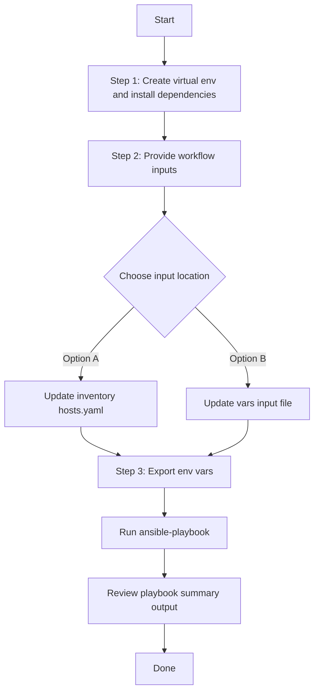

# Wired Campus Automation Config Generator

## Table of Contents

- [User Flow (3 Steps)](#user-flow-3-steps)

- [Overview](#overview)
- [Key Capabilities](#key-capabilities)
- [Workflow Structure](#workflow-structure)
- [Prerequisites](#prerequisites)
- [Input Data Model](#input-data-model)
- [Operational Behavior](#operational-behavior)
- [Quick Start](#quick-start)
- [Input Examples](#input-examples)
- [Generated Output](#generated-output)
- [Using Generated Output with Workflow Manager](#using-generated-output-with-workflow-manager)
- [Troubleshooting](#troubleshooting)
- [Best Practices](#best-practices)
- [References](#references)

---

## Overview

This workflow exports existing wired campus automation (layer2) configurations from Cisco Catalyst Center and generates YAML files compatible with:

- `cisco.catalystcenter.wired_campus_automation_workflow_manager`

It is designed for brownfield operations where layer2 configurations already exist and you need reusable, versionable infrastructure-as-code artifacts.

---

## Key Capabilities

- Generates workflow-manager-ready YAML from live Catalyst Center data.
- Supports full export (`generate_all_configurations: true`) and selective export with device and feature filters.
- Extracts layer2 features: VLANs, CDP, LLDP, STP, VTP, DHCP Snooping, IGMP Snooping, MLD Snooping, Authentication, Logical Ports, and Port Configuration.
- Supports device targeting by IP address, hostname, or serial number.
- Supports VLAN-specific and interface-specific filtering for granular extraction.
- Supports deterministic output path via `file_path` and dynamic pathing via `{{ playbook_dir }}`.
- Keeps output user-independent (no hardcoded `/ws/<username>` path required).

---

## Workflow Structure

```text
wired_campus_automation_config_generator/
├── README.md
├── playbook/
│   └── wired_campus_automation_config_generator.yml
├── schema/
│   └── wired_campus_automation_config_generator_schema.yml
└── vars/
    └── wired_campus_automation_config_generator_inputs.yml
```

---

## Prerequisites

### Software

| Component | Recommended |
|---|---|
| Cisco Catalyst Center | 2.3.7.9+ |
| Python | 3.9+ |
| Ansible | 2.13+ |
| catalystcentersdk | 2.10.10+ |

### Required packages

```bash
ansible-galaxy collection install cisco.catalystcenter    # >= 6.40.0
ansible-galaxy collection install ansible.utils
pip install catalystcentersdk
pip install yamale
```

### Access requirements

- Valid Catalyst Center credentials.
- Network access from Ansible control node to Catalyst Center API.
- Existing layer2 configurations deployed on supported devices.

### Supported devices

- Catalyst 9000 series switches (9200/9300/9350/9400/9500/9600)
- IE series switches (IE3400/IE3400H/IE3500/IE9300)
- IOS-XE 17.3 or higher

---

## Input Data Model

Top-level variable:

- `wired_campus_automation_config` (list, required)

Each list item supports:

| Parameter | Type | Required | Description |
|---|---|---|---|
| `generate_all_configurations` | bool | No | When `true`, exports all layer2 configurations from all managed devices (full-discovery mode). Filters are ignored. |
| `file_path` | str | No | Output file path for generated YAML. If omitted, module auto-generates a timestamped filename. |
| `global_filters` | dict | No | Device targeting filters (ignored when `generate_all_configurations` is `true`). |
| `component_specific_filters` | dict | No | Layer2 feature and detail filters (ignored when `generate_all_configurations` is `true`). |

`global_filters` supports:

| Parameter | Type | Required | Description |
|---|---|---|---|
| `ip_address_list` | list[str] | No | Device IP addresses (highest priority). |
| `serial_number_list` | list[str] | No | Device serial numbers (medium priority, used if `ip_address_list` not provided). |
| `hostname_list` | list[str] | No | Device hostnames (lowest priority, used if neither `ip_address_list` nor `serial_number_list` provided). |

`component_specific_filters` supports:

| Parameter | Type | Required | Description |
|---|---|---|---|
| `components_list` | list[str] | No | Supported value: `layer2_configurations` |
| `layer2_features` | list[str] | No | Features to extract: `vlans`, `cdp`, `lldp`, `stp`, `vtp`, `dhcp_snooping`, `igmp_snooping`, `mld_snooping`, `authentication`, `logical_ports`, `port_configuration` |
| `vlans` | dict | No | VLAN-specific filter with `vlan_ids_list` |
| `port_configuration` | dict | No | Port-specific filter with `interface_names_list` |

---

## Operational Behavior

1. The playbook loads input from `VARS_FILE_PATH` (if provided) or falls back to inventory/host variables.
2. It loops each item in `wired_campus_automation_config`.
3. For each item, the playbook passes the item directly as a single-element list to the module's `config` parameter.
4. If `generate_all_configurations: true`, the module discovers all managed devices and extracts all supported layer2 configurations.
5. If `global_filters` and/or `component_specific_filters` are provided, the module targets specific devices and features.
6. If `file_path` is set, output is written exactly there. If omitted, module auto-generates:
   `wired_campus_automation_playbook_config_<YYYY-MM-DD_HH-MM-SS>.yml`
7. Generated file uses top-level key `config`, ready for workflow manager consumption.

> **Note:** This module only overwrites output files. There is no append mode.

---

## Quick Start

### 1. Prepare inventory

Configure Catalyst Center credentials in your inventory, for example:

```yaml
catalyst_center_hosts:
  hosts:
    catalyst_center_primary:
      catalyst_center_host: 10.10.10.10
      catalyst_center_username: admin
      catalyst_center_password: "password"
      catalyst_center_verify: false
      catalyst_center_port: 443
      catalyst_center_version: "2.3.7.9"
      catalyst_center_debug: false
      catalyst_center_log: true
      catalyst_center_log_level: "INFO"
```

### 2. Update input variables

Edit:

- `workflows/wired_campus_automation_config_generator/vars/wired_campus_automation_config_generator_inputs.yml`

### 3. Validate input schema

```bash
./tools/schemavalidation.sh \
  -s workflows/wired_campus_automation_config_generator/schema/wired_campus_automation_config_generator_schema.yml \
  -d workflows/wired_campus_automation_config_generator/vars/wired_campus_automation_config_generator_inputs.yml
```

### 4. Execute workflow

The playbook supports two input methods:

#### Option A: Vars file input (recommended for version-controlled configs)

```bash
ansible-playbook -i inventory/demo_lab/hosts.yaml \
  workflows/wired_campus_automation_config_generator/playbook/wired_campus_automation_config_generator.yml \
  --extra-vars VARS_FILE_PATH=./workflows/wired_campus_automation_config_generator/vars/wired_campus_automation_config_generator_inputs.yml \
  -vvvv
```

#### Option B: Inventory file input

Omit `VARS_FILE_PATH` and define `wired_campus_automation_config` directly as a host variable in your inventory file or in `host_vars`/`group_vars`.

**Example inventory snippet (`inventory/demo_lab/hosts.yaml`):**

```yaml
catalyst_center_hosts:
  hosts:
    catalyst_center220:
      catalyst_center_host: "{{ lookup('ansible.builtin.env', 'HOSTIP') }}"
      catalyst_center_password: "{{ lookup('ansible.builtin.env', 'CATALYST_CENTER_PASSWORD') }}"
      catalyst_center_port: 443
      catalyst_center_username: "{{ lookup('ansible.builtin.env', 'CATALYST_CENTER_USERNAME') }}"
      catalyst_center_verify: false
      catalyst_center_version: 2.3.7.9

      # Workflow data defined as host variables
      wired_campus_automation_config:
        - generate_all_configurations: true
          file_path: "{{ playbook_dir }}/wired_campus_automation_playbook_config_all.yml"
```

Then run **without** `VARS_FILE_PATH`:

```bash
ansible-playbook -i inventory/demo_lab/hosts.yaml \
  workflows/wired_campus_automation_config_generator/playbook/wired_campus_automation_config_generator.yml \
  -vvvv
```

The playbook auto-detects the input source and prints it at the start:
- `Input source: vars file <path>` when using Option A
- `Input source: inventory variables (VARS_FILE_PATH not provided)` when using Option B

---

## Input Examples

### Example 1: Export all layer2 configurations

```yaml
wired_campus_automation_config:
  - generate_all_configurations: true
    file_path: "{{ playbook_dir }}/wired_campus_automation_playbook_config_all.yml"
```

### Example 2: Export by device IP addresses

```yaml
wired_campus_automation_config:
  - file_path: "{{ playbook_dir }}/wired_campus_automation_playbook_config_by_ip.yml"
    global_filters:
      ip_address_list:
        - "192.168.1.10"
        - "192.168.1.11"
    component_specific_filters:
      components_list:
        - layer2_configurations
```

### Example 3: Export specific layer2 features by hostname

```yaml
wired_campus_automation_config:
  - file_path: "{{ playbook_dir }}/wired_campus_automation_playbook_config_by_hostname.yml"
    global_filters:
      hostname_list:
        - "access-switch-floor1.lab.com"
        - "core-switch-01.lab.com"
    component_specific_filters:
      components_list:
        - layer2_configurations
      layer2_features:
        - vlans
        - stp
        - cdp
        - lldp
```

### Example 4: Export specific VLANs by serial number

```yaml
wired_campus_automation_config:
  - file_path: "{{ playbook_dir }}/wired_campus_automation_playbook_config_vlans.yml"
    global_filters:
      serial_number_list:
        - "FCW2140L05Y"
        - "FCW2140L06Z"
    component_specific_filters:
      components_list:
        - layer2_configurations
      layer2_features:
        - vlans
      vlans:
        vlan_ids_list:
          - "10"
          - "20"
          - "100"
```

### Example 5: Export specific port configurations

```yaml
wired_campus_automation_config:
  - file_path: "{{ playbook_dir }}/wired_campus_automation_playbook_config_ports.yml"
    global_filters:
      ip_address_list:
        - "10.1.1.5"
    component_specific_filters:
      components_list:
        - layer2_configurations
      layer2_features:
        - port_configuration
      port_configuration:
        interface_names_list:
          - "GigabitEthernet1/0/1"
          - "GigabitEthernet1/0/2"
          - "TenGigabitEthernet1/0/1"
```

### Example 6: Auto-generated timestamp filename

```yaml
wired_campus_automation_config:
  - generate_all_configurations: true
```

---

## Generated Output

Each generated file contains a top-level `config` key. Example structure:

```yaml
---
config:
  - layer2_configurations:
      hostname: "access-switch-floor1.lab.com"
      management_ip_address: "192.168.1.10"
      vlans:
        - vlan_id: 10
          vlan_name: "DATA_VLAN"
        - vlan_id: 20
          vlan_name: "VOICE_VLAN"
      cdp:
        global_cdp: true
      stp:
        stp_mode: "rapid-pvst"
      port_configuration:
        - interface_name: "GigabitEthernet1/0/1"
          description: "Access Port - Floor 1"
          switchport_mode: "access"
          access_vlan: 10
```

In this workflow, sample paths use `{{ playbook_dir }}` so output remains portable across users and workspaces.

---

## Using Generated Output with Workflow Manager

Use the exported file directly as `vars_files`, then pass `config` to the manager module.

```yaml
---
- name: Apply generated wired campus automation configuration
  hosts: catalyst_center_hosts
  connection: local
  gather_facts: no

  vars_files:
    - "{{ playbook_dir }}/wired_campus_automation_playbook_config_all.yml"

  tasks:
    - name: Apply layer2 configuration
      cisco.catalystcenter.wired_campus_automation_workflow_manager:
        catalystcenter_host: "{{ catalyst_center_host }}"
        catalystcenter_username: "{{ catalyst_center_username }}"
        catalystcenter_password: "{{ catalyst_center_password }}"
        catalystcenter_verify: "{{ catalyst_center_verify }}"
        catalystcenter_port: "{{ catalyst_center_port }}"
        catalystcenter_version: "{{ catalyst_center_version }}"
        state: merged
        config: "{{ config }}"
```

---

## Troubleshooting

| Symptom | Likely Cause | Resolution |
|---|---|---|
| File appears in unexpected directory | `file_path` omitted | Set explicit `file_path` (recommended: `{{ playbook_dir }}/...`) |
| No data exported | Filters too narrow or device not found | Validate IP/hostname/serial against Catalyst Center inventory |
| API errors for some devices | Device does not support layer2 features | Use `global_filters` to target only Catalyst 9000 or IE series switches |
| Empty configuration for a feature | Feature not configured on target device | Verify the feature is configured on the device in Catalyst Center |
| Schema validation fails | Typo or wrong YAML structure | Re-run `./tools/validate.sh` and fix reported field |
| Module fails on version check | Catalyst Center < 2.3.7.9 | Upgrade Catalyst Center or use compatible workflow |
| `yamale: command not found` | Missing validation dependency | `pip install yamale` in your active environment |
| `generate_all_configurations` with API errors | Non-layer2 devices discovered | Use specific device filters to target only layer2-capable devices |

---

## Best Practices

- Use `global_filters` with specific device lists in production to avoid extracting from unsupported devices.
- Keep one output file per intent (all/device-group/feature-set) for cleaner Git diffs and easier rollback.
- Use `{{ playbook_dir }}` in `file_path` for user-independent, portable paths.
- Start with `generate_all_configurations: true` for initial brownfield discovery, then refine with filters.
- Commit generated files that represent intended state, not every ad-hoc run.
- Enable Catalyst Center logging (`catalyst_center_log: true`) when troubleshooting.
- Target only Catalyst 9000 and IE series switches running IOS-XE 17.3+ for reliable results.

---

## References

- Workflow playbook:
  `workflows/wired_campus_automation_config_generator/playbook/wired_campus_automation_config_generator.yml`
- Input file:
  `workflows/wired_campus_automation_config_generator/vars/wired_campus_automation_config_generator_inputs.yml`
- Schema:
  `workflows/wired_campus_automation_config_generator/schema/wired_campus_automation_config_generator_schema.yml`
- Target module:
  `cisco.catalystcenter.wired_campus_automation_playbook_config_generator`
- Consumer module:
  `cisco.catalystcenter.wired_campus_automation_workflow_manager`

## Workflow Steps
## User Flow (3 Steps)



### Installation and Run (Aligned)

1. Create and activate a Python virtual environment, then install dependencies.

```bash
python3 -m venv .venv
source .venv/bin/activate
pip install -r requirements.txt
ansible-galaxy collection install cisco.catalystcenter --force
```

2. Provide workflow inputs in either inventory (`inventory/demo_lab/hosts.yaml`) or the workflow `vars/` file.

3. Export Catalyst Center environment variables and run the playbook.

```bash
export HOSTIP=<catalyst-center-ip-or-fqdn>
export CATALYST_CENTER_USERNAME=<username>
export CATALYST_CENTER_PASSWORD='<password>'
ansible-playbook -i ./inventory/demo_lab/hosts.yaml ./workflows/wired_campus_automation_config_generator/playbook/wired_campus_automation_config_generator.yml -vvvv
```
