# Cisco Catalyst Center Wireless Design Playbook

This playbook automates the management of wireless network designs in Cisco Catalyst Center, covering SSIDs, interfaces, power profiles, AP profiles, RF profiles, and anchor groups. It streamlines configuration tasks and ensures consistency across deployments.

## Key Features

- **Wireless SSID**:
  - Add/Edit/Delete single, multiple, or bulk Enterprise and Guest SSIDs.
- **Wireless RF Profile**:
  - Add/Edit/Delete single, multiple, or bulk RF Profiles.
  - Mark a default RF Profile.
- **Wireless Interfaces**:
  - Add/Edit/Delete single, multiple, or bulk Interfaces.
- **Power Profile**:
  - Add/Edit/Delete single, multiple, or bulk Power Profiles.
- **AP Profile**:
  - Add/Edit/Delete single, multiple, or bulk AP Profiles for IOS-XE.
  - Manage Calendar Power Profiles for AP Profiles.
- **Anchor Groups**:
  - Add/Edit/Delete single, multiple, or bulk Anchor Groups.

**Version Added**: 6.33.2

## Workflow Steps

### Step 1: Install and Generate Inventory

1. **Install Ansible**: Follow the [official Ansible documentation](https://docs.ansible.com/ansible/latest/installation_guide/intro_installation.html) for installation.
2. **Install Cisco Catalyst Center Collection**:
   ```bash
   ansible-galaxy collection install cisco.dnac
   ```
3. **Generate Inventory**: Create an Ansible inventory file (e.g., `inventory.yml`) with your Cisco Catalyst Center details.
   ```yaml
   catalyst_center_hosts:
     hosts:
       your_catalyst_center_instance_name:
         catalyst_center_host: xx.xx.xx.xx
         catalyst_center_password: XXXXXXXX
         catalyst_center_port: 443
         catalyst_center_timeout: 60
         catalyst_center_username: admin
         catalyst_center_verify: false  # Set to true for production
         catalyst_center_version: 2.3.7.9
         catalyst_center_debug: true
         catalyst_center_log_level: INFO
         catalyst_center_log: true
   ```

### Step 2: Define Inputs and Validate

1. **Define Input Variables**: Create variable files (e.g., `vars/wireless_design_inputs.yml`) to specify the desired wireless design state for creation, update, or deletion.

## Schema for Wireless Network Profiles

This schema defines the structure of the input file for configuring wireless designs in Cisco Catalyst Center.

### Wireless Design Details

| Parameter                | Type | Required | Default Value | Description                                                                 |
|--------------------------|------|----------|---------------|-----------------------------------------------------------------------------|
| `wireless_design_details`| List | No       | N/A           | List of wireless design elements (up to 1000). Includes `wireless_design_details_type`. |

#### Wireless Design Components

| Parameter                  | Type | Required | Default Value | Description                                                                 |
|----------------------------|------|----------|---------------|-----------------------------------------------------------------------------|
| `ssids`                    | List | No       | N/A           | List of SSIDs (up to 1000). Includes `ssids_type`.                          |
| `interfaces`               | List | No       | N/A           | List of interfaces (up to 1000). Includes `interfaces_type`.                |
| `power_profiles`           | List | No       | N/A           | List of power profiles (up to 1000). Includes `power_profiles_type`.        |
| `access_point_profiles`    | List | No       | N/A           | List of AP profiles (up to 1000). Includes `ap_profiles_type`.             |
| `radio_frequency_profiles` | List | No       | N/A           | List of RF profiles (up to 1000). Includes `rf_profiles_type`.             |
| `anchor_groups`            | List | No       | N/A           | List of anchor groups (up to 1000). Includes `anchor_groups_type`.          |

### SSID Configuration (`ssids_type`)

| Parameter                         | Type       | Required | Default Value | Description                                                                 |
|-----------------------------------|------------|----------|---------------|-----------------------------------------------------------------------------|
| `ssid_name`                       | String     | Yes      | N/A           | Unique SSID name (up to 32 characters).                                    |
| `ssid_type`                       | Enum       | Yes      | N/A           | SSID type: "Enterprise" or "Guest".                                        |
| `wlan_profile_name`               | String     | No       | Auto-generated| WLAN profile name. Auto-generated from `ssid_name` if not provided.        |
| `radio_policy`                    | Dict       | No       | N/A           | Radio policy settings. Includes `radio_policy_type`.                       |
| `fast_lane`                       | Bool       | No       | False         | Enable Fast Lane for performance optimization.                             |
| `quality_of_service`              | Dict       | No       | N/A           | QoS settings. Includes `quality_of_service_type`.                          |
| `ssid_state`                      | Dict       | No       | N/A           | SSID state settings. Includes `ssid_state_type`.                           |
| `l2_security`                     | Dict       | Yes      | N/A           | Layer 2 security settings. Includes `l2_security_type`.                    |
| `fast_transition`                 | Enum       | No       | DISABLE       | Fast transition: "ADAPTIVE", "ENABLE", "DISABLE".                          |
| `fast_transition_over_the_ds`     | Bool       | No       | False         | Enable fast transition over the distributed system.                        |
| `wpa_encryption`                  | List[Enum] | No       | N/A           | WPA encryption: "GCMP256", "CCMP256", "GCMP128", "CCMP128".                |
| `auth_key_management`             | List[Enum] | No       | N/A           | Authentication key management: "802.1X-SHA1", "802.1X-SHA2", etc.          |
| `cckm_timestamp_tolerance`        | Int        | No       | 0             | CCKM timestamp tolerance (ms).                                             |
| `l3_security`                     | Dict       | No       | N/A           | Layer 3 security settings. Includes `l3_security_type`.                    |
| `aaa`                             | Dict       | No       | N/A           | AAA settings. Includes `aaa_type`.                                         |
| `mfp_client_protection`           | Enum       | No       | OPTIONAL      | Management frame protection: "OPTIONAL", "DISABLED", "REQUIRED".           |
| `protected_management_frame`      | Enum       | No       | DISABLED      | Protected management frame: "OPTIONAL", "DISABLED", "REQUIRED".            |
| `11k_neighbor_list`               | Bool       | No       | True          | Enable 802.11k neighbor list for roaming.                                  |
| `coverage_hole_detection`         | Bool       | No       | False         | Enable coverage hole detection.                                            |
| `wlan_timeouts`                   | Dict       | No       | N/A           | WLAN timeout settings. Includes `wlan_timeouts_type`.                      |
| `bss_transition_support`          | Dict       | No       | N/A           | BSS transition settings. Includes `bss_transition_support_type`.           |
| `nas_id`                          | List[String] | No     | N/A           | List of NAS identifiers.                                                   |
| `client_rate_limit`               | Int        | No       | 0             | Client rate limit (kbps, 0 for no limit).                                  |
| `sites_specific_override_settings`| List[Dict] | No       | N/A           | Site-specific overrides. Includes `sites_specific_override_settings_type`.  |

#### Radio Policy (`radio_policy_type`)

| Parameter                | Type       | Required | Default Value | Description                                                                 |
|--------------------------|------------|----------|---------------|-----------------------------------------------------------------------------|
| `radio_bands`            | List[Number] | No     | N/A           | Radio bands: 2.4, 5, 6.                                                    |
| `2_dot_4_ghz_band_policy`| Enum       | No       | 802.11-bg     | 2.4 GHz policy: "802.11-bg", "802.11-g".                                   |
| `band_select`            | Bool       | No       | False         | Enable band selection.                                                     |
| `6_ghz_client_steering`  | Bool       | No       | False         | Enable 6 GHz client steering.                                              |

#### Quality of Service (`quality_of_service_type`)

| Parameter | Type | Required | Default Value | Description                                                                 |
|-----------|------|----------|---------------|-----------------------------------------------------------------------------|
| `egress`  | Enum | No       | N/A           | Egress QoS: "PLATINUM", "GOLD", "SILVER", "BRONZE".                        |
| `ingress` | Enum | No       | N/A           | Ingress QoS: "PLATINUM-UP", "GOLD-UP", "SILVER-UP", "BRONZE-UP".           |

#### SSID State (`ssid_state_type`)

| Parameter         | Type | Required | Default Value | Description                                                                 |
|-------------------|------|----------|---------------|-----------------------------------------------------------------------------|
| `admin_status`    | Bool | No       | False         | SSID administrative status (enabled/disabled).                              |
| `broadcast_ssid`  | Bool | No       | False         | Enable SSID broadcasting.                                                  |

#### Layer 2 Security (`l2_security_type`)

| Parameter            | Type       | Required | Default Value | Description                                                                 |
|----------------------|------------|----------|---------------|-----------------------------------------------------------------------------|
| `l2_auth_type`       | Enum       | Yes      | N/A           | Authentication type: "WPA2_ENTERPRISE", "WPA3_ENTERPRISE", etc.            |
| `ap_beacon_protection`| Bool      | No       | False         | Enable AP beacon protection.                                               |
| `open_ssid`          | String     | No       | N/A           | SSID name for open SSID.                                                   |
| `passphrase_type`    | Enum       | No       | ASCII         | Passphrase type: "HEX", "ASCII".                                           |
| `passphrase`         | String     | No       | N/A           | Passphrase for personal authentication.                                    |
| `mpsk_settings`      | List[Dict] | No       | N/A           | Multi-PSK settings. Includes `mpsk_settings_type`.                         |

##### MPSK Settings (`mpsk_settings_type`)

| Parameter              | Type   | Required | Default Value | Description                                                                 |
|------------------------|--------|----------|---------------|-----------------------------------------------------------------------------|
| `mpsk_priority`        | Enum   | No       | 0             | MPSK priority: 0, 1, 2, 3, 4.                                              |
| `mpsk_passphrase_type` | Enum   | No       | ASCII         | MPSK passphrase type: "HEX", "ASCII".                                      |
| `mpsk_passphrase`      | String | Yes      | N/A           | MPSK passphrase.                                                           |

#### Layer 3 Security (`l3_security_type`)

| Parameter                | Type   | Required | Default Value            | Description                                                                 |
|--------------------------|--------|----------|--------------------------|-----------------------------------------------------------------------------|
| `l3_auth_type`           | Enum   | No       | OPEN                     | Authentication type: "OPEN", "WEB_AUTH".                                   |
| `auth_server`            | Enum   | No       | web_authentication_external | Server: "central_web_authentication", "web_authentication_external", etc.  |
| `web_auth_url`           | String | No       | N/A                      | URL for web authentication.                                                |
| `enable_sleeping_client` | Bool   | No       | False                    | Enable sleeping client support.                                            |
| `sleeping_client_timeout`| Int    | No       | 720                      | Sleeping client timeout (minutes).                                         |

#### AAA Settings (`aaa_type`)

| Parameter                          | Type       | Required | Default Value | Description                                                                 |
|------------------------------------|------------|----------|---------------|-----------------------------------------------------------------------------|
| `auth_servers_ip_address_list`     | List[String] | No     | N/A           | Authentication server IP addresses.                                         |
| `accounting_servers_ip_address_list`| List[String] | No     | N/A           | Accounting server IP addresses.                                            |
| `aaa_override`                     | Bool       | No       | N/A           | Enable AAA override.                                                       |
| `mac_filtering`                    | Bool       | No       | N/A           | Enable MAC filtering.                                                      |
| `deny_rcm_clients`                 | Bool       | No       | N/A           | Deny RCM clients.                                                          |
| `enable_posture`                   | Bool       | No       | N/A           | Enable posture assessment.                                                 |
| `pre_auth_acl_name`                | String     | No       | N/A           | Pre-authentication ACL name.                                               |

#### WLAN Timeouts (`wlan_timeouts_type`)

| Parameter                       | Type | Required | Default Value | Description                                                                 |
|---------------------------------|------|----------|---------------|-----------------------------------------------------------------------------|
| `enable_session_timeout`        | Bool | No       | True          | Enable session timeout.                                                    |
| `session_timeout`               | Int  | No       | 1800          | Session timeout (seconds).                                                 |
| `enable_client_exclusion_timeout`| Bool | No       | True          | Enable client exclusion timeout.                                           |
| `client_exclusion_timeout`      | Int  | No       | 180           | Client exclusion timeout (seconds).                                        |

#### BSS Transition Support (`bss_transition_support_type`)

| Parameter                  | Type | Required | Default Value | Description                                                                 |
|----------------------------|------|----------|---------------|-----------------------------------------------------------------------------|
| `bss_max_idle_service`     | Bool | No       | True          | Enable BSS max idle service.                                               |
| `bss_idle_client_timeout`  | Int  | No       | 300           | BSS idle client timeout (seconds).                                         |
| `directed_multicast_service`| Bool | No       | True          | Enable directed multicast service.                                         |

#### Site-Specific Overrides (`sites_specific_override_settings_type`)

| Parameter                    | Type       | Required | Default Value | Description                                                                 |
|------------------------------|------------|----------|---------------|-----------------------------------------------------------------------------|
| `site_name_hierarchy`        | String     | Yes      | N/A           | Site name hierarchy for overrides.                                         |
| `wlan_profile_name`          | String     | No       | N/A           | WLAN profile name for the site.                                            |
| `l2_security`                | Dict       | No       | N/A           | Layer 2 security settings. Includes `site_l2_security_type`.               |
| `fast_transition`            | Enum       | No       | N/A           | Fast transition: "ADAPTIVE", "ENABLE", "DISABLE".                          |
| `fast_transition_over_the_ds`| Bool       | No       | N/A           | Enable fast transition over the distributed system.                        |
| `wpa_encryption`             | List[Enum] | No       | N/A           | WPA encryption: "GCMP256", "CCMP256", "GCMP128", "CCMP128".                |
| `aaa`                        | Dict       | No       | N/A           | AAA settings. Includes `site_aaa_type`.                                    |
| `protected_management_frame` | Enum       | No       | N/A           | Protected management frame: "OPTIONAL", "DISABLED", "REQUIRED".            |
| `nas_id`                     | List[String] | No     | N/A           | List of NAS identifiers.                                                   |
| `client_rate_limit`          | Int        | No       | N/A           | Client rate limit (kbps).                                                  |
| `remove_override_in_hierarchy`| Bool      | No       | N/A           | Remove override settings in hierarchy.                                     |

##### Site Layer 2 Security (`site_l2_security_type`)

| Parameter        | Type       | Required | Default Value | Description                                                                 |
|------------------|------------|----------|---------------|-----------------------------------------------------------------------------|
| `l2_auth_type`   | Enum       | No       | N/A           | Authentication type: "WPA2_ENTERPRISE", "WPA3_ENTERPRISE", etc.            |
| `open_ssid`      | String     | No       | N/A           | SSID name for open SSID.                                                   |
| `passphrase`     | String     | No       | N/A           | Passphrase for personal authentication.                                    |
| `mpsk_settings`  | List[Dict] | No       | N/A           | Multi-PSK settings. Includes `site_mpsk_settings_type`.                    |

##### Site MPSK Settings (`site_mpsk_settings_type`)

| Parameter              | Type   | Required | Default Value | Description                                                                 |
|------------------------|--------|----------|---------------|-----------------------------------------------------------------------------|
| `mpsk_priority`        | Enum   | No       | N/A           | MPSK priority: 0, 1, 2, 3, 4.                                              |
| `mpsk_passphrase_type` | Enum   | No       | N/A           | MPSK passphrase type: "HEX", "ASCII".                                      |
| `mpsk_passphrase`      | String | No       | N/A           | MPSK passphrase.                                                           |

##### Site AAA Settings (`site_aaa_type`)

| Parameter                          | Type       | Required | Default Value | Description                                                                 |
|------------------------------------|------------|----------|---------------|-----------------------------------------------------------------------------|
| `auth_servers_ip_address_list`     | List[String] | No     | N/A           | Authentication server IP addresses.                                         |
| `accounting_servers_ip_address_list`| List[String] | No     | N/A           | Accounting server IP addresses.                                            |
| `aaa_override`                     | Bool       | No       | N/A           | Enable AAA override.                                                       |
| `mac_filtering`                    | Bool       | No       | N/A           | Enable MAC filtering.                                                      |

### Interface Configuration (`interfaces_type`)

| Parameter        | Type   | Required | Default Value | Description                                                                 |
|------------------|--------|----------|---------------|-----------------------------------------------------------------------------|
| `interface_name` | String | Yes      | N/A           | Unique interface name (up to 31 characters).                               |
| `vlan_id`        | Int    | Yes      | N/A           | VLAN ID (1-4094).                                                          |

### Power Profile Configuration (`power_profiles_type`)

| Parameter                 | Type       | Required | Default Value | Description                                                                 |
|---------------------------|------------|----------|---------------|-----------------------------------------------------------------------------|
| `power_profile_name`      | String     | Yes      | N/A           | Power profile name (up to 128 characters).                                 |
| `power_profile_description`| String    | No       | N/A           | Description (up to 128 characters).                                        |
| `rules`                   | List[Dict] | No       | N/A           | Rules for the power profile. Includes `power_profile_rule_type`.           |

#### Power Profile Rule (`power_profile_rule_type`)

| Parameter         | Type | Required | Default Value | Description                                                                 |
|-------------------|------|----------|---------------|-----------------------------------------------------------------------------|
| `interface_type`  | Enum | Yes      | N/A           | Interface type: "ETHERNET", "RADIO", "USB".                                 |
| `interface_id`    | Enum | No       | N/A           | Interface ID: "GIGABITETHERNET0", "6GHZ", etc.                             |
| `parameter_type`  | Enum | No       | N/A           | Parameter type: "SPEED", "SPATIALSTREAM", "STATE".                         |
| `parameter_value` | Enum | No       | N/A           | Value: "5000MBPS", "EIGHT_BY_EIGHT", "DISABLE", etc.                       |

### Access Point Profile Configuration (`ap_profiles_type`)

| Parameter                         | Type       | Required | Default Value | Description                                                                 |
|-----------------------------------|------------|----------|---------------|-----------------------------------------------------------------------------|
| `access_point_profile_name`       | String     | Yes      | N/A           | AP profile name (up to 32 characters).                                     |
| `access_point_profile_description`| String     | No       | N/A           | Description (up to 241 characters).                                        |
| `remote_teleworker`               | Bool       | No       | False         | Enable remote teleworker mode.                                             |
| `management_settings`             | Dict       | No       | N/A           | Management settings. Includes `management_settings_type`.                  |
| `security_settings`               | Dict       | No       | N/A           | Security settings. Includes `security_settings_type`.                      |
| `mesh_enabled`                    | Bool       | No       | False         | Enable mesh networking.                                                    |
| `mesh_settings`                   | Dict       | No       | N/A           | Mesh settings. Includes `mesh_settings_type`.                              |
| `power_settings`                  | Dict       | No       | N/A           | Power settings. Includes `power_settings_type`.                            |
| `country_code`                    | Enum       | No       | N/A           | Country code (e.g., "United States", "Canada").                            |
| `time_zone`                       | Enum       | No       | NOT CONFIGURED| Time zone: "NOT CONFIGURED", "CONTROLLER", "DELTA FROM CONTROLLER".        |
| `time_zone_offset_hour`           | Int        | No       | 0             | Time zone offset (hours, -12 to 14).                                       |
| `time_zone_offset_minutes`        | Int        | No       | 0             | Time zone offset (minutes, 0 to 59).                                       |
| `maximum_client_limit`             | Int        | No       | 0             | Maximum clients (0-1200, 0 for no limit).                                  |

#### Management Settings (`management_settings_type`)

| Parameter                   | Type   | Required | Default Value | Description                                                                 |
|-----------------------------|--------|----------|---------------|-----------------------------------------------------------------------------|
| `access_point_authentication`| Enum  | No       | NO-AUTH       | AP authentication: "NO-AUTH", "EAP-TLS", "EAP-PEAP", "EAP-FAST".           |
| `dot1x_username`            | String | No       | N/A           | Username for 802.1X authentication.                                        |
| `dot1x_password`            | String | No       | N/A           | Password for 802.1X authentication.                                        |
| `ssh_enabled`               | Bool   | No       | False         | Enable SSH access.                                                         |
| `telnet_enabled`            | Bool   | No       | False         | Enable Telnet access.                                                      |
| `management_username`       | String | No       | N/A           | Management username.                                                       |
| `management_password`       | String | No       | N/A           | Management password.                                                       |
| `management_enable_password`| String | No       | N/A           | Management enable password.                                                |
| `cdp_state`                 | Bool   | No       | False         | Enable Cisco Discovery Protocol (CDP).                                     |

#### Security Settings (`security_settings_type`)

| Parameter                | Type | Required | Default Value | Description                                                                 |
|--------------------------|------|----------|---------------|-----------------------------------------------------------------------------|
| `awips`                  | Bool | No       | False         | Enable Aironet Wireless Intrusion Prevention System.                        |
| `awips_forensic`         | Bool | No       | False         | Enable AWIPS forensic analysis.                                            |
| `rogue_detection_enabled`| Bool | No       | False         | Enable rogue AP detection.                                                 |
| `minimum_rss`            | Int  | No       | -90           | Minimum RSSI threshold (-128 to -70 dBm).                                  |
| `transient_interval`     | Int  | No       | 0             | Transient interval for rogue detection.                                    |
| `report_interval`        | Int  | No       | 10            | Report interval for rogue detection (10-300 seconds).                      |
| `pmf_denial`             | Bool | No       | False         | Enable protected management frame denial.                                  |

#### Mesh Settings (`mesh_settings_type`)

| Parameter                   | Type   | Required | Default Value | Description                                                                 |
|-----------------------------|--------|----------|---------------|-----------------------------------------------------------------------------|
| `range`                     | Int    | No       | 12000         | Mesh range (feet, 150-132000).                                             |
| `backhaul_client_access`    | Bool   | No       | False         | Enable client access on backhaul.                                          |
| `rap_downlink_backhaul`     | Enum   | No       | 5 GHz         | RAP downlink backhaul: "5 GHz", "2.4 GHz".                                 |
| `ghz_5_backhaul_data_rates`| Enum   | No       | auto          | 5 GHz data rates: "auto", "802.11abg", "802.12ac", "802.11ax", "802.11n". |
| `ghz_2_4_backhaul_data_rates`| Enum | No       | auto          | 2.4 GHz data rates: "auto", "802.11abg", "802.11ax", "802.11n".           |
| `bridge_group_name`         | String | No       | default       | Bridge group name for mesh.                                                |

#### Power Settings (`power_settings_type`)

| Parameter                | Type       | Required | Default Value | Description                                                                 |
|--------------------------|------------|----------|---------------|-----------------------------------------------------------------------------|
| `ap_power_profile_name`  | String     | No       | N/A           | Name of the AP power profile.                                              |
| `calendar_power_profiles`| List[Dict] | No       | N/A           | Calendar-based power profiles. Includes `calendar_power_profile_type`.      |

##### Calendar Power Profile (`calendar_power_profile_type`)

| Parameter               | Type       | Required | Default Value | Description                                                                 |
|-------------------------|------------|----------|---------------|-----------------------------------------------------------------------------|
| `ap_power_profile_name` | String     | Yes      | N/A           | Name of the AP power profile.                                              |
| `scheduler_type`        | Enum       | Yes      | N/A           | Scheduler type: "DAILY", "WEEKLY", "MONTHLY".                              |
| `scheduler_start_time`  | String     | Yes      | N/A           | Scheduler start time.                                                      |
| `scheduler_end_time`    | String     | Yes      | N/A           | Scheduler end time.                                                        |
| `scheduler_days_list`   | List[Enum] | No       | N/A           | Days: "sunday", "monday", etc.                                             |
| `scheduler_dates_list`  | List[String] | No     | N/A           | Specific dates for scheduling.                                             |

### Radio Frequency Profile Configuration (`rf_profiles_type`)

| Parameter                     | Type       | Required | Default Value | Description                                                                 |
|-------------------------------|------------|----------|---------------|-----------------------------------------------------------------------------|
| `radio_frequency_profile_name`| String     | Yes      | N/A           | RF profile name.                                                           |
| `default_rf_profile`          | Bool       | No       | False         | Set as default RF profile.                                                 |
| `radio_bands`                 | List[Enum] | No       | N/A           | Radio bands: 2.4, 5, 6.                                                    |
| `radio_bands_2_4ghz_settings` | Dict       | No       | N/A           | 2.4 GHz settings. Includes `radio_bands_2_4ghz_settings_type`.             |
| `radio_bands_5ghz_settings`   | Dict       | No       | N/A           | 5 GHz settings. Includes `radio_bands_5ghz_settings_type`.                 |
| `radio_bands_6ghz_settings`   | Dict       | No       | N/A           | 6 GHz settings. Includes `radio_bands_6ghz_settings_type`.                 |

#### 2.4 GHz Settings (`radio_bands_2_4ghz_settings_type`)

| Parameter                  | Type       | Required | Default Value | Description                                                                 |
|----------------------------|------------|----------|---------------|-----------------------------------------------------------------------------|
| `parent_profile`           | Enum       | No       | CUSTOM        | Parent profile: "HIGH", "TYPICAL", "LOW", "CUSTOM".                        |
| `dca_channels_list`        | List[Number] | No     | N/A           | DCA channels: 1, 2, 3, ..., 14.                                            |
| `supported_data_rates_list`| List[Number] | No     | N/A           | Supported data rates.                                                      |
| `mandatory_data_rates_list`| List[Number] | No     | N/A           | Mandatory data rates.                                                      |
| `minimum_power_level`      | Int        | No       | 7             | Minimum power level (-10 to 30 dBm).                                       |
| `maximum_power_level`      | Int        | No       | 30            | Maximum power level (-10 to 30 dBm).                                       |
| `rx_sop_threshold`         | Enum       | No       | MEDIUM        | RX SOP threshold: "HIGH", "MEDIUM", "LOW", "AUTO", "CUSTOM".               |
| `custom_rx_sop_threshold`  | Int        | No       | N/A           | Custom RX SOP threshold (-85 to -60 dBm).                                  |
| `tpc_power_threshold`      | Int        | No       | -70           | TPC power threshold (-80 to -50 dBm).                                      |
| `coverage_hole_detection`  | Dict       | No       | N/A           | Coverage hole detection. Includes `coverage_hole_detection_type`.          |
| `client_limit`             | Int        | No       | 200           | Client limit (0-500).                                                      |
| `spatial_reuse`            | Dict       | No       | N/A           | Spatial reuse settings. Includes `spatial_reuse_type`.                     |

#### 5 GHz Settings (`radio_bands_5ghz_settings_type`)

| Parameter                  | Type       | Required | Default Value | Description                                                                 |
|----------------------------|------------|----------|---------------|-----------------------------------------------------------------------------|
| `parent_profile`           | Enum       | No       | CUSTOM        | Parent profile: "HIGH", "TYPICAL", "LOW", "CUSTOM".                        |
| `channel_width`            | Enum       | No       | best          | Channel width: "20", "40", "80", "160", "best".                            |
| `preamble_puncturing`      | Bool       | No       | False         | Enable preamble puncturing.                                                |
| `zero_wait_dfs`            | Bool       | No       | False         | Enable zero-wait DFS.                                                      |
| `dca_channels_list`        | List[Number] | No     | N/A           | DCA channels: 36, 40, ..., 173.                                            |
| `supported_data_rates_list`| List[Number] | No     | N/A           | Supported data rates.                                                      |
| `mandatory_data_rates_list`| List[Number] | No     | N/A           | Mandatory data rates.                                                      |
| `minimum_power_level`      | Int        | No       | -10           | Minimum power level (-10 to 30 dBm).                                       |
| `maximum_power_level`      | Int        | No       | 30            | Maximum power level (-10 to 30 dBm).                                       |
| `rx_sop_threshold`         | Enum       | No       | LOW           | RX SOP threshold: "HIGH", "MEDIUM", "LOW", "AUTO", "CUSTOM".               |
| `custom_rx_sop_threshold`  | Int        | No       | N/A           | Custom RX SOP threshold (-85 to -60 dBm).                                  |
| `tpc_power_threshold`      | Int        | No       | -60           | TPC power threshold (-80 to -50 dBm).                                      |
| `coverage_hole_detection`  | Dict       | No       | N/A           | Coverage hole detection. Includes `coverage_hole_detection_type`.          |
| `client_limit`             | Int        | No       | 200           | Client limit (1-200).                                                      |
| `flexible_radio_assignment`| Dict       | No       | N/A           | Flexible radio assignment. Includes `flexible_radio_assignment_type`.      |
| `spatial_reuse`            | Dict       | No       | N/A           | Spatial reuse settings. Includes `spatial_reuse_type`.                     |

#### 6 GHz Settings (`radio_bands_6ghz_settings_type`)

| Parameter                         | Type       | Required | Default Value | Description                                                                 |
|-----------------------------------|------------|----------|---------------|-----------------------------------------------------------------------------|
| `parent_profile`                  | Enum       | No       | CUSTOM        | Parent profile: "CUSTOM".                                                  |
| `minimum_dbs_channel_width`       | Number     | No       | N/A           | Minimum DBS channel width: 20, 40, 80, 160, 320.                           |
| `maximum_dbs_channel_width`       | Number     | No       | N/A           | Maximum DBS channel width: 20, 40, 80, 160, 320.                           |
| `preamble_puncturing`             | Bool       | No       | False         | Enable preamble puncturing.                                                |
| `psc_enforcing_enabled`           | Bool       | No       | False         | Enable PSC enforcement.                                                    |
| `dca_channels_list`               | List[Int]  | No       | N/A           | DCA channels.                                                              |
| `supported_data_rates_list`       | List[Number] | No     | N/A           | Supported data rates.                                                      |
| `mandatory_data_rates_list`       | List[Number] | No     | N/A           | Mandatory data rates.                                                      |
| `standard_power_service`          | Bool       | No       | False         | Enable standard power service.                                             |
| `minimum_power_level`             | Int        | No       | -10           | Minimum power level (-10 to 30 dBm).                                       |
| `maximum_power_level`             | Int        | No       | 30            | Maximum power level (-10 to 30 dBm).                                       |
| `rx_sop_threshold`                | Enum       | No       | N/A           | RX SOP threshold: "HIGH", "MEDIUM", "LOW", "AUTO", "CUSTOM".               |
| `custom_rx_sop_threshold`         | Int        | No       | N/A           | Custom RX SOP threshold (-85 to -60 dBm).                                  |
| `tpc_power_threshold`             | Int        | No       | -70           | TPC power threshold (-80 to -50 dBm).                                      |
| `coverage_hole_detection`         | Dict       | No       | N/A           | Coverage hole detection. Includes `coverage_hole_detection_type`.          |
| `client_limit`                    | Int        | No       | 200           | Client limit (0-500).                                                      |
| `flexible_radio_assignment`       | Dict       | No       | N/A           | Flexible radio assignment. Includes `flexible_radio_assignment_6ghz_type`. |
| `discovery_frames_6ghz`           | Enum       | No       | N/A           | 6 GHz discovery: "None", "Broadcast Probe Response", "FILS Discovery".      |
| `broadcast_probe_response_interval`| Int      | No       | 20            | Broadcast probe response interval (5-25 ms).                               |
| `multi_bssid`                     | Dict       | No       | N/A           | Multi-BSSID settings. Includes `multi_bssid_type`.                         |
| `spatial_reuse`                   | Dict       | No       | N/A           | Spatial reuse settings. Includes `spatial_reuse_type`.                     |

##### Coverage Hole Detection (`coverage_hole_detection_type`)

| Parameter            | Type | Required | Default Value | Description                                                                 |
|----------------------|------|----------|---------------|-----------------------------------------------------------------------------|
| `minimum_client_level`| Int  | No       | 3             | Minimum client level (1-200).                                              |
| `data_rssi_threshold`| Int  | No       | -80           | Data RSSI threshold (-90 to -60 dBm).                                      |
| `voice_rssi_threshold`| Int | No       | -80           | Voice RSSI threshold (-90 to -60 dBm).                                     |
| `exception_level`    | Int  | No       | 25            | Exception level percentage (0-100).                                        |

##### Flexible Radio Assignment (`flexible_radio_assignment_type`)

| Parameter       | Type | Required | Default Value | Description                                                                 |
|-----------------|------|----------|---------------|-----------------------------------------------------------------------------|
| `client_aware`  | Bool | No       | False         | Enable client-aware FRA.                                                   |
| `client_select` | Int  | No       | 50            | Client select threshold (0-100).                                           |
| `client_reset`  | Int  | No       | 5             | Client reset threshold (0-100).                                            |

##### Flexible Radio Assignment 6 GHz (`flexible_radio_assignment_6ghz_type`)

| Parameter                   | Type | Required | Default Value | Description                                                                 |
|-----------------------------|------|----------|---------------|-----------------------------------------------------------------------------|
| `client_reset_count`        | Int  | No       | 1             | Client reset count (1-10).                                                 |
| `client_utilization_threshold`| Int | No       | 5             | Client utilization threshold (1-100).                                      |

##### Multi-BSSID (`multi_bssid_type`)

| Parameter              | Type | Required | Default Value | Description                                                                 |
|------------------------|------|----------|---------------|-----------------------------------------------------------------------------|
| `dot_11ax_parameters`  | Dict | No       | N/A           | 802.11ax parameters. Includes `dot_11ax_parameters_type`.                  |
| `dot_11be_parameters`  | Dict | No       | N/A           | 802.11be parameters. Includes `dot_11be_parameters_type`.                  |
| `target_waketime`      | Bool | No       | False         | Enable target wake time.                                                   |
| `twt_broadcast_support`| Bool | No       | False         | Enable TWT broadcast support.                                              |

##### 802.11ax Parameters (`dot_11ax_parameters_type`)

| Parameter         | Type | Required | Default Value | Description                                                                 |
|-------------------|------|----------|---------------|-----------------------------------------------------------------------------|
| `ofdma_downlink`  | Bool | No       | False         | Enable OFDMA downlink.                                                     |
| `ofdma_uplink`    | Bool | No       | False         | Enable OFDMA uplink.                                                       |
| `mu_mimo_downlink`| Bool | No       | True          | Enable MU-MIMO downlink.                                                   |
| `mu_mimo_uplink`  | Bool | No       | True          | Enable MU-MIMO uplink.                                                     |

##### 802.11be Parameters (`dot_11be_parameters_type`)

| Parameter         | Type | Required | Default Value | Description                                                                 |
|-------------------|------|----------|---------------|-----------------------------------------------------------------------------|
| `ofdma_downlink`  | Bool | No       | False         | Enable OFDMA downlink.                                                     |
| `ofdma_uplink`    | Bool | No       | False         | Enable OFDMA uplink.                                                       |
| `mu_mimo_downlink`| Bool | No       | True          | Enable MU-MIMO downlink.                                                   |
| `mu_mimo_uplink`  | Bool | No       | True          | Enable MU-MIMO uplink.                                                     |
| `ofdma_multi_ru`  | Bool | No       | False         | Enable OFDMA multi-RU.                                                     |

##### Spatial Reuse (`spatial_reuse_type`)

| Parameter                    | Type | Required | Default Value | Description                                                                 |
|------------------------------|------|----------|---------------|-----------------------------------------------------------------------------|
| `non_srg_obss_pd`            | Bool | No       | False         | Enable non-SRG OBSS PD.                                                    |
| `non_srg_obss_pd_max_threshold`| Int | No       | -62           | Non-SRG OBSS PD max threshold (-82 to -62 dBm).                            |
| `srg_obss_pd`                | Bool | No       | False         | Enable SRG OBSS PD.                                                        |
| `srg_obss_pd_min_threshold`  | Int  | No       | -82           | SRG OBSS PD min threshold (-82 to -62 dBm).                                |
| `srg_obss_pd_max_threshold`  | Int  | No       | -62           | SRG OBSS PD max threshold (-82 to -62 dBm).                                |

### Anchor Group Configuration (`anchor_groups_type`)

| Parameter          | Type       | Required | Default Value | Description                                                                 |
|--------------------|------------|----------|---------------|-----------------------------------------------------------------------------|
| `anchor_group_name`| String     | Yes      | N/A           | Anchor group name (up to 32 characters).                                   |
| `mobility_anchors` | List[Dict] | Yes      | N/A           | Mobility anchors. Includes `mobility_anchor_type`.                         |

#### Mobility Anchor (`mobility_anchor_type`)

| Parameter              | Type   | Required | Default Value | Description                                                                 |
|------------------------|--------|----------|---------------|-----------------------------------------------------------------------------|
| `device_name`          | String | Yes      | N/A           | Mobility anchor device name.                                               |
| `device_ip_address`    | String | Yes      | N/A           | Device IP address.                                                         |
| `device_mac_address`   | String | No       | N/A           | Device MAC address.                                                        |
| `device_type`          | Enum   | No       | N/A           | Device type: "IOS-XE", "AIREOS".                                           |
| `device_priority`      | Int    | Yes      | N/A           | Device priority (1-3).                                                     |
| `device_nat_ip_address`| String | No       | N/A           | NAT IP address.                                                            |
| `mobility_group_name`  | String | No       | N/A           | Mobility group name.                                                       |
| `managed_device`       | Bool   | Yes      | N/A           | Indicates if the device is managed.                                        |

**Note**: Refer to the official documentation for detailed information on defining workflows: https://galaxy.ansible.com/ui/repo/published/cisco/dnac/content/module/wireless_design_workflow_manager/


### Step 3: Execute the Playbook
The Wireless Design module allows you to configure and manage various aspects of your wireless network through Cisco Catalyst Center. The configuration is structured into several key components:


Refer to the full workflow specification for detailed instructions on the available options and their structure: https://galaxy.ansible.com/ui/repo/published/cisco/dnac/docs/ 

#### a. SSIDs

SSIDs are the foundation of wireless networks, enabling devices to connect to the network with specific configurations. In Cisco Catalyst Center, SSIDs can be configured for enterprise or guest use cases with detailed security, QoS, and radio settings.


##### Create an Enterprise SSID

This example demonstrates how to configure an enterprise SSID with advanced security and performance settings.

```yaml
wireless_design_details:
  - ssids:
    - ssid_name: "iac_ssid"
      ssid_type: "Enterprise"
      wlan_profile_name: "iac_profile"
      radio_policy:
        radio_bands: [2.4, 5, 6]
        2_dot_4_ghz_band_policy: "802.11-bg"
        band_select: true
        6_ghz_client_steering: true
      fast_lane: false
      quality_of_service:
        egress: SILVER
        ingress: BRONZE-UP
      ssid_state:
        admin_status: true
        broadcast_ssid: true
      l2_security:
        l2_auth_type: "WPA2_WPA3_ENTERPRISE"
        ap_beacon_protection: true
      fast_transition: "ENABLE"
      fast_transition_over_the_ds: true
      wpa_encryption: ["CCMP128", "GCMP128", "CCMP256", "GCMP256"]
      auth_key_management: ["802.1X-SHA2", "FT+802.1x", "SUITE-B-1X", "SUITE-B-192X"]
      cckm_timestamp_tolerance: 2000
      aaa:
        auth_servers_ip_address_list: ["172.23.241.229"]
        accounting_servers_ip_address_list: ["172.23.241.229"]
        aaa_override: true
        mac_filtering: true
        deny_rcm_clients: true
      mfp_client_protection: "OPTIONAL"
      protected_management_frame: "REQUIRED"
      11k_neighbor_list: true
      coverage_hole_detection: true
      wlan_timeouts:
        enable_session_timeout: true
        session_timeout: 3600
        enable_client_execlusion_timeout: true
        client_execlusion_timeout: 1800
      bss_transition_support:
        bss_max_idle_service: true
        bss_idle_client_timeout: 3000
        directed_multicast_service: true
      nas_id: ["AP ETH Mac Address"]
      client_rate_limit: 90000
```
Mapping config to UI Actions:
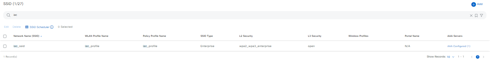

##### Edit Enterprise SSID

To modify an existing enterprise SSID, you can update specific fields such as security, radio policy, or QoS settings. The following example demonstrates how to edit an enterprise SSID:

```yaml
wireless_design_details:
  - ssids:
    - ssid_name: "iac_ssid"
      ssid_type: "Enterprise"
      l2_security:
        l2_auth_type: "WPA2_WPA3_ENTERPRISE"
      aaa:
        auth_servers_ip_address_list: []
        accounting_servers_ip_address_list: []
        aaa_override: false
        mac_filtering: false
        deny_rcm_clients: false
```
Mapping config to UI Actions:
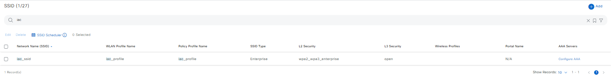

##### Configure Guest SSID

Guest SSIDs are designed to provide temporary or restricted access to external users, ensuring secure and controlled connectivity. In Cisco Catalyst Center, guest SSIDs can be configured with specific security, authentication, and access policies to meet organizational requirements.

The following example demonstrates how to configure a guest SSID with WPA2 Enterprise security and web authentication. This configuration ensures secure access for guest users while leveraging centralized authentication and accounting.

```yaml
wireless_design_details:
  - ssids:
    - ssid_name: "iac_guest_ssid"
      ssid_type: "Guest"
      wlan_profile_name: "iac_guest_profile"
      radio_policy:
        radio_bands: [2.4]
        2_dot_4_ghz_band_policy: "802.11-g"
      fast_lane: true
      ssid_state:
        admin_status: true
        broadcast_ssid: true
      l2_security:
        l2_auth_type: "WPA2_ENTERPRISE"
      fast_transition: "ENABLE"
      fast_transition_over_the_ds: true
      wpa_encryption: ["CCMP128"]
      auth_key_management: ["CCKM", "802.1X-SHA1", "802.1X-SHA2", "FT+802.1x"]
      cckm_timestamp_tolerance: 2000
      l3_security:
        l3_auth_type: WEB_AUTH
        auth_server: central_web_authentication
      aaa:
        auth_servers_ip_address_list: ["172.23.241.229"]
        accounting_servers_ip_address_list: ["172.23.241.229"]

```
Mapping config to UI Actions:
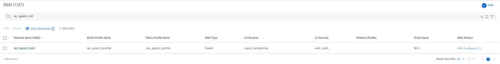

##### Edit Guest SSID

To modify an existing guest SSID, you can update specific fields such as security or authentication type. The following example demonstrates how to edit a guest SSID to use open authentication for both Layer 2 and Layer 3 security.

```yaml
wireless_design_details:
  - ssids:
    - ssid_name: "iac_guest_ssid"
      ssid_type: "Guest"
      l2_security:
        l2_auth_type: "OPEN"
      l3_security:
        l3_auth_type: "OPEN"
```
Mapping config to UI Actions:
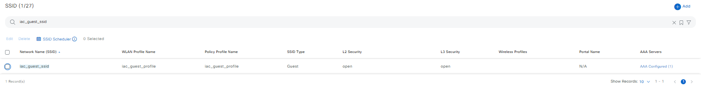

##### Delete SSID

To delete an SSID, specify the ssid_name in the playbook in the *deleted* state. This ensures the SSID is removed from the wireless network configuration. Delete both the Enterprise and Guest SSIDs

```yaml
wireless_design_details:
  - ssids:
    - ssid_name: "iac_guest_ssid"
    - ssid_name: "iac_ssid"
    - ssid_name: "temporary_employee_ssid"
```

#### b. Interfaces

##### Create interfaces
Interfaces and VLAN groups in Cisco Catalyst Center allow you to define and manage the network segmentation for wireless traffic. By associating interfaces with specific VLANs, you can ensure proper traffic isolation and routing for different types of network users, such as employees, guests, and IoT devices.

The following example demonstrates how to create wireless interfaces and associate them with VLANs. Each interface is mapped to a specific VLAN ID to segment traffic effectively.

```yaml
wireless_design_details:
  - interfaces:
    - interface_name: "data"
      vlan_id: 10
    - interface_name: "voice"
      vlan_id: 11
    - interface_name: "guest_access"
      vlan_id: 12
    - interface_name: "emp_access"
      vlan_id: 13
```
Mapping config to UI Actions:\
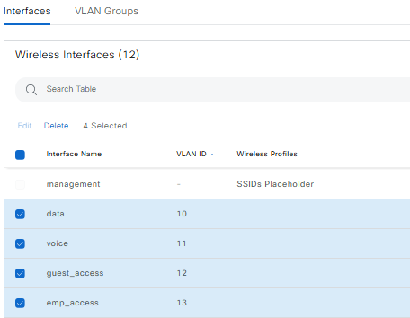

##### Update Wireless Interfaces and VLANs
To modify existing wireless interfaces or update their associated VLANs, specify the updated *interface_name* and *vlan_id* in the playbook. The following example demonstrates how to update the VLAN IDs for the *data* and *voice* interfaces.

```yaml
wireless_design_details:
  - interfaces:
    - interface_name: "data"
      vlan_id: 7
    - interface_name: "voice"
      vlan_id: 8
```
Mapping config to UI Actions:\
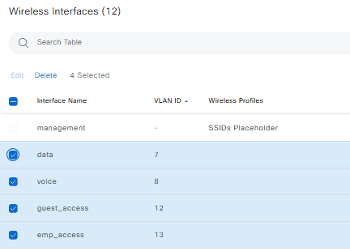

##### Delete Wireless Interfaces

To delete wireless interfaces, specify the interface_name in the playbook in the *deleted* state. This ensures the interface is removed from the wireless network configuration.

```yaml
wireless_design_details:
  - interfaces:
    - interface_name: "data"
    - interface_name: "voice"
    - interface_name: "guest_access"
    - interface_name: "iot_network"
```

#### c. Power Profile

Power profiles in Cisco Catalyst Center allow you to optimize access point (AP) power consumption and performance by configuring specific power settings for different interfaces. These profiles help manage energy efficiency while maintaining network performance.

##### Create Power Profile

The following example demonstrates how to create a power profile named *iac_radio_state*. This profile disables specific radio interfaces (e.g., 6GHz, 5GHz, and Secondary 5GHz) to optimize power usage.

```yaml
wireless_design_details:
  - power_profiles:
      - power_profile_name: "iac_radio_state"
        power_profile_description: "Profile for radio state settings."
        rules:
          - interface_type: "RADIO"
            interface_id: "6GHZ"
            parameter_type: "STATE"
            parameter_value: "DISABLE"
          - interface_type: "RADIO"
            interface_id: "5GHZ"
            parameter_type: "STATE"
            parameter_value: "DISABLE"
          - interface_type: "RADIO"
            interface_id: "SECONDARY_5GHZ"
            parameter_type: "STATE"
            parameter_value: "DISABLE"

```
Mapping config to UI Actions:\
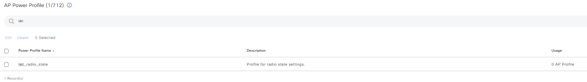

##### Update Power Profile

To update an existing power profile, modify the desired settings in the playbook. The following example demonstrates how to update the *iac_radio_state* profile to disable the 2.4GHz radio interface.

```yaml
wireless_design_details:
  - power_profiles:
      - power_profile_name: "iac_radio_state"
        power_profile_description: "Updated profile for radio state settings."
        rules:
          - interface_type: "RADIO"
            interface_id: "2_4GHZ"
            parameter_type: "STATE"
            parameter_value: "DISABLE"
```
Mapping config to UI Actions:\
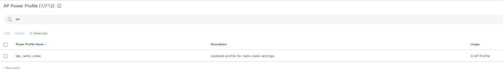

##### Delete Power Profile

To delete a power profile, specify the profile name in the playbook in the *deleted* state:

```yaml
wireless_design_details:
  - power_profiles:
      - power_profile_name: "iac_radio_state"
      - power_profile_name: "Ethernet State"
        
```

In the playbook log, it will return exactly how many items were deleted and the names of the deleted items:
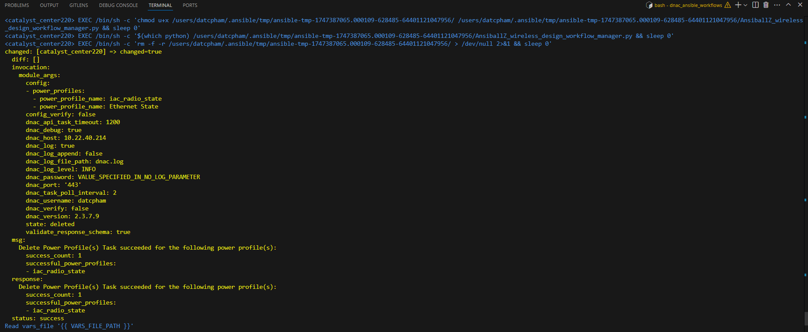

#### d. Access Point (AP) Profile

##### Create access point profile

Configure access point profiles with management, security, and mesh settings.
To create an access point profile, you need to provide at least the profile name.
In the following example, we create three access point profiles, each with its own set of settings. For instance, in the first example we are simply creating a basic AP profile with EAP-FAST authentication and a username and password for authentication. In the second example we are creating a profile with EAP-FAST authentication, a username and password for authentication, and a mesh configuration. In the third example we are creating a profile with EAP-PEAP authentication, a username and password for authentication, and a mesh configuration as well as power management settings.

```yaml
wireless_design_details:
  - access_point_profiles:
    - access_point_profile_name: "ap_profile_eap_fast"
      management_settings:
        access_point_authentication: "EAP-FAST"
        dot1x_username: "xxxxx"
        dot1x_password: "xxxxxxxx"

    - access_point_profile_name: "Office AP Profile"
      remote_teleworker: true
      management_settings:
        access_point_authentication: "NO-AUTH"
        ssh_enabled: true
        telnet_enabled: false
        management_username: "xxxxx"
        management_password: "xxxxxxxx"
        management_enable_password: "xxxxxxxx"

    - access_point_profile_name: "Staging-AP"
      access_point_profile_description: "Main office AP profile"
      management_settings:
        access_point_authentication: "EAP-PEAP"
        dot1x_username: "xxxxx"
        dot1x_password: "xxxxxxxx"
        ssh_enabled: false
        telnet_enabled: false
      security_settings:
        awips: true
        awips_forensic: false
        rogue_detection: true
        minimum_rssi: -71
        transient_interval: 300
        report_interval: 60
        pmf_denial: false
      mesh_enabled: false
      mesh_settings:
        range: 1000
        backhaul_client_access: true
        rap_downlink_backhaul: "2.4 GHz"
        ghz_2_4_backhaul_data_rates: "802.11n"
        bridge_group_name: "Bridge1"
      power_settings:
        ap_power_profile_name: "iac_radio_state"
        calendar_power_profiles:
          - ap_power_profile_name: "iac_radio_state"
            scheduler_type: "MONTHLY"
            scheduler_dates_list: ["2", "9", "28"]
            scheduler_start_time: "08:00 AM"
            scheduler_end_time: "6:00 PM"
      time_zone: "DELTA FROM CONTROLLER"
      time_zone_offset_hour: -11
      time_zone_offset_minutes: 30
      maximum_client_limit: 900
        
```
Mapping config to UI Actions:\
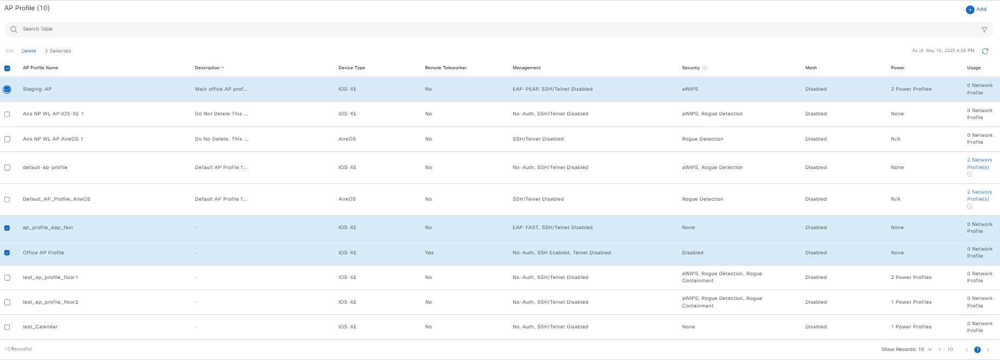
Playbook log return:\
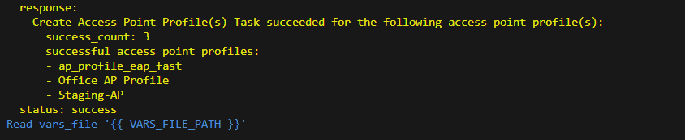

##### Update access point profile

We can modify the access point profiles by providing the specific settings we want to update. In the following example, we update the access point power settings to include a calendar-based power profile for a specific period or time range:

```yaml
wireless_design_details:
- access_point_profiles:
  - access_point_profile_name: "Office AP Profile"
    power_settings:
      calendar_power_profiles:
        - ap_power_profile_name: "Low-Power-Mode"
          scheduler_type: "DAILY"
          scheduler_start_time: "1:00 AM"
          scheduler_end_time: "5:00 AM"

```

##### Delete access point profile
To delete an access point profile, you can specify the profile name in the playbook in the *deleted* state.

```yaml
wireless_design_details:
- access_point_profiles:
  - access_point_profile_name: "Office AP Profile"
  - access_point_profile_name: "Staging-AP"
  - access_point_profile_name: "ap_profile_eap_fast"

```

#### e. RF Profile
Optimize radio frequency settings for different bands (2.4GHz, 5GHz, 6GHz).

##### Create RF Profile
The provided RF profile examples demonstrate how to optimize radio frequency settings for different wireless bands (2.4GHz, 5GHz, and 6GHz) in Cisco Catalyst Center. We have provided three examples on how to create these profiles:
The first profile configures the 2.4GHz band with limited channels (1, 6, 11) to reduce interference, inheriting settings from a "HIGH" parent profile. 
The second profile is a mixed configuration for 5GHz and 6GHz bands, with client limits on 5GHz. 
The third profile is an advanced configuration for the 6GHz band, including detailed settings for power levels, data rates, spatial reuse, and multi-BSSID support.

```yaml
wireless_design_details:
  - radio_frequency_profiles:
    - radio_frequency_profile_name: "iac_rf_profile_2_4ghz"
      default_rf_profile: false
      radio_bands: [2.4]

      radio_bands_2_4ghz_settings:
        parent_profile: "HIGH"
        dca_channels_list: [1, 6, 11]

    - radio_frequency_profile_name: "iac_rf_profile_5_6ghz_mixed"
      default_rf_profile: false
      radio_bands: [5, 6]

      radio_bands_5ghz_settings:
        parent_profile: "LOW"
        preamble_puncturing: false
        client_limit: 100

      radio_bands_6ghz_settings:
        parent_profile: "CUSTOM"
        psc_enforcing_enabled: true
        maximum_dbs_channel_width: 160
        discovery_frames_6ghz: "None"

    - radio_frequency_profile_name: "iac_rf_profile_6_ghz"
      default_rf_profile: false
      radio_bands: [6]

      radio_bands_6ghz_settings:
        minimum_dbs_channel_width: 80
        maximum_dbs_channel_width: 160
        preamble_puncturing: true
        psc_enforcing_enabled: true
        dca_channels_list: [5, 9, 13, 17, 21, 25, 29, 33, 37, 41, 45, 49, 53, 57, 61, 65, 69, 73, 77, 81, 85, 89, 93, 97, 101, 105, 109, 113, 117, 121, 125, 129, 133, 137, 141, 145, 149, 153, 157, 161, 165, 169, 173, 177, 181, 185, 189, 193, 197, 201, 205, 209, 213, 217, 221, 225, 229, 233]
        supported_data_rates_list: [12, 18, 24, 36, 48, 54]
        mandatory_data_rates_list: [12, 54]
        minimum_power_level: 10
        maximum_power_level: 30
        rx_sop_threshold: "CUSTOM"
        custom_rx_sop_threshold: -80
        tpc_power_threshold: -60
        coverage_hole_detection:
          minimum_client_level: 5
          data_rssi_threshold: -72
          voice_rssi_threshold: -68
          exception_level: 6
        client_limit: 150
        flexible_radio_assigment:
          client_reset_count: 10
          client_utilization_threshold: 10
        discovery_frames_6ghz: "None"
        broadcast_probe_response_interval: 10
        standard_power_service: false
        multi_bssid:
          dot_11ax_parameters:
            ofdma_downlink: true
            ofdma_uplink: true
            mu_mimo_downlink: true
            mu_mimo_uplink: true
          dot_11be_parameters:
            ofdma_downlink: true
            ofdma_uplink: true
            mu_mimo_downlink: true
            mu_mimo_uplink: true
            ofdma_multi_ru: true
          target_waketime: true
          twt_broadcast_support: true
        spatial_reuse:
          non_srg_obss_pd: true
          non_srg_obss_pd_max_threshold: -63
          srg_obss_pd: true
          srg_obss_pd_min_threshold: -63
          srg_obss_pd_max_threshold: -62

```
Mapping config to UI Actions:
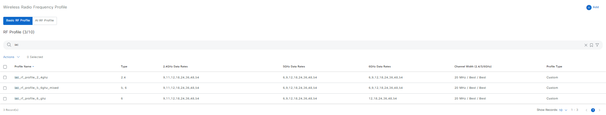
Playbook log return:\
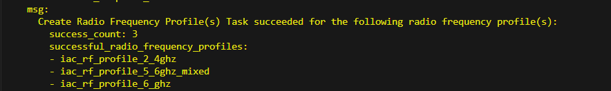


##### Update RF Profile
We can update the RF Profile by modifying any of the configurations in the RF Profile section of the playbook. In the following examples, we are updating the RF Profile "iac_rf_profile_2_4ghz" by changing the parent profile and adjusting the power levels.
In the second example, we are updating the RF Profile "iac_rf_profile_5_6ghz_mixed" by modifying the channel width, supported data rates, and mandatory data rates.

```yaml
wireless_design_details:
  - radio_frequency_profiles:
    - radio_frequency_profile_name: "iac_rf_profile_2_4ghz"
      default_rf_profile: false
      radio_bands: [2.4]
      radio_bands_2_4ghz_settings:
        parent_profile: "LOW"
        minimum_power_level: 3
        maximum_power_level: 15

    - radio_frequency_profile_name: "iac_rf_profile_5_6ghz_mixed"
      default_rf_profile: false
      radio_bands: [5]
      radio_bands_5ghz_settings:
        parent_profile: "TYPICAL"
        channel_width: "160"
        dca_channels_list: [36, 40, 44, 48, 52, 56, 60, 64]
        supported_data_rates_list: [12, 24, 36, 48, 6, 18, 9, 54]
        mandatory_data_rates_list: [24]
```

##### Delete RF Profile

To delete any RF profile, you can specify the profile name in the playbook in the *deleted* state.

```yaml
wireless_design_details:
  - radio_frequency_profiles:
    - radio_frequency_profile_name: "iac_rf_profile_2_4ghz"
    - radio_frequency_profile_name: "iac_rf_profile_5_6ghz_mixed"

```

#### f. Anchor Groups
Anchor groups in Cisco Catalyst Center allow you to define mobility anchors for seamless roaming across wireless networks. Mobility anchors are controllers that handle traffic for specific SSIDs, enabling secure and efficient client mobility between different network segments or sites.

##### Add Anchor Group and Mobility Anchor
The following example demonstrates how to add an anchor group and its associated mobility anchors. We can specify the anchor group name and the details of each mobility anchor in the playbook. In this example, we are adding an anchor group named *Enterprise_Anchor_Group* with two mobility anchors.

```yaml
wireless_design_details:
  - anchor_groups:
    - anchor_group_name: "Enterprise_Anchor_Group"
      mobility_anchors:
        - device_name: "WLC_Enterprise_1"
          device_ip_address: "192.168.0.10"
          device_mac_address: '00:1A:2B:3C:4D:5E'
          device_type: "IOS-XE"
          device_priority: 1
          device_nat_ip_address: "10.0.0.10"
          mobility_group_name: Enterprise_Mobility_Group
          managed_device: false
        - device_name: "WLC_Enterprise_2"
          device_ip_address: "192.168.0.11"
          device_mac_address: '00:1A:2B:3C:4D:5F'
          device_type: "AIREOS"
          device_priority: 2
          device_nat_ip_address: "10.0.0.11"
          mobility_group_name: "Enterprise_Mobility_Group"
          managed_device: false
```
Mapping config to UI Actions:
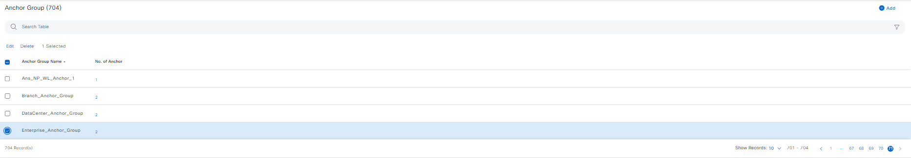
Playbook log return:\
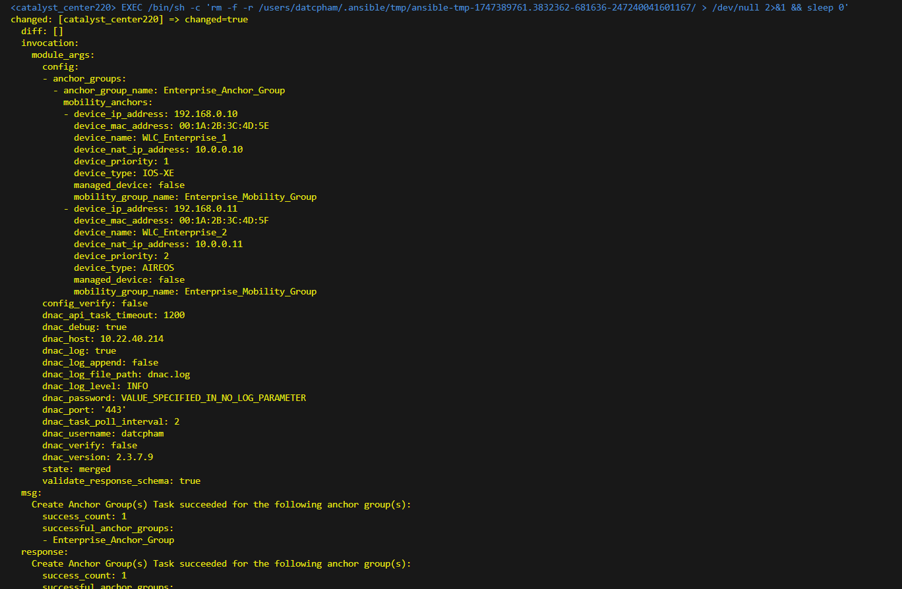

##### Update Anchor Group

To update an existing anchor group, modify the mobility anchors associated with the group. You can add new mobility anchors, update existing ones, or change their configurations. The following example demonstrates how to update the "Enterprise_Anchor_Group" by updating existing anchors, adding new mobility anchors and modifying their details.

```yaml
wireless_design_details:
  - anchor_groups:
    - anchor_group_name: "Enterprise_Anchor_Group"
      mobility_anchors:
        - device_name: "WLC_Enterprise_1"
          device_ip_address: "192.168.0.11"
          device_mac_address: '00:1A:2B:3C:4D:5F'
          device_type: "AIREOS"
          device_priority: 2
          device_nat_ip_address: "10.0.0.11"
          mobility_group_name: "Enterprise_Mobility_Group"
          managed_device: false
        - device_name: "WLC_Enterprise_10"
          device_ip_address: "192.168.0.110"
          device_mac_address: "AA:1A:2B:3C:4D:5E"
          device_type: "IOS-XE"
          device_priority: 1
          device_nat_ip_address: "10.0.0.10"
          mobility_group_name: "Enterprise_Mobility_Group"
          managed_device: false
        - device_name: "WLC_Enterprise_20"
          device_ip_address: "192.168.0.111"
          device_mac_address: "AA:1A:2B:3C:4D:5E"
          device_type: "AIREOS"
          device_priority: 2
          mobility_group_name: "Enterprise_Mobility_Group"
          managed_device: false

```

##### Delete Anchor Group

To delete any anchor groups, you can specify the anchor groups to be deleted in the playbook in the *deleted* state. If you want to delete the "Enterprise_Anchor_Group", you can specify it in the playbook as follows: 

```yaml
wireless_design_details:
  - anchor_groups:
    - anchor_group_name: "Enterprise_Anchor_Group"

```


#### Using the Jinja Template for Bulk Operations

The Jinja template in the wireless design playbook is designed to dynamically generate bulk configurations for SSIDs, interfaces, power profiles, RF profiles, and anchor groups, enabling automation of large-scale deployments or testing scenarios. By leveraging Jinja loops and conditionals, it simplifies the creation of multiple configurations with consistent settings, such as alternating SSID types (Enterprise and Guest), VLAN assignments for interfaces, radio frequency optimizations, and mobility anchor setups. This approach ensures scalability, flexibility, and efficiency in managing wireless network designs.

#### Example Jinja Template

Below is an example of how the Jinja template is structured to generate bulk configurations for wireless design:

```bash
wireless_design_details:
  # Example SSIDs
  - ssids:
    
    - ssid_name: "example_ssid_{{ i }}"
      ssid_type: "{{ 'Enterprise' if i % 2 == 0 else 'Guest' }}"
      wlan_profile_name: "example_profile_{{ i }}"
      radio_policy:
        radio_bands: [2.4, 5, 6]
        2_dot_4_ghz_band_policy: "802.11-bg"
        band_select: true
        6_ghz_client_steering: {{ 'true' if i % 2 == 0 else 'false' }}
      fast_lane: {{ 'true' if i % 2 == 0 else 'false' }}
      ssid_state:
        admin_status: true
        broadcast_ssid: true
      l2_security:
        l2_auth_type: "{{ 'WPA2_ENTERPRISE' if i % 2 == 0 else 'OPEN' }}"
      l3_security:
        l3_auth_type: "{{ 'WEB_AUTH' if i % 2 == 0 else 'OPEN' }}"
      fast_transition: "ENABLE"
    

  # Example Interfaces
  - interfaces:
    
    - interface_name: "example_interface_{{ i }}"
      vlan_id: {{ 10 + i }}
    

  # Example Power Profiles
  - power_profiles:
    
    - power_profile_name: "example_power_profile_{{ i }}"
      power_profile_description: "Power profile example {{ i }}"
      rules:
        - interface_type: "RADIO"
          interface_id: "{{ '6GHZ' if i == 1 else '5GHZ' }}"
          parameter_type: "STATE"
          parameter_value: "DISABLE"
        - interface_type: "RADIO"
          interface_id: "2_4GHZ"
          parameter_type: "STATE"
          parameter_value: "ENABLE"
    

  # Example Access Point Profiles
  - access_point_profiles:
    
    - access_point_profile_name: "example_ap_profile_{{ i }}"
      
      access_point_profile_description: "Description for AP profile {{ i }}"
      remote_teleworker: true
      
      
      management_settings:
        access_point_authentication: "EAP-TLS"
        ssh_enabled: true
        telnet_enabled: false
        management_username: "admin"
        management_password: "securePass"
        management_enable_password: "enablePass"
      
    

  # Example RF Profiles
  - radio_frequency_profiles:
    
    - radio_frequency_profile_name: "example_rf_profile_{{ i }}"
      default_rf_profile: {{ 'true' if i == 1 else 'false' }}
      radio_bands: [2.4, 5, 6]
      
      radio_bands_2_4ghz_settings:
        parent_profile: "HIGH"
        dca_channels_list: [1, 6, 11]
      
      radio_bands_5ghz_settings:
        parent_profile: "TYPICAL"
        channel_width: "80"
        dca_channels_list: [36, 40, 44, 48]
      
    

  # Example Anchor Groups
  - anchor_groups:
    
    - anchor_group_name: "example_anchor_group_{{ i }}"
      mobility_anchors:
        - device_name: "WLC_Example_{{ i }}"
          device_ip_address: "192.168.0.{{ 10 + i }}"
          device_mac_address: "00:1A:2B:3C:4D:{{ 5 + i }}"
          device_type: "{{ 'IOS-XE' if i == 1 else 'AIREOS' }}"
          device_priority: {{ i }}
          device_nat_ip_address: "10.0.0.{{ 10 + i }}"
          mobility_group_name: "Example_Mobility_Group"
          managed_device: false
    
```

The Jinja template example for dynamically generating bulk configurations for wireless design can be found in the *jinja_template* folder under the *wireless_design directory*. You can refer to this template as a starting point and modify it to suit your specific network configurations and requirements.

## Command line

### 1. Validate the playbook

To ensure a successful execution of the playbooks with your specified inputs, follow these steps:

Input Validation:
Before executing the playbook, it is essential to validate the input schema. This step ensures that all required parameters are included and correctly formatted. Run the following command *./tools/validate.sh -s* to perform the validation providing the schema path -d and the input path.

```bash
  ./tools/validate.sh \
  -s workflows/wireless_design/schema/wireless_design_schema.yml \
  -d workflows/wireless_design/vars/wireless_design_inputs.yml
```

Return result validate:
```code
  (pyats-ansible-phamdat) bash-4.4$ ./tools/validate.sh -s workflows/wireless_design/schema/wireless_design_schema.yml -d workflows/wireless_design/vars/wireless_design_inputs.yml 
  workflows/wireless_design/schema/wireless_design_schema.yml
  workflows/wireless_design/vars/wireless_design_inputs.yml
  yamale   -s workflows/wireless_design/schema/wireless_design_schema.yml  workflows/wireless_design/vars/wireless_design_inputs.yml
  Validating workflows/wireless_design/vars/wireless_design_inputs.yml...
  Validation success! 👍
  (pyats-ansible-phamdat) bash-4.4$ 
```

### 2. Running the Playbook

Once the input validation is complete and no errors are found, you can run the playbook. Provide your input file path using the --e variable as VARS_FILE_PATH:

```bash
  ansible-playbook \
    -i inventory/demo_lab/hosts.yaml \
    workflows/wireless_design/playbook/wireless_design_playbook.yml \
    --e VARS_FILE_PATH=./../vars/wireless_design_inputs.yml \
    -vvv
```

If there is an error in the input or an issue with the API call during execution, the playbook will halt and display the relevant error details.

##### Using the Jinja Template for Bulk Operations

The Jinja Template allows you to create bulk configurations for wireless design, simplifying the process of generating multiple configurations. To use the Jinja Template, modify and run the playbook with the following command:

```bash
  ansible-playbook -i inventory/demo_lab/hosts.yaml workflows/wireless_design/playbook/wireless_design_playbook.yml --extra-vars VARS_FILE_PATH=./../vars/jinja_wireless_design_inputs.yml -vvvv
```

Post-Execution Verification:
After executing the playbook, check the Catalyst Center UI to verify wireless design. If *debug_log* is enabled, you can also review the logs for detailed information on operations performed and any updates made.

## References

*Note: The environment used for the references in the above instructions is as follows:*

```yaml
python: 3.12.0
dnac_version: 2.3.7.9
ansible: 9.9.0
dnacentersdk: 2.8.14
cisco.dnac: 6.33.2
```
