# Cisco Catalyst Center Wireless Design Playbook

This playbook automates the management of wireless network designs in Cisco Catalyst Center, covering SSIDs, interfaces, power profiles, AP profiles, RF profiles, and anchor groups. It streamlines configuration tasks and ensures consistency across deployments.

## Key Features

- **Wireless SSID**:
  - Add/Edit/Delete single, multiple, or bulk Enterprise and Guest SSIDs.
- **Wireless RF Profile**:
  - Add/Edit/Delete single, multiple, or bulk RF Profiles.
  - Mark a default RF Profile.
- **Wireless Interfaces**:
  - Add/Edit/Delete single, multiple, or bulk Interfaces.
- **Power Profile**:
  - Add/Edit/Delete single, multiple, or bulk Power Profiles.
- **AP Profile**:
  - Add/Edit/Delete single, multiple, or bulk AP Profiles for IOS-XE.
  - Manage Calendar Power Profiles for AP Profiles.
- **Anchor Groups**:
  - Add/Edit/Delete single, multiple, or bulk Anchor Groups.

**Version Added**: 6.33.2

## Workflow Steps

### Step 1: Install and Generate Inventory

1. **Install Ansible**: Follow the [official Ansible documentation](https://docs.ansible.com/ansible/latest/installation_guide/intro_installation.html) for installation.
2. **Install Cisco Catalyst Center Collection**:
   ```bash
   ansible-galaxy collection install cisco.dnac
   ```
3. **Generate Inventory**: Create an Ansible inventory file (e.g., `inventory.yml`) with your Cisco Catalyst Center details.
   ```yaml
   catalyst_center_hosts:
     hosts:
       your_catalyst_center_instance_name:
         catalyst_center_host: xx.xx.xx.xx
         catalyst_center_password: XXXXXXXX
         catalyst_center_port: 443
         catalyst_center_timeout: 60
         catalyst_center_username: admin
         catalyst_center_verify: false  # Set to true for production
         catalyst_center_version: 2.3.7.9
         catalyst_center_debug: true
         catalyst_center_log_level: INFO
         catalyst_center_log: true
   ```

### Step 2: Define Inputs and Validate

1. **Define Input Variables**: Create variable files (e.g., `vars/wireless_design_inputs.yml`) to specify the desired wireless design state for creation, update, or deletion.

#### Schema for Wireless Network Profiles

The schema file (e.g., `schema/wireless_design_schema.yml`) defines the structure of the input file for configuring wireless designs in Cisco Catalyst Center. It includes components such as SSIDs, interfaces, power profiles, and other configurations to manage wireless networks effectively.

**Wireless Design Details**

| Parameter                | Type | Required | Default Value | Description                                                                 |
|--------------------------|------|----------|---------------|-----------------------------------------------------------------------------|
| `wireless_design_details`| List | No       | N/A           | List of wireless design elements (up to 1000). Includes `wireless_design_details_type`. |

**Wireless Design Components**

| Parameter                  | Type | Required | Default Value | Description                                                                 |
|----------------------------|------|----------|---------------|-----------------------------------------------------------------------------|
| `ssids`                    | List | No       | N/A           | List of SSIDs (up to 1000). Includes `ssids_type`.                          |
| `interfaces`               | List | No       | N/A           | List of interfaces (up to 1000). Includes `interfaces_type`.                |
| `power_profiles`           | List | No       | N/A           | List of power profiles (up to 1000). Includes `power_profiles_type`.        |
| `access_point_profiles`    | List | No       | N/A           | List of AP profiles (up to 1000). Includes `ap_profiles_type`.              |
| `radio_frequency_profiles` | List | No       | N/A           | List of RF profiles (up to 1000). Includes `rf_profiles_type`.              |
| `anchor_groups`            | List | No       | N/A           | List of anchor groups (up to 1000). Includes `anchor_groups_type`.          |

**SSID Configuration (`ssids_type`)**

| Parameter                         | Type       | Required | Default Value | Description                                                                 |
|-----------------------------------|------------|----------|---------------|-----------------------------------------------------------------------------|
| `ssid_name`                       | String     | Yes      | N/A           | Unique SSID name (up to 32 characters).                                    |
| `ssid_type`                       | Enum       | Yes      | N/A           | SSID type: "Enterprise" or "Guest".                                        |
| `wlan_profile_name`               | String     | No       | Auto-generated| WLAN profile name. Auto-generated from `ssid_name` if not provided.        |
| `radio_policy`                    | Dict       | No       | N/A           | Radio policy settings. Includes `radio_policy_type`.                       |
| `fast_lane`                       | Bool       | No       | False         | Enable Fast Lane for performance optimization.                             |
| `quality_of_service`              | Dict       | No       | N/A           | QoS settings. Includes `quality_of_service_type`.                          |
| `ssid_state`                      | Dict       | No       | N/A           | SSID state settings. Includes `ssid_state_type`.                           |
| `l2_security`                     | Dict       | Yes      | N/A           | Layer 2 security settings. Includes `l2_security_type`.                    |
| `fast_transition`                 | Enum       | No       | DISABLE       | Fast transition: "ADAPTIVE", "ENABLE", "DISABLE".                          |
| `fast_transition_over_the_ds`     | Bool       | No       | False         | Enable fast transition over the distributed system.                        |
| `wpa_encryption`                  | List[Enum] | No       | N/A           | WPA encryption: "GCMP256", "CCMP256", "GCMP128", "CCMP128".                |
| `auth_key_management`             | List[Enum] | No       | N/A           | Authentication key management: "802.1X-SHA1", "802.1X-SHA2", etc.          |
| `cckm_timestamp_tolerance`        | Int        | No       | 0             | CCKM timestamp tolerance (ms).                                             |
| `l3_security`                     | Dict       | No       | N/A           | Layer 3 security settings. Includes `l3_security_type`.                    |
| `aaa`                             | Dict       | No       | N/A           | AAA settings. Includes `aaa_type`.                                         |
| `mfp_client_protection`           | Enum       | No       | OPTIONAL      | Management frame protection: "OPTIONAL", "DISABLED", "REQUIRED".           |
| `protected_management_frame`      | Enum       | No       | DISABLED      | Protected management frame: "OPTIONAL", "DISABLED", "REQUIRED".            |
| `11k_neighbor_list`               | Bool       | No       | True          | Enable 802.11k neighbor list for roaming.                                  |
| `coverage_hole_detection`         | Bool       | No       | False         | Enable coverage hole detection.                                            |
| `wlan_timeouts`                   | Dict       | No       | N/A           | WLAN timeout settings. Includes `wlan_timeouts_type`.                      |
| `bss_transition_support`          | Dict       | No       | N/A           | BSS transition settings. Includes `bss_transition_support_type`.           |
| `nas_id`                          | List[String] | No     | N/A           | List of NAS identifiers.                                                   |
| `client_rate_limit`               | Int        | No       | 0             | Client rate limit (kbps, 0 for no limit).                                  |
| `sites_specific_override_settings`| List[Dict] | No       | N/A           | Site-specific overrides. Includes `sites_specific_override_settings_type`.  |

**Interface Configuration (`interfaces_type`)**

| Parameter        | Type   | Required | Default Value | Description                                                                 |
|------------------|--------|----------|---------------|-----------------------------------------------------------------------------|
| `interface_name` | String | Yes      | N/A           | Unique interface name (up to 31 characters).                                |
| `vlan_id`        | Int    | Yes      | N/A           | VLAN ID (1-4094).                                                           |

**Power Profile Configuration (`power_profiles_type`)**

| Parameter                  | Type       | Required | Default Value | Description                                                                 |
|----------------------------|------------|----------|---------------|-----------------------------------------------------------------------------|
| `power_profile_name`       | String     | Yes      | N/A           | Power profile name (up to 128 characters).                                  |
| `power_profile_description`| String     | No       | N/A           | Description (up to 128 characters).                                         |
| `rules`                    | List[Dict] | No       | N/A           | Rules for the power profile. Includes `power_profile_rule_type`.            |

**Access Point Profile Configuration (`ap_profiles_type`)**

| Parameter                         | Type       | Required | Default Value | Description                                                                 |
|-----------------------------------|------------|----------|---------------|-----------------------------------------------------------------------------|
| `access_point_profile_name`       | String     | Yes      | N/A           | AP profile name (up to 32 characters).                                     |
| `access_point_profile_description`| String     | No       | N/A           | Description (up to 241 characters).                                        |
| `remote_teleworker`               | Bool       | No       | False         | Enable remote teleworker mode.                                             |
| `management_settings`             | Dict       | No       | N/A           | Management settings. Includes `management_settings_type`.                  |
| `security_settings`               | Dict       | No       | N/A           | Security settings. Includes `security_settings_type`.                      |
| `mesh_enabled`                    | Bool       | No       | False         | Enable mesh networking.                                                    |
| `mesh_settings`                   | Dict       | No       | N/A           | Mesh settings. Includes `mesh_settings_type`.                              |
| `power_settings`                  | Dict       | No       | N/A           | Power settings. Includes `power_settings_type`.                            |
| `country_code`                    | Enum       | No       | N/A           | Country code (e.g., "United States", "Canada").                            |
| `time_zone`                       | Enum       | No       | NOT CONFIGURED| Time zone: "NOT CONFIGURED", "CONTROLLER", "DELTA FROM CONTROLLER".        |
| `time_zone_offset_hour`           | Int        | No       | 0             | Time zone offset (hours, -12 to 14).                                       |
| `time_zone_offset_minutes`        | Int        | No       | 0             | Time zone offset (minutes, 0 to 59).                                       |
| `maximum_client_limit`             | Int        | No       | 0             | Maximum clients (0-1200, 0 for no limit).                                  |

**Radio Frequency Profile Configuration (`rf_profiles_type`)**

| Parameter                     | Type       | Required | Default Value | Description                                                                 |
|-------------------------------|------------|----------|---------------|-----------------------------------------------------------------------------|
| `radio_frequency_profile_name`| String     | Yes      | N/A           | RF profile name.                                                            |
| `default_rf_profile`          | Bool       | No       | False         | Set as default RF profile.                                                  |
| `radio_bands`                 | List[Enum] | No       | N/A           | Radio bands: 2.4, 5, 6.                                                     |
| `radio_bands_2_4ghz_settings` | Dict       | No       | N/A           | 2.4 GHz settings. Includes `radio_bands_2_4ghz_settings_type`.              |
| `radio_bands_5ghz_settings`   | Dict       | No       | N/A           | 5 GHz settings. Includes `radio_bands_5ghz_settings_type`.                  |
| `radio_bands_6ghz_settings`   | Dict       | No       | N/A           | 6 GHz settings. Includes `radio_bands_6ghz_settings_type`.                  |

**Anchor Group Configuration (`anchor_groups_type`)**

| Parameter          | Type       | Required | Default Value | Description                                                                 |
|--------------------|------------|----------|---------------|-----------------------------------------------------------------------------|
| `anchor_group_name`| String     | Yes      | N/A           | Anchor group name (up to 32 characters).                                    | 
| `mobility_anchors` | List[Dict] | Yes      | N/A           | Mobility anchors. Includes `mobility_anchor_type`.                          |


> **Note**: Refer to the official documentation for detailed information on defining workflows: https://galaxy.ansible.com/ui/repo/published/cisco/dnac/content/module/wireless_design_workflow_manager/


## Example Input File
The Wireless Design module allows you to configure and manage various aspects of your wireless network through Cisco Catalyst Center. The configuration is structured into several key components:
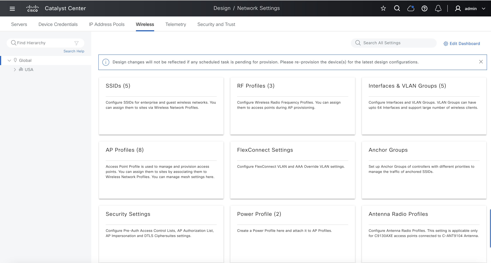

Refer to the full workflow specification for detailed instructions on the available options and their structure: https://galaxy.ansible.com/ui/repo/published/cisco/dnac/docs/ 

### 1. Wireless SSIDs
SSIDs are the foundation of wireless networks, enabling devices to connect to the network with specific configurations. In Cisco Catalyst Center, SSIDs can be configured for enterprise or guest use cases with detailed security, QoS, and radio settings. 

#### a. Create
Example inputs include `GUEST` and `ENTERPRISE` SSIDs:
```yaml
catalyst_center_version: 2.3.7.9
wireless_design_details:
  # Wireless SSID design inputs
  - ssids:
    - ssid_name: "iac-open"
      ssid_type: "Enterprise"
      wlan_profile_name: "iac-open_profile"
      radio_policy:
        radio_bands: [2.4, 5, 6]
        2_dot_4_ghz_band_policy: "802.11-bg"
        band_select: true
        6_ghz_client_steering: true
      fast_lane: true
      ssid_state:
        admin_status: true
        broadcast_ssid: true
      l2_security:
        l2_auth_type: "OPEN"
      l3_security:
        l3_auth_type: "OPEN"
      fast_transition: "DISABLE"
      aaa:
        aaa_override: false
        mac_filtering: true
        deny_rcm_clients: false
      mfp_client_protection: "OPTIONAL"
      protected_management_frame: "REQUIRED"
      11k_neighbor_list: true
      coverage_hole_detection: true
      wlan_timeouts:
        enable_session_timeout: true
        session_timeout: 3600
        enable_client_exclusion_timeout: true
        client_exclusion_timeout: 1800
      bss_transition_support:
        bss_max_idle_service: true
        bss_idle_client_timeout: 300
        directed_multicast_service: true
      nas_id: ["AP Location"]
      client_rate_limit: 90000
    # SSID for employees with open Security for testing purpose
    - ssid_name: iac-employees
      ssid_type: "Enterprise"
      wlan_profile_name: iac-employees_profile
      radio_policy:
        radio_bands: [2.4, 5, 6]
        2_dot_4_ghz_band_policy: "802.11-bg"
        band_select: true
        6_ghz_client_steering: true
      fast_lane: true
      ssid_state:
        admin_status: true
        broadcast_ssid: true
      l2_security:
        l2_auth_type: "OPEN"
      l3_security:
        l3_auth_type: "OPEN"
      fast_transition: "DISABLE"
      aaa:
        aaa_override: false
        mac_filtering: true
        deny_rcm_clients: false
      mfp_client_protection: "OPTIONAL"
      protected_management_frame: "REQUIRED"
      11k_neighbor_list: true
      coverage_hole_detection: true
      wlan_timeouts:
        enable_session_timeout: true
        session_timeout: 3600
        enable_client_exclusion_timeout: true
        client_exclusion_timeout: 1800
      bss_transition_support:
        bss_max_idle_service: true
        bss_idle_client_timeout: 300
        directed_multicast_service: true
      nas_id: ["AP Location"]
      client_rate_limit: 90000
    # SSID for guests with open Security for testing purpose
    - ssid_name: iac-guests
      ssid_type: "Guest"
      wlan_profile_name: iac-guests_profile
      radio_policy:
        radio_bands: [2.4, 5, 6]
        2_dot_4_ghz_band_policy: "802.11-bg"
        band_select: true
        6_ghz_client_steering: true
      fast_lane: true
      ssid_state:
        admin_status: true
        broadcast_ssid: true
      l2_security:
        l2_auth_type: "OPEN"
      l3_security:
        l3_auth_type: "OPEN"
      fast_transition: "DISABLE"
      aaa:
        aaa_override: false
        mac_filtering: true
        deny_rcm_clients: false
      mfp_client_protection: "OPTIONAL"
      protected_management_frame: "REQUIRED"
      11k_neighbor_list: true
      coverage_hole_detection: true
      wlan_timeouts:
        enable_session_timeout: true
        session_timeout: 3600
        enable_client_exclusion_timeout: true
        client_exclusion_timeout: 1800
    # SSID for guests with aaa configured
    - ssid_name: "iac-guests-aaa"
      ssid_type: "Guest"
      radio_policy:
        radio_bands: [2.4, 5, 6]
        2_dot_4_ghz_band_policy: "802.11-bg"
        band_select: true
        6_ghz_client_steering: true
      fast_lane: false
      quality_of_service:
        egress: SILVER
        ingress: BRONZE-UP
      ssid_state:
        admin_status: true
        broadcast_ssid: true
      l2_security:
        l2_auth_type: "WPA2_WPA3_ENTERPRISE"
        ap_beacon_protection: true
      fast_transition: "ENABLE"
      fast_transition_over_the_ds: true
      wpa_encryption: ["CCMP128", "GCMP128", "CCMP256", "GCMP256"]
      auth_key_management: ["CCKM", "802.1X-SHA1", "802.1X-SHA2", "FT+802.1x", "SUITE-B-1X", "SUITE-B-192X"]
      cckm_timestamp_tolerance: 2000
      l3_security:
        l3_auth_type: WEB_AUTH
        auth_server: web_authentication_internal
        enable_sleeping_client: true
        sleeping_client_timeout: 600
      aaa:
        auth_servers_ip_address_list: ["172.23.241.230"]
        accounting_servers_ip_address_list: ["172.23.241.229"]
        aaa_override: true
        mac_filtering: true
        deny_rcm_clients: true
      mfp_client_protection: "OPTIONAL"
      protected_management_frame: "REQUIRED"
      11k_neighbor_list: true
      coverage_hole_detection: true
      wlan_timeouts:
        enable_session_timeout: true
        session_timeout: 3600
        enable_client_exclusion_timeout: true
        client_exclusion_timeout: 1800
      bss_transition_support:
        bss_max_idle_service: true
        bss_idle_client_timeout: 3000
        directed_multicast_service: true
      nas_id: ["AP ETH Mac Address"]
      client_rate_limit: 90000
```

#### b. Update
It can combine both `creation` and `updating` in a single input. If the SSID already exists, the input will be interpreted as an update; if the SSID does not exist, the input will be interpreted as a creation. The module will process this and return the message clearly.

```yaml
catalyst_center_version: 2.3.7.9
wireless_design_details:
  - ssids:
    # Update
    - ssid_name: "iac-guests-aaa"
      ssid_type: "Guest"
      l2_security:
        l2_auth_type: "WPA2_WPA3_ENTERPRISE"
      l3_security:
        l3_auth_type: WEB_AUTH
        auth_server: web_authentication_internal
        enable_sleeping_client: true
        sleeping_client_timeout: 600
      aaa:
        auth_servers_ip_address_list: []
        accounting_servers_ip_address_list: []
        aaa_override: false
        mac_filtering: false
        deny_rcm_clients: false
    # Create
    - ssid_name: "iac-guests-new"
      ssid_type: "Enterprise"
      l2_security:
        l2_auth_type: "OPEN"
```

#### c. Delete
To delete an SSID, specify the ssid_name in the playbook in the *deleted* state. This ensures the SSID is removed from the wireless network configuration. Delete both the Enterprise and Guest SSIDs. The module will process this and return the exact and clear message regarding the number of SSIDs successfully deleted.

```yaml
catalyst_center_version: 2.3.7.9
wireless_design_details:
  - ssids:
    - ssid_name: "iac-open"
    - ssid_name: "iac-employees"
    - ssid_name: "iac-guests"
    - ssid_name: "iac-guests-aaa"
    - ssid_name: "iac-guests-new"
    - ssid_name: "non-exist"
```

### 2. Wireless Interfaces
Interfaces and VLAN groups in Cisco Catalyst Center allow you to define and manage the network segmentation for wireless traffic. By associating interfaces with specific VLANs, you can ensure proper traffic isolation and routing for different types of network users, such as employees, guests, and IoT devices.

The following example demonstrates how to create wireless interfaces and associate them with VLANs. Each interface is mapped to a specific VLAN ID to segment traffic effectively.

#### a. Create

```yaml
catalyst_center_version: 2.3.7.9
wireless_design_details:
  # Wireless VLAN design inputs
  - interfaces:
    - interface_name: "iac_data"
      vlan_id: 10
    - interface_name: "iac_voice"
      vlan_id: 11
    - interface_name: "iac_guest_access"
      vlan_id: 12
    - interface_name: "iac_emp_access"
      vlan_id: 13
```

#### b. Update
To modify existing wireless interfaces or update their associated VLANs, specify the updated *interface_name* and *vlan_id* in the playbook. The following example demonstrates how to update the VLAN IDs for the *data* and *voice* interfaces.

```yaml
catalyst_center_version: 2.3.7.9
wireless_design_details:
  - interfaces:
    - interface_name: "iac_data"
      vlan_id: 7
    - interface_name: "iac_voice"
      vlan_id: 8
```

#### c. Delete
To delete wireless interfaces, specify the interface_name in the playbook in the *deleted* state. This ensures the interface is removed from the wireless network configuration.

```yaml
catalyst_center_version: 2.3.7.9
wireless_design_details:
  - interfaces:
    - interface_name: "iac_data"
    - interface_name: "iac_voice"
    - interface_name: "iac_guest_access"
    - interface_name: "iac_emp_access"
```

### 3. Power Profiles
Power profiles in Cisco Catalyst Center allow you to optimize access point (AP) power consumption and performance by configuring specific power settings for different interfaces. These profiles help manage energy efficiency while maintaining network performance.

#### a. Create
The following example demonstrates how to create a power profile.
```yaml
catalyst_center_version: 2.3.7.9
wireless_design_details:
  # Wireless Power Profiles design inputs
  - power_profiles:
    - power_profile_name: "iac_default"
      rules:
        - interface_type: "USB"
        - interface_type: "RADIO"
        - interface_type: "ETHERNET"
    - power_profile_name: "iac_RadioState"
      power_profile_description: "Profile for radio state settings."
      rules:
        - interface_type: "RADIO"
          interface_id: "6GHZ"
          parameter_type: "STATE"
          parameter_value: "DISABLE"
        - interface_type: "RADIO"
          interface_id: "5GHZ"
          parameter_type: "STATE"
          parameter_value: "DISABLE"
        - interface_type: "RADIO"
          interface_id: "SECONDARY_5GHZ"
          parameter_type: "STATE"
          parameter_value: "DISABLE"
        - interface_type: "RADIO"
          interface_id: "2_4GHZ"
          parameter_type: "STATE"
          parameter_value: "DISABLE"
```

#### b. Update
To update an existing power profile, modify the desired settings in the playbook. The following example demonstrates how to update the profile to disable the 2.4GHz radio interface.

```yaml
catalyst_center_version: 2.3.7.9
wireless_design_details:
  - power_profiles:
      - power_profile_name: "iac_RadioState"
        power_profile_description: "Updated profile for radio state settings."
        rules:
          - interface_type: "RADIO"
            interface_id: "2_4GHZ"
            parameter_type: "STATE"
            parameter_value: "DISABLE"
```

#### c. Delete
To delete a power profile, specify the profile name in the playbook in the *deleted* state. The module will process this and return the exact and clear message regarding the number of `Power Profiles` successfully deleted.

```yaml
catalyst_center_version: 2.3.7.9
wireless_design_details:
  - power_profiles:
      - power_profile_name: "iac_RadioState"
      - power_profile_name: "abhf"
```

### 4. AP Profiles
Configure access point profiles with management, security, and mesh settings.
To create an access point profile, you need to provide at least the profile name.

#### a. Create
```yaml
catalyst_center_version: 2.3.7.9
wireless_design_details:
  # Wireless Access Point Profile design inputs
  - access_point_profiles:
    - access_point_profile_name: "iac_Corporate-Office-AP"
    - access_point_profile_name: "iac_Guest-WiFi-AP"
      access_point_profile_description: "Main office AP profile for guest network"
    - access_point_profile_name: "iac_Remote-Worker-AP"
      access_point_profile_description: "Profile for remote teleworkers"
      remote_teleworker: true
    - access_point_profile_name: "iac_Branch-Office-AP"
      remote_teleworker: true
    - access_point_profile_name: "iac_Warehouse-AP"
      remote_teleworker: true
      management_settings:
        access_point_authentication: "NO-AUTH"
    - access_point_profile_name: "iac_AUthenticated-EAP-TLS-AP"
      remote_teleworker: false
      management_settings:
        access_point_authentication: "EAP-TLS"
    - access_point_profile_name: "iac_Authenticated-EAP-PEAP-AP"
      management_settings:
        access_point_authentication: "EAP-PEAP"
        dot1x_username: "admin"
        dot1x_password: "asdfasdfasdfsdf"
    - access_point_profile_name: "iac_Authenticated-EAP-FAST-AP"
      management_settings:
        access_point_authentication: "EAP-FAST"
        dot1x_username: "admin"
        dot1x_password: "asdfasdfasdfsdf"
    - access_point_profile_name: "iac_Authenticated-NO-AUTH-AP"
      remote_teleworker: true
      management_settings:
        access_point_authentication: "NO-AUTH"
        ssh_enabled: true
        telnet_enabled: false
        management_username: "admin"
        management_password: "securePass"
        management_enable_password: "adflmlssf"
```

#### b. Update
We can modify the access point profiles by providing the specific settings we want to update. In the following example, we update the access point power settings to include a calendar-based power profile for a specific period or time range.
Provide both new input and the same old input for the update; the module will process and return the exact message if item has been changed (updated).

***Note***: One power profile with the name `default` should be created beforehand.

```yaml
catalyst_center_version: 2.3.7.9
wireless_design_details:
  - access_point_profiles:
    - access_point_profile_name: "iac_Corporate-Office-AP"
    - access_point_profile_name: "iac_Authenticated-EAP-FAST-AP"
      power_settings:
        calendar_power_profiles:
          - ap_power_profile_name: "default"
            scheduler_type: "DAILY"
            scheduler_start_time: "1:00 AM"
            scheduler_end_time: "5:00 AM"
    - access_point_profile_name: "iac_Guest-WiFi-AP"
      power_settings:
        calendar_power_profiles:
          - ap_power_profile_name: "default"
            scheduler_type: "MONTHLY"
            scheduler_dates_list: ["2", "9", "28"]
            scheduler_start_time: "08:00 AM"
            scheduler_end_time: "6:00 PM"
```

#### c. Delete
To delete an access point profile, you can specify the profile name in the playbook in the *deleted* state.

```yaml
catalyst_center_version: 2.3.7.9
wireless_design_details:
- access_point_profiles:
  - access_point_profile_name: "iac_Corporate-Office-AP"
  - access_point_profile_name: "iac_Guest-WiFi-AP"
  - access_point_profile_name: "iac_Remote-Worker-AP"
  - access_point_profile_name: "iac_Branch-Office-AP"
  - access_point_profile_name: "iac_Warehouse-AP"
  - access_point_profile_name: "iac_AUthenticated-EAP-TLS-AP"
  - access_point_profile_name: "iac_Authenticated-EAP-PEAP-AP"
  - access_point_profile_name: "iac_Authenticated-EAP-FAST-AP"
  - access_point_profile_name: "iac_Authenticated-NO-AUTH-AP"
```

### 5. RF Profiles
Optimize radio frequency settings for different bands (2.4GHz, 5GHz, 6GHz).

#### a. Create
The provided RF profile examples demonstrate how to optimize radio frequency settings for different wireless bands (2.4GHz, 5GHz, and 6GHz) in Cisco Catalyst Center.

```yaml
catalyst_center_version: 2.3.7.9
wireless_design_details:
  #Define the RF profiles for the wireless network
  - radio_frequency_profiles:
    - radio_frequency_profile_name: "iac_rf_profile_6ghz_basic"
      default_rf_profile: false
      radio_bands: [6]
      radio_bands_6ghz_settings:
        parent_profile: "CUSTOM"
        minimum_dbs_channel_width: 40
        maximum_dbs_channel_width: 80
    - radio_frequency_profile_name: "iac_cistom_rf_profile_2_4ghz"
      default_rf_profile: false
      radio_bands: [2.4]
      radio_bands_2_4ghz_settings:
        parent_profile: "TYPICAL"
        dca_channels_list: [1, 6]
        supported_data_rates_list: [1, 11, 12, 18, 2, 24, 36, 48, 5.5, 54, 6, 9]
        mandatory_data_rates_list: [12]
    - radio_frequency_profile_name: "iac_cistom_rf_5ghz_160mhz"
      default_rf_profile: false
      radio_bands: [5]
      radio_bands_5ghz_settings:
        parent_profile: "HIGH"
        channel_width: "80"
        dca_channels_list: [52, 56, 60, 64]
        supported_data_rates_list: [18, 24, 36, 48, 54]
        mandatory_data_rates_list: [24]
    - radio_frequency_profile_name: "iac_cistom_rf_2_4ghz_custom"
      default_rf_profile: false
      radio_bands: [2.4]
      radio_bands_2_4ghz_settings:
        parent_profile: "LOW"
        minimum_power_level: 1
        maximum_power_level: 10
    - radio_frequency_profile_name: "iac_cistom_rf_5ghz_high"
      default_rf_profile: false
      radio_bands: [5]
      radio_bands_5ghz_settings:
        parent_profile: "TYPICAL"
        channel_width: '20'
        zero_wait_dfs: true
```

#### b. Update
We can update the RF Profile by modifying any of the configurations in the RF Profile section of the playbook.
Provide both new input and the same old input for the update, and provide new input for create (RF does not exist before); the module will process and return the exact message if it has been changed (updated) and confirm if a new RF has been created.

```yaml
catalyst_center_version: 2.3.7.9
wireless_design_details:
  #Define the RF profiles for the wireless network
  - radio_frequency_profiles:
    - radio_frequency_profile_name: "iac_rf_profile_6ghz_basic"
      default_rf_profile: false
      radio_bands: [6]
      radio_bands_6ghz_settings:
        parent_profile: "CUSTOM"
        minimum_dbs_channel_width: 20
        maximum_dbs_channel_width: 80

    - radio_frequency_profile_name: "iac_cistom_rf_5ghz_high"
      default_rf_profile: false
      radio_bands: [5]
      radio_bands_5ghz_settings:
        parent_profile: "TYPICAL"
        channel_width: '20'
        zero_wait_dfs: true

    - radio_frequency_profile_name: "iac_new_create"
      default_rf_profile: false
      radio_bands: [2.4, 5, 6]
```

#### c. Delete
To delete any RF profile, you can specify the profile name in the playbook in the *deleted* state.
Provide input that includes both valid RF and invalid RF; the module will process and return the exact message indicating which RF has been successfully deleted.

```yaml
catalyst_center_version: 2.3.7.9
wireless_design_details:
  - radio_frequency_profiles:
    - radio_frequency_profile_name: "non-exist"
    - radio_frequency_profile_name: "iac_rf_profile_6ghz_basic"
    - radio_frequency_profile_name: "iac_cistom_rf_profile_2_4ghz"
    - radio_frequency_profile_name: "iac_cistom_rf_5ghz_160mhz"
    - radio_frequency_profile_name: "iac_cistom_rf_2_4ghz_custom"
    - radio_frequency_profile_name: "iac_cistom_rf_5ghz_high"
    - radio_frequency_profile_name: "iac_new_create"
```

### 6. Anchor Group
Anchor groups in Cisco Catalyst Center allow you to define mobility anchors for seamless roaming across wireless networks. Mobility anchors are controllers that handle traffic for specific SSIDs, enabling secure and efficient client mobility between different network segments or sites.

#### a. Create
The following example demonstrates how to add an anchor group and its associated mobility anchors. We can specify the anchor group name and the details of each mobility anchor in the playbook. In this example, we are adding an anchor group named *iac_Enterprise_Anchor_Group* with two mobility anchors.

*Note*: With `managed_device: true`, need to provide real device input based on the testbed.

```yaml
catalyst_center_version: 2.3.7.9
wireless_design_details:
  # Define the mobility groups for the wireless network
  - anchor_groups:
    - anchor_group_name: "iac_Enterprise_Anchor_Group"
      mobility_anchors:
        - device_name: "WLC_Enterprise_1"
          device_ip_address: "192.168.0.10"
          device_mac_address: '00:1A:2B:3C:4D:5E'
          device_type: "IOS-XE"
          device_priority: 1
          device_nat_ip_address: "10.0.0.10"
          mobility_group_name: Enterprise_Mobility_Group
          managed_device: false
        - device_name: "WLC_Enterprise_2"
          device_ip_address: "192.168.0.11"
          device_mac_address: '00:1A:2B:3C:4D:5F'
          device_type: "AIREOS"
          device_priority: 2
          device_nat_ip_address: "10.0.0.11"
          mobility_group_name: "Enterprise_Mobility_Group"
          managed_device: false

    - anchor_group_name: "iac_anchor_manager_device"
      mobility_anchors:
        - device_name: "NY-EWLC-1.cisco.local"
          device_ip_address: "204.192.6.200"
          device_priority: 1
          managed_device: true
```

#### b. Update

To update an existing anchor group, modify the mobility anchors associated with the group. You can add new mobility anchors, update existing ones, or change their configurations. The following example demonstrates how to update the "iac_Enterprise_Anchor_Group" by updating existing anchors, adding new mobility anchors and modifying their details.

```yaml
catalyst_center_version: 2.3.7.9
wireless_design_details:
  - anchor_groups:
    - anchor_group_name: "iac_Enterprise_Anchor_Group"
      mobility_anchors:
        - device_name: "WLC_Enterprise_1"
          device_ip_address: "192.168.0.11"
          device_mac_address: '00:1A:2B:3C:4D:5F'
          device_type: "AIREOS"
          device_priority: 2
          device_nat_ip_address: "10.0.0.11"
          mobility_group_name: "Enterprise_Mobility_Group"
          managed_device: false
        - device_name: "WLC_Enterprise_10"
          device_ip_address: "192.168.0.110"
          device_mac_address: "AA:1A:2B:3C:4D:5E"
          device_type: "IOS-XE"
          device_priority: 1
          device_nat_ip_address: "10.0.0.10"
          mobility_group_name: "Enterprise_Mobility_Group"
          managed_device: false
        - device_name: "WLC_Enterprise_20"
          device_ip_address: "192.168.0.111"
          device_mac_address: "AA:1A:2B:3C:4D:5E"
          device_type: "AIREOS"
          device_priority: 2
          mobility_group_name: "Enterprise_Mobility_Group"
          managed_device: false
```

#### c. Delete

To delete any anchor groups, you can specify the anchor groups to be deleted in the playbook in the *deleted* state.

```yaml
catalyst_center_version: 2.3.7.9
wireless_design_details:
  - anchor_groups:
    - anchor_group_name: "iac_Enterprise_Anchor_Group"
    - anchor_group_name: "iac_anchor_manager_device"
```

### 7. All in one
The steps above are the small steps for each specified area. You can create all wireless designs including `SSID`, `wireless interface`, `RF profile`, `power profile`, `AP profile`, and `anchor group` in a single run.

```yaml
catalyst_center_version: 2.3.7.9
wireless_design_details:
  # Wireless SSID design inputs
  - ssids:
    - ssid_name: "iac-open"
      ssid_type: "Enterprise"
      wlan_profile_name: "iac-open_profile"
      radio_policy:
        radio_bands: [2.4, 5, 6]
        2_dot_4_ghz_band_policy: "802.11-bg"
        band_select: true
        6_ghz_client_steering: true
      fast_lane: true
      ssid_state:
        admin_status: true
        broadcast_ssid: true
      l2_security:
        l2_auth_type: "OPEN"
      l3_security:
        l3_auth_type: "OPEN"
      fast_transition: "DISABLE"
      aaa:
        aaa_override: false
        mac_filtering: true
        deny_rcm_clients: false
      mfp_client_protection: "OPTIONAL"
      protected_management_frame: "REQUIRED"
      11k_neighbor_list: true
      coverage_hole_detection: true
      wlan_timeouts:
        enable_session_timeout: true
        session_timeout: 3600
        enable_client_exclusion_timeout: true
        client_exclusion_timeout: 1800
      bss_transition_support:
        bss_max_idle_service: true
        bss_idle_client_timeout: 300
        directed_multicast_service: true
      nas_id: ["AP Location"]
      client_rate_limit: 90000
    # SSID for employees with open Security for testing purpose
    - ssid_name: iac-employees
      ssid_type: "Enterprise"
      wlan_profile_name: iac-employees_profile
      radio_policy:
        radio_bands: [2.4, 5, 6]
        2_dot_4_ghz_band_policy: "802.11-bg"
        band_select: true
        6_ghz_client_steering: true
      fast_lane: true
      ssid_state:
        admin_status: true
        broadcast_ssid: true
      l2_security:
        l2_auth_type: "OPEN"
      l3_security:
        l3_auth_type: "OPEN"
      fast_transition: "DISABLE"
      aaa:
        aaa_override: false
        mac_filtering: true
        deny_rcm_clients: false
      mfp_client_protection: "OPTIONAL"
      protected_management_frame: "REQUIRED"
      11k_neighbor_list: true
      coverage_hole_detection: true
      wlan_timeouts:
        enable_session_timeout: true
        session_timeout: 3600
        enable_client_exclusion_timeout: true
        client_exclusion_timeout: 1800
      bss_transition_support:
        bss_max_idle_service: true
        bss_idle_client_timeout: 300
        directed_multicast_service: true
      nas_id: ["AP Location"]
      client_rate_limit: 90000
    # SSID for guests with open Security for testing purpose
    - ssid_name: iac-guests
      ssid_type: "Guest"
      wlan_profile_name: iac-guests_profile
      radio_policy:
        radio_bands: [2.4, 5, 6]
        2_dot_4_ghz_band_policy: "802.11-bg"
        band_select: true
        6_ghz_client_steering: true
      fast_lane: true
      ssid_state:
        admin_status: true
        broadcast_ssid: true
      l2_security:
        l2_auth_type: "OPEN"
      l3_security:
        l3_auth_type: "OPEN"
      fast_transition: "DISABLE"
      aaa:
        aaa_override: false
        mac_filtering: true
        deny_rcm_clients: false
      mfp_client_protection: "OPTIONAL"
      protected_management_frame: "REQUIRED"
      11k_neighbor_list: true
      coverage_hole_detection: true
      wlan_timeouts:
        enable_session_timeout: true
        session_timeout: 3600
        enable_client_exclusion_timeout: true
        client_exclusion_timeout: 1800
    # SSID for guests with aaa configured
    - ssid_name: "iac-guests-aaa"
      ssid_type: "Guest"
      radio_policy:
        radio_bands: [2.4, 5, 6]
        2_dot_4_ghz_band_policy: "802.11-bg"
        band_select: true
        6_ghz_client_steering: true
      fast_lane: false
      quality_of_service:
        egress: SILVER
        ingress: BRONZE-UP
      ssid_state:
        admin_status: true
        broadcast_ssid: true
      l2_security:
        l2_auth_type: "WPA2_WPA3_ENTERPRISE"
        ap_beacon_protection: true
      fast_transition: "ENABLE"
      fast_transition_over_the_ds: true
      wpa_encryption: ["CCMP128", "GCMP128", "CCMP256", "GCMP256"]
      auth_key_management: ["CCKM", "802.1X-SHA1", "802.1X-SHA2", "FT+802.1x", "SUITE-B-1X", "SUITE-B-192X"]
      cckm_timestamp_tolerance: 2000
      l3_security:
        l3_auth_type: WEB_AUTH
        auth_server: web_authentication_internal
        enable_sleeping_client: true
        sleeping_client_timeout: 600
      aaa:
        auth_servers_ip_address_list: ["172.23.241.230"]
        accounting_servers_ip_address_list: ["172.23.241.229"]
        aaa_override: true
        mac_filtering: true
        deny_rcm_clients: true
      mfp_client_protection: "OPTIONAL"
      protected_management_frame: "REQUIRED"
      11k_neighbor_list: true
      coverage_hole_detection: true
      wlan_timeouts:
        enable_session_timeout: true
        session_timeout: 3600
        enable_client_exclusion_timeout: true
        client_exclusion_timeout: 1800
      bss_transition_support:
        bss_max_idle_service: true
        bss_idle_client_timeout: 3000
        directed_multicast_service: true
      nas_id: ["AP ETH Mac Address"]
      client_rate_limit: 90000

  # Wireless VLAN design inputs
  - interfaces:
    - interface_name: "iac_data"
      vlan_id: 10
    - interface_name: "iac_voice"
      vlan_id: 11
    - interface_name: "iac_guest_access"
      vlan_id: 12
    - interface_name: "iac_emp_access"
      vlan_id: 13

  # Wireless Power Profiles design inputs
  - power_profiles:
    - power_profile_name: "iac_default"
      rules:
        - interface_type: "USB"
        - interface_type: "RADIO"
        - interface_type: "ETHERNET"
    - power_profile_name: "iac_RadioState"
      power_profile_description: "Profile for radio state settings."
      rules:
        - interface_type: "RADIO"
          interface_id: "6GHZ"
          parameter_type: "STATE"
          parameter_value: "DISABLE"
        - interface_type: "RADIO"
          interface_id: "5GHZ"
          parameter_type: "STATE"
          parameter_value: "DISABLE"
        - interface_type: "RADIO"
          interface_id: "SECONDARY_5GHZ"
          parameter_type: "STATE"
          parameter_value: "DISABLE"
        - interface_type: "RADIO"
          interface_id: "2_4GHZ"
          parameter_type: "STATE"
          parameter_value: "DISABLE"

  # Wireless Access Point Profile design inputs
  - access_point_profiles:
    - access_point_profile_name: "iac_Corporate-Office-AP"
    - access_point_profile_name: "iac_Guest-WiFi-AP"
      access_point_profile_description: "Main office AP profile for guest network"
    - access_point_profile_name: "iac_Remote-Worker-AP"
      access_point_profile_description: "Profile for remote teleworkers"
      remote_teleworker: true
    - access_point_profile_name: "iac_Branch-Office-AP"
      remote_teleworker: true
    - access_point_profile_name: "iac_Warehouse-AP"
      remote_teleworker: true
      management_settings:
        access_point_authentication: "NO-AUTH"
    - access_point_profile_name: "iac_AUthenticated-EAP-TLS-AP"
      remote_teleworker: false
      management_settings:
        access_point_authentication: "EAP-TLS"
    - access_point_profile_name: "iac_Authenticated-EAP-PEAP-AP"
      management_settings:
        access_point_authentication: "EAP-PEAP"
        dot1x_username: "admin"
        dot1x_password: "asdfasdfasdfsdf"
    - access_point_profile_name: "iac_Authenticated-EAP-FAST-AP"
      management_settings:
        access_point_authentication: "EAP-FAST"
        dot1x_username: "admin"
        dot1x_password: "asdfasdfasdfsdf"
    - access_point_profile_name: "iac_Authenticated-NO-AUTH-AP"
      remote_teleworker: true
      management_settings:
        access_point_authentication: "NO-AUTH"
        ssh_enabled: true
        telnet_enabled: false
        management_username: "admin"
        management_password: "securePass"
        management_enable_password: "adflmlssf"

  #Define the RF profiles for the wireless network
  - radio_frequency_profiles:
    - radio_frequency_profile_name: "iac_rf_profile_6ghz_basic"
      default_rf_profile: false
      radio_bands: [6]
      radio_bands_6ghz_settings:
        parent_profile: "CUSTOM"
        minimum_dbs_channel_width: 40
        maximum_dbs_channel_width: 80
    - radio_frequency_profile_name: "iac_cistom_rf_profile_2_4ghz"
      default_rf_profile: false
      radio_bands: [2.4]
      radio_bands_2_4ghz_settings:
        parent_profile: "TYPICAL"
        dca_channels_list: [1, 6]
        supported_data_rates_list: [1, 11, 12, 18, 2, 24, 36, 48, 5.5, 54, 6, 9]
        mandatory_data_rates_list: [12]
    - radio_frequency_profile_name: "iac_cistom_rf_5ghz_160mhz"
      default_rf_profile: false
      radio_bands: [5]
      radio_bands_5ghz_settings:
        parent_profile: "HIGH"
        channel_width: "80"
        dca_channels_list: [52, 56, 60, 64]
        supported_data_rates_list: [18, 24, 36, 48, 54]
        mandatory_data_rates_list: [24]
    - radio_frequency_profile_name: "iac_cistom_rf_2_4ghz_custom"
      default_rf_profile: false
      radio_bands: [2.4]
      radio_bands_2_4ghz_settings:
        parent_profile: "LOW"
        minimum_power_level: 1
        maximum_power_level: 10
    - radio_frequency_profile_name: "iac_cistom_rf_5ghz_high"
      default_rf_profile: false
      radio_bands: [5]
      radio_bands_5ghz_settings:
        parent_profile: "TYPICAL"
        channel_width: '20'
        zero_wait_dfs: true

  # Define the mobility groups for the wireless network
  - anchor_groups:
    - anchor_group_name: "iac_Enterprise_Anchor_Group"
      mobility_anchors:
        - device_name: "WLC_Enterprise_1"
          device_ip_address: "192.168.0.10"
          device_mac_address: '00:1A:2B:3C:4D:5E'
          device_type: "IOS-XE"
          device_priority: 1
          device_nat_ip_address: "10.0.0.10"
          mobility_group_name: Enterprise_Mobility_Group
          managed_device: false
        - device_name: "WLC_Enterprise_2"
          device_ip_address: "192.168.0.11"
          device_mac_address: '00:1A:2B:3C:4D:5F'
          device_type: "AIREOS"
          device_priority: 2
          device_nat_ip_address: "10.0.0.11"
          mobility_group_name: "Enterprise_Mobility_Group"
          managed_device: false

    - anchor_group_name: "iac_anchor_manager_device"
      mobility_anchors:
        - device_name: "NY-EWLC-1.cisco.local"
          device_ip_address: "204.192.6.200"
          device_priority: 1
          managed_device: true
```

2.  **Validate Configuration:** 
To ensure a successful execution of the playbooks with your specified inputs, follow these steps:

Input Validation:
Before executing the playbook, it is essential to validate the input schema. This step ensures that all required parameters are included and correctly formatted. Run the following command *./tools/validate.sh -s* to perform the validation providing the schema path -d and the input path.

```bash
  ./tools/validate.sh \
  -s workflows/wireless_design/schema/wireless_design_schema.yml \
  -d workflows/wireless_design/vars/wireless_design_inputs.yml
```

Return result validate:
```code
  (pyats-ansible-phamdat) bash-4.4$ ./tools/validate.sh -s workflows/wireless_design/schema/wireless_design_schema.yml -d workflows/wireless_design/vars/wireless_design_inputs.yml 
  workflows/wireless_design/schema/wireless_design_schema.yml
  workflows/wireless_design/vars/wireless_design_inputs.yml
  yamale   -s workflows/wireless_design/schema/wireless_design_schema.yml  workflows/wireless_design/vars/wireless_design_inputs.yml
  Validating workflows/wireless_design/vars/wireless_design_inputs.yml...
  Validation success! 👍
  (pyats-ansible-phamdat) bash-4.4$ 
```


### Step 3: Execute the Playbook

This is the final step where you deploy the configuration to Cisco Catalyst Center and verify the changes.

1. **Run the Playbook**

Run the playbook to seamlessly apply the wireless design configuration defined in your input variables to Cisco Catalyst Center. 
Before proceeding, ensure that the input validation step has been completed successfully, with no errors detected in the provided variables. Once validated, execute the playbook by specifying the input file path using the --e variable as VARS_FILE_PATH. The VARS_FILE_PATH must be provided as a full path to the input file.
This ensures that the configuration is accurately deployed to Cisco Catalyst Center, automating the setup process and reducing the risk of manual errors.

#### a. Include add/update (state = 'merged') 
```bash
  ansible-playbook \
    -i inventory/demo_lab/hosts.yaml \
    workflows/wireless_design/playbook/wireless_design_playbook.yml \
    --e VARS_FILE_PATH=./../vars/wireless_design_inputs.yml \
    -vvv
``` 

#### b. Include delete (state = 'deleted') 
```bash
  ansible-playbook \
    -i inventory/demo_lab/hosts.yaml \
    workflows/wireless_design/playbook/delete_wireless_design_playbook.yml \
    --e VARS_FILE_PATH=./../vars/wireless_design_inputs.yml \
    -vvv
``` 

If there is an error in the input or an issue with the API call during execution, the playbook will halt and display the relevant error details.

2. **Output return**

After executing the playbook with the input from `Step 2`, we will receive the output in the playbook log and check the Catalyst Center UI to verify the changes made after execution.

#### a. Wireless SSIDs

##### `CREATE/ADD`:
- Terminal return:
```code
  response:
    Create SSID(s) Task succeeded for the following SSID(s):
      success_count: 4
      successful_ssids:
      - iac-open
      - iac-employees
      - iac-guests
      - iac-guests-aaa
  status: success
```
- Mapping in the UI:

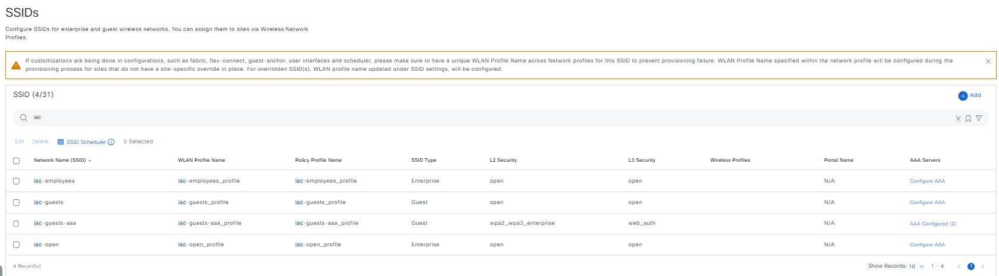

##### `UPDATE/EDIT`:
Return the exact message for create (if the SSID did not exist before) and update (if the SSID already existed).

- Terminal return:
```code
  response:
    Create SSID(s) Task succeeded for the following SSID(s):
      success_count: 1
      successful_ssids:
      - iac-guests-new
    Update SSID(s) Task succeeded for the following SSID(s):
      success_count: 1
      successful_ssids:
      - iac-guests-aaa
  status: success
```
- Mapping in the UI:

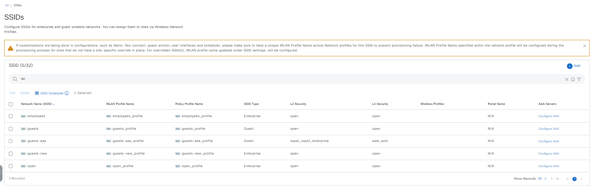

##### `DELETE/REMOVE`:
Return the exact SSIDs that were actually deleted.

- Terminal return:
```code
  response:
    Delete SSID(s) Task succeeded for the following SSID(s):
      success_count: 5
      successful_ssids:
      - remove_override_in_hierarchy: true
        site_name: Global
        ssid_name: iac-open
      - remove_override_in_hierarchy: true
        site_name: Global
        ssid_name: iac-employees
      - remove_override_in_hierarchy: true
        site_name: Global
        ssid_name: iac-guests
      - remove_override_in_hierarchy: true
        site_name: Global
        ssid_name: iac-guests-aaa
      - remove_override_in_hierarchy: true
        site_name: Global
        ssid_name: iac-guests-new
  status: success
```

#### b. Interfaces

##### `CREATE/ADD`:
- Terminal return:
```code
  response:
    Create Interface(s) Task succeeded for the following interface(s):
      success_count: 4
      successful_interfaces:
      - iac_data
      - iac_voice
      - iac_guest_access
      - iac_emp_access
  status: success
```
- Mapping in the UI:

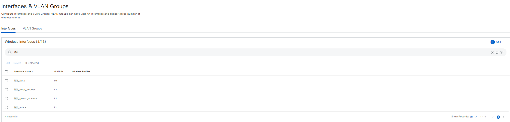

##### `UPDATE/EDIT`:
- Terminal return:
```code
  response:
    Update Interface(s) Task succeeded for the following interface(s):
      success_count: 2
      successful_interfaces:
      - iac_data
      - iac_voice
  status: success
```
- Mapping in the UI:

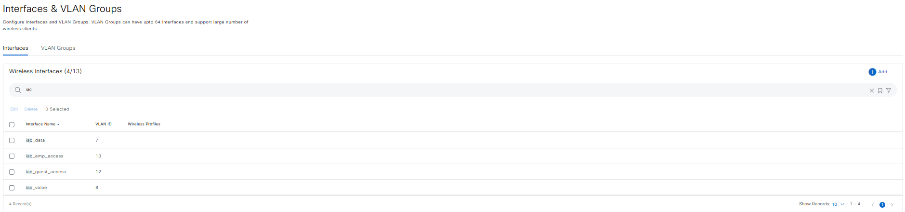

##### `DELETE/REMOVE`:
- Terminal return:
```code
  response:
    Delete Interface(s) Task succeeded for the following interface(s):
      success_count: 4
      successful_interfaces:
      - iac_data
      - iac_voice
      - iac_guest_access
      - iac_emp_access
  status: success
```

#### c. Power Profiles

##### `CREATE/ADD`:
- Terminal:
```code
  response:
    Create Power Profile(s) Task succeeded for the following power profile(s):
      success_count: 2
      successful_power_profiles:
      - iac_default
      - iac_RadioState
  status: success
```
- Mapping in the UI:

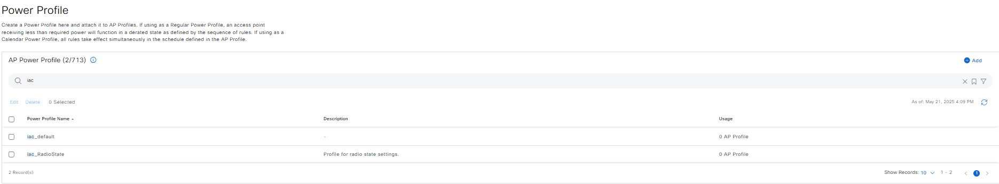

##### `UPDATE/EDIT`:
- Terminal:
```code
  response:
    Update Power Profile(s) Task succeeded for the following power profile(s):
      success_count: 1
      successful_power_profiles:
      - iac_RadioState
  status: success
```
- Mapping in the UI:

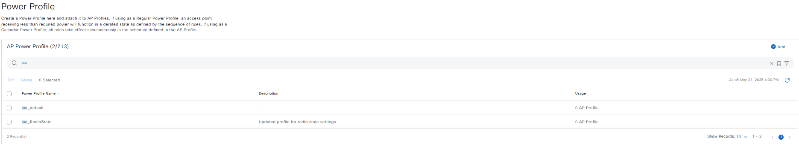

##### `DELETE/REMOVE`:
- Terminal:
```code
  response:
    Delete Power Profile(s) Task succeeded for the following power profile(s):
      success_count: 1
      successful_power_profiles:
      - iac_RadioState
  status: success
```

#### d. AP Profiles

##### `CREATE/ADD`:
- Terminal:
```code
  response:
    Create Access Point Profile(s) Task succeeded for the following access point profile(s):
      success_count: 9
      successful_access_point_profiles:
      - iac_Corporate-Office-AP
      - iac_Guest-WiFi-AP
      - iac_Remote-Worker-AP
      - iac_Branch-Office-AP
      - iac_Warehouse-AP
      - iac_AUthenticated-EAP-TLS-AP
      - iac_Authenticated-EAP-PEAP-AP
      - iac_Authenticated-EAP-FAST-AP
      - iac_Authenticated-NO-AUTH-AP
  status: success
```
- Mapping in the UI:

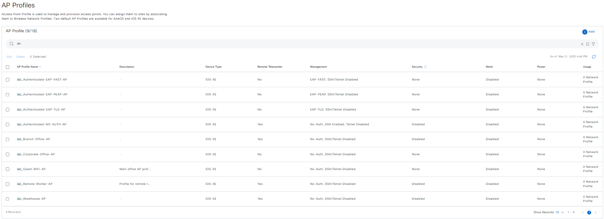

##### `UPDATE/EDIT`:
- Terminal:
```code
  response:
    Update Access Point Profile(s) Task succeeded for the following access point profile(s):
      success_count: 2
      successful_access_point_profiles:
      - iac_Authenticated-EAP-FAST-AP
      - iac_Guest-WiFi-AP
  status: success
```

##### `DELETE/REMOVE`:
- Terminal:
```code
  response:
    Delete Access Point Profile(s) Task succeeded for the following access point profile(s):
      success_count: 9
      successful_access_point_profiles:
      - iac_Corporate-Office-AP
      - iac_Guest-WiFi-AP
      - iac_Remote-Worker-AP
      - iac_Branch-Office-AP
      - iac_Warehouse-AP
      - iac_AUthenticated-EAP-TLS-AP
      - iac_Authenticated-EAP-PEAP-AP
      - iac_Authenticated-EAP-FAST-AP
      - iac_Authenticated-NO-AUTH-AP
  status: success
```

#### e. RF Profiles

##### `CREATE/ADD`:
- Terminal:
```code
  response:
    Create Radio Frequency Profile(s) Task succeeded for the following radio frequency profile(s):
      success_count: 5
      successful_radio_frequency_profiles:
      - iac_rf_profile_6ghz_basic
      - iac_cistom_rf_profile_2_4ghz
      - iac_cistom_rf_5ghz_160mhz
      - iac_cistom_rf_2_4ghz_custom
      - iac_cistom_rf_5ghz_high
  status: success
```
- Mapping in the UI:

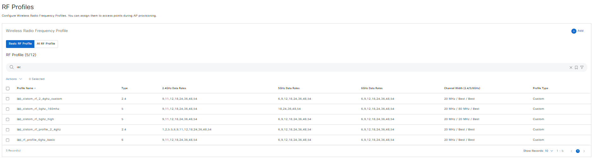

##### `UPDATE/EDIT`:
- Terminal:
```code
  response:
    Create Radio Frequency Profile(s) Task succeeded for the following radio frequency profile(s):
      success_count: 1
      successful_radio_frequency_profiles:
      - iac_new_create
    Update Radio Frequency Profile(s) Task succeeded for the following radio frequency profile(s):
      success_count: 1
      successful_radio_frequency_profiles:
      - iac_rf_profile_6ghz_basic
  status: success
```
- Mapping in the UI:

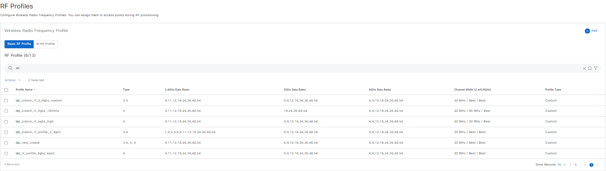

##### `DELETE/REMOVE`:
Return the exact SSIDs that were actually deleted.
- Terminal:
```code
  response:
    Delete Radio Frequency Profile(s) Task succeeded for the following radio frequency profile(s):
      success_count: 6
      successful_radio_frequency_profiles:
      - iac_rf_profile_6ghz_basic
      - iac_cistom_rf_profile_2_4ghz
      - iac_cistom_rf_5ghz_160mhz
      - iac_cistom_rf_2_4ghz_custom
      - iac_cistom_rf_5ghz_high
      - iac_new_create
  status: success
```

#### f. Anchor Group

##### `CREATE/ADD`:
- Terminal:
```code
  response:
    Create Anchor Group(s) Task succeeded for the following anchor group(s):
      success_count: 2
      successful_anchor_groups:
      - iac_Enterprise_Anchor_Group
      - iac_anchor_manager_device
  status: success
```
- Mapping in the UI:

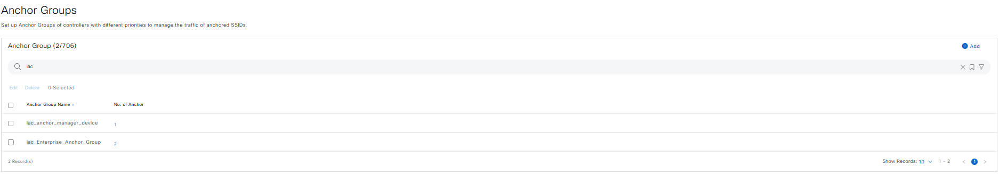

##### `UPDATE/EDIT`:
- Terminal:
```code
  response:
    Update Anchor Group(s) Task succeeded for the following anchor group(s):
      success_count: 1
      successful_anchor_groups:
      - iac_Enterprise_Anchor_Group
  status: success
```

##### `DELETE/REMOVE`:
- Terminal:
```code
  response:
    Delete Anchor Group(s) Task succeeded for the following anchor group(s):
      success_count: 2
      successful_anchor_groups:
      - iac_Enterprise_Anchor_Group
      - iac_anchor_manager_device
  status: success
```

## Using the Jinja Template for Bulk Operations

The Jinja template in the wireless design playbook is designed to dynamically generate bulk configurations for SSIDs, interfaces, power profiles, RF profiles, and anchor groups, enabling automation of large-scale deployments or testing scenarios. By leveraging Jinja loops and conditionals, it simplifies the creation of multiple configurations with consistent settings, such as alternating SSID types (Enterprise and Guest), VLAN assignments for interfaces, radio frequency optimizations, and mobility anchor setups. This approach ensures scalability, flexibility, and efficiency in managing wireless network designs.

### Example Jinja Template

Below is an example of how the Jinja template is structured to generate bulk configurations for wireless design:

```bash
wireless_design_details:
  # Example SSIDs
  - ssids:
    
    - ssid_name: "example_ssid_{{ i }}"
      ssid_type: "{{ 'Enterprise' if i % 2 == 0 else 'Guest' }}"
      wlan_profile_name: "example_profile_{{ i }}"
      radio_policy:
        radio_bands: [2.4, 5, 6]
        2_dot_4_ghz_band_policy: "802.11-bg"
        band_select: true
        6_ghz_client_steering: {{ 'true' if i % 2 == 0 else 'false' }}
      fast_lane: {{ 'true' if i % 2 == 0 else 'false' }}
      ssid_state:
        admin_status: true
        broadcast_ssid: true
      l2_security:
        l2_auth_type: "{{ 'WPA2_ENTERPRISE' if i % 2 == 0 else 'OPEN' }}"
      l3_security:
        l3_auth_type: "{{ 'WEB_AUTH' if i % 2 == 0 else 'OPEN' }}"
      fast_transition: "ENABLE"
    

  # Example Interfaces
  - interfaces:
    
    - interface_name: "example_interface_{{ i }}"
      vlan_id: {{ 10 + i }}
    

  # Example Power Profiles
  - power_profiles:
    
    - power_profile_name: "example_power_profile_{{ i }}"
      power_profile_description: "Power profile example {{ i }}"
      rules:
        - interface_type: "RADIO"
          interface_id: "{{ '6GHZ' if i == 1 else '5GHZ' }}"
          parameter_type: "STATE"
          parameter_value: "DISABLE"
        - interface_type: "RADIO"
          interface_id: "2_4GHZ"
          parameter_type: "STATE"
          parameter_value: "ENABLE"
    

  # Example Access Point Profiles
  - access_point_profiles:
    
    - access_point_profile_name: "example_ap_profile_{{ i }}"
      
      access_point_profile_description: "Description for AP profile {{ i }}"
      remote_teleworker: true
      
      
      management_settings:
        access_point_authentication: "EAP-TLS"
        ssh_enabled: true
        telnet_enabled: false
        management_username: "admin"
        management_password: "securePass"
        management_enable_password: "enablePass"
      
    

  # Example RF Profiles
  - radio_frequency_profiles:
    
    - radio_frequency_profile_name: "example_rf_profile_{{ i }}"
      default_rf_profile: {{ 'true' if i == 1 else 'false' }}
      radio_bands: [2.4, 5, 6]
      
      radio_bands_2_4ghz_settings:
        parent_profile: "HIGH"
        dca_channels_list: [1, 6, 11]
      
      radio_bands_5ghz_settings:
        parent_profile: "TYPICAL"
        channel_width: "80"
        dca_channels_list: [36, 40, 44, 48]
      
    

  # Example Anchor Groups
  - anchor_groups:
    
    - anchor_group_name: "example_anchor_group_{{ i }}"
      mobility_anchors:
        - device_name: "WLC_Example_{{ i }}"
          device_ip_address: "192.168.0.{{ 10 + i }}"
          device_mac_address: "00:1A:2B:3C:4D:{{ 5 + i }}"
          device_type: "{{ 'IOS-XE' if i == 1 else 'AIREOS' }}"
          device_priority: {{ i }}
          device_nat_ip_address: "10.0.0.{{ 10 + i }}"
          mobility_group_name: "Example_Mobility_Group"
          managed_device: false
    
```

The Jinja template example for dynamically generating bulk configurations for wireless design can be found in the *jinja_template* folder under the *wireless_design directory*. You can refer to this template as a starting point and modify it to suit your specific network configurations and requirements.


### Using the Jinja Template for Bulk Operations

The Jinja Template allows you to create bulk configurations for wireless design, simplifying the process of generating multiple configurations. To use the Jinja Template, modify and run the playbook with the following command:

```bash
  ansible-playbook -i inventory/demo_lab/hosts.yaml workflows/wireless_design/playbook/wireless_design_playbook.yml --extra-vars VARS_FILE_PATH=./../vars/jinja_wireless_design_inputs.yml -vvvv
```

## References

*Note: The environment used for the references in the above instructions is as follows:*

```yaml
python: 3.12.0
dnac_version: 2.3.7.9
ansible: 9.9.0
dnacentersdk: 2.8.14
cisco.dnac: 6.33.2
```
