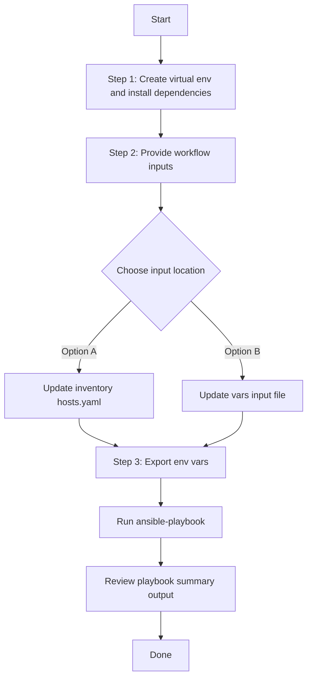

# Wireless Design Config Generator

## Table of Contents

- [User Flow (3 Steps)](#user-flow-3-steps)

- [Overview](#overview)
- [Features](#features)
- [Prerequisites](#prerequisites)
- [Workflow Structure](#workflow-structure)
- [Schema Parameters](#schema-parameters)
- [Getting Started](#getting-started)
- [Operations](#operations)
- [Examples](#examples)

## Overview

The Wireless Design config generator automates YAML playbook generation for existing wireless design settings in Cisco Catalyst Center. It generates output compatible with `wireless_design_workflow_manager`, enabling brownfield extraction and easy reuse of current wireless design configurations.

---

## Features

- **Configuration Generation**: Generate YAML configurations compatible with `wireless_design_workflow_manager`.
  - Extract existing wireless settings (SSIDs, interfaces, profiles, anchor groups, feature templates).
  - Convert API responses into playbook-ready YAML.
  - Reuse generated files for migration, backup, and automation workflows.
- **Component Filtering**: Target specific components such as `ssids`, `interfaces`, `power_profiles`, and `feature_template_config`.
- **Advanced Filtering**: Filter by SSID/site/type, interface/vlan, profile names, feature template type, and more.
- **Flexible Output**: Supports custom `file_path` and `file_mode` (`overwrite` / `append`).
- **Brownfield Discovery**: Omit `config` to generate all supported wireless design configurations.

---

## Prerequisites

### Software Requirements

| Component | Version |
|-----------|---------|
| Ansible | 2.13+ |
| cisco.catalystcenter collection | 2.6.0 |
| Python | 3.9+ |
| Cisco Catalyst Center | 2.3.7.9+ |
| catalystcentersdk | 2.9.3+ |

### Required Collections

```bash
ansible-galaxy collection install cisco.catalystcenter
ansible-galaxy collection install ansible.utils
pip install catalystcentersdk
pip install yamale
```

### Access Requirements

- Catalyst Center credentials with read access to wireless design APIs
- Network connectivity to Catalyst Center
- Existing wireless configuration data in Catalyst Center

---

## Workflow Structure

```
wireless_design_config_generator/
├── playbook/
│   └── wireless_design_config_generator.yml          # Main operations
├── vars/
│   └── wireless_design_config_inputs.yml             # Input examples
├── schema/
│   └── wireless_design_config_schema.yml             # Input validation
└── README.md
```

---

## Schema Parameters

### Basic Configuration

| Parameter | Type | Required | Default | Description |
|-----------|------|----------|---------|-------------|
| `file_path` | string | No | auto-generated | Output file path for generated YAML |
| `file_mode` | string | No | `overwrite` | File write mode: `overwrite` or `append` |
| `config` | dict | No | omitted | Module-native config block |
| `config.component_specific_filters` | dict | No | omitted | Component list and per-component filters |

### Supported Components

- `ssids`
- `interfaces`
- `power_profiles`
- `access_point_profiles`
- `radio_frequency_profiles`
- `anchor_groups`
- `feature_template_config`
- `802_11_be_profiles`
- `flex_connect_configuration`

### Common Filters

- `ssids`: `site_name_hierarchy`, `ssid_name`, `ssid_type` (`Enterprise` / `Guest`)
- `interfaces`: `interface_name`, `vlan_id`
- `power_profiles`: `power_profile_name`
- `access_point_profiles`: `ap_profile_name`
- `radio_frequency_profiles`: `rf_profile_name`
- `anchor_groups`: `anchor_group_name`
- `feature_template_config`: `feature_template_type`, `design_name`
- `802_11_be_profiles`: `profile_name`
- `flex_connect_configuration`: `site_name_hierarchy`

---

## Getting Started

## Workflow Steps
## User Flow (3 Steps)



### Installation and Run (Aligned)

1. Create and activate a Python virtual environment, then install dependencies.

```bash
python3 -m venv .venv
source .venv/bin/activate
pip install -r requirements.txt
ansible-galaxy collection install cisco.catalystcenter --force
```

2. Provide workflow inputs in either inventory (`inventory/demo_lab/hosts.yaml`) or the workflow `vars/` file.

3. Export Catalyst Center environment variables and run the playbook.

```bash
export HOSTIP=<catalyst-center-ip-or-fqdn>
export CATALYST_CENTER_USERNAME=<username>
export CATALYST_CENTER_PASSWORD='<password>'
ansible-playbook -i ./inventory/demo_lab/hosts.yaml ./workflows/wireless_design_config_generator/playbook/wireless_design_config_generator.yml -vvvv
```

### Validate and Execute

```bash
# Validate
./tools/schemavalidation.sh -s workflows/wireless_design_config_generator/schema/wireless_design_config_schema.yml \
  -v workflows/wireless_design_config_generator/vars/wireless_design_config_inputs.yml
```

```bash
# Execute
ansible-playbook -i inventory/demo_lab/hosts.yaml \
  workflows/wireless_design_config_generator/playbook/wireless_design_config_generator.yml \
  --extra-vars VARS_FILE_PATH=${PWD}/workflows/wireless_design_config_generator/vars/wireless_design_config_inputs.yml
```


## Operations

### Generate Operations (state: gathered)

Use `wireless_design_config_generator.yml` for all generation tasks.

1. **Generate all wireless design configurations**
- Omit `config`.

2. **Generate selected components only**
- Use `config.component_specific_filters.components_list`.

3. **Generate filtered configuration slices**
- Provide filters under `config.component_specific_filters` (`ssids`, `interfaces`, `feature_template_config`, etc.).

4. **Append generated output**
- Set `file_mode: append` to append into an existing file.

---

## Examples

### Example 1: Generate all wireless design settings

```yaml
wireless_design_config:
  - file_path: "/tmp/wireless_design_complete_config.yml"
```

### Example 2: Generate SSIDs for a specific site

```yaml
wireless_design_config:
  - file_path: "/tmp/wireless_design_ssids.yml"
    config:
      component_specific_filters:
        components_list: ["ssids"]
        ssids:
          - site_name_hierarchy: "Global/USA/San Jose"
            ssid_type: "Guest"
```

### Example 3: Generate feature templates with filter and append

```yaml
wireless_design_config:
  - file_path: "/tmp/wireless_design_aggregate.yml"
    file_mode: "append"
    config:
      component_specific_filters:
        components_list: ["feature_template_config"]
        feature_template_config:
          - feature_template_type: "advanced_ssid"
            design_name: "Enterprise Wireless Design"
```

---

## Notes

- `wireless_design_playbook_config_generator` expects `config` as a dictionary when filters are used.
- Omit `config` to generate all configurations.
- An empty dictionary for `config` is invalid.
- If component filters are provided without `components_list`, the module auto-populates `components_list`.

## Inventory / group_vars Example

You can also run this workflow without `VARS_FILE_PATH` by moving the sample workflow data into inventory, `host_vars`, or `group_vars`.

1. Create an inventory vars file such as `inventory/group_vars/all.yml` or `inventory/host_vars/<host>.yml`.
2. Copy the sample workflow data from `workflows/wireless_design_config_generator/vars/wireless_design_config_inputs.yml` into that inventory vars file.
3. Keep the same top-level variable name in inventory: `wireless_design_config`.
4. Run the playbook without `VARS_FILE_PATH`:

```bash
ansible-playbook -i <inventory-file> workflows/wireless_design_config_generator/playbook/wireless_design_config_generator.yml -vvvv
```
## VARS_FILE_PATH Path Resolution

Ansible resolves `VARS_FILE_PATH` relative to the playbook directory, not the current working directory.

Use either of these forms:

- Relative to the playbook: `../vars/wireless_design_config_inputs.yml`
- Fully resolved from the repo root: `${PWD}/workflows/wireless_design_config_generator/vars/wireless_design_config_inputs.yml`

